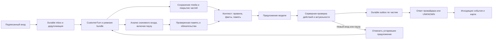
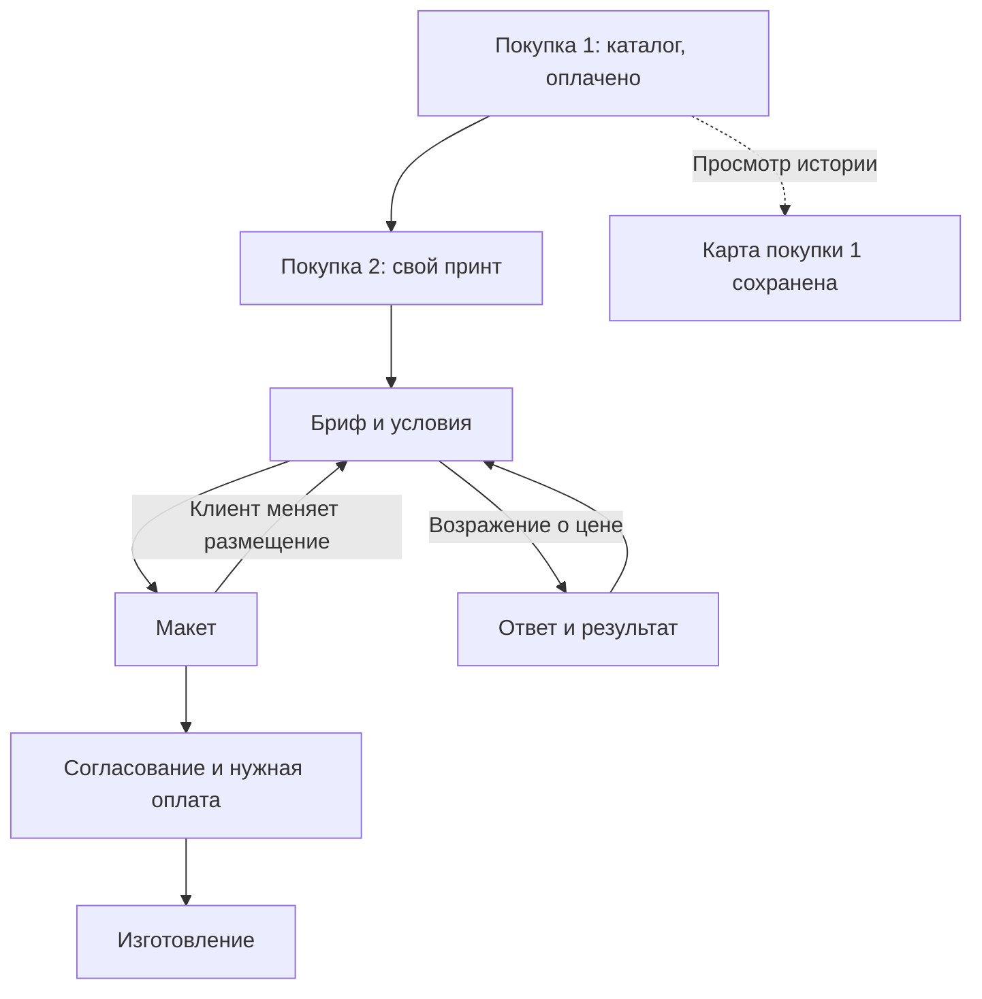

# TwoComms · единый Implementation Plan

**Версия 2.5 · 14.09.2026 · D073: реализация приоритетных исправлений по D072 начата; приёмка и выпуск фиксируются отдельно для каждого среза.**

Цель — Соломия, которая понимает весь разговор, помогает выбрать и купить, помнит подтверждённые предпочтения, вовремя привлекает человека и сохраняет каждое обязательство даже после сбоя. Администратор должен быстро понимать состояние клиента по карте его пути, без чтения месяца переписки.

Этот документ полностью задаёт целевое поведение, правила бизнеса, архитектурные решения, порядок работ и приёмку. Текст интервью служит историей происхождения решений; читать другие планы для исполнения этого плана не требуется. Решения владельца включены в соответствующие блоки, а поздние уточнения заменяют прежние гипотезы в своей области.

**Синтез документа не является реализацией.** Здесь сохранён один ранее выполненный локальный пункт B02.1 в его узкой исторической области. Состояние остальных пунктов определяется чекбоксами и evidence выпуска ниже. Новая версия не означает публикацию prompt, изменение настроек production или успешный deployment. Существующие несвязанные изменения рабочего дерева сохраняются.

## 0. Порядок, приоритет и контроль выполнения

Актуальный порядок задаёт **D072 ниже**. Сначала устраняем подтверждённые потери ответов, ложные продажи и блокировку анализа; затем исправляем контекстные напоминания и семантику карты. Существующую защиту медиа, денег, источников и отправки сохраняем. Новые товарные функции добавляют свои события и элементы карты одновременно со своим backend.

Статусы пунктов: `[ ]` — не начат; `[~]` — действительно выполняется, включая готовность к выпуску; `[!]` — блокировка с причиной и следующим условием; `[x]` — Astra приняла результат после commit → push main → SSH deploy и релевантной проверки. Исключение — исторический локальный B02.1, явно отмеченный ниже. Начавший агент отмечает пункт до редактирования кода. Закончивший сразу фиксирует результат, проверку и ограничения, не ожидая завершения всего блока. Пункт выпуска подтверждает production отдельно: локальный тест не заменяет факт выпуска. Для принятия ранее выполненного пункта не расширять его смысл задним числом.

**Выполнение: 31 из 196 пунктов · взвешенный прогресс 24.4% · в работе 25 · блокировано 0 · не закрыто 165.** Блоков: 1/17 полностью закрыто, 16 остаются. Из закрытых пунктов один — исторический локальный B02.1; подтверждение новых production выпусков находится непосредственно у пунктов.

| Блок | Приоритет | Результат | Вес | Готово | Состояние |
|---|---|---|---:|---:|---|
| B01 | P0 | Изображения и сертификат | 12% | 10/10 | Завершён |
| B02 | P0 | Инструкции и ручное управление | 9% | 9/13 | ~ В работе |
| B03 | P0 | Turn, outbox и ручное управление | 11% | 10/21 | ~ В работе |
| B04 | P0/P1 | Бесплатные модели и очередь | 7% | 1/12 | ~ В работе |
| B05 | P1 | Память, понимание и материальность | 11% | 0/11 | ~ В работе |
| B06 | P1 | Каталог, доступность и спрос | 7% | 0/10 | Не начат |
| B07 | P1 | Карточки и размер | 4% | 0/8 | Не начат |
| B08 | P1 | Предложение и деньги | 10% | 0/12 | Не начат |
| B09 | P1 | Карта, индикаторы и UX чата | 7% | 1/20 | ~ В работе |
| B10 | P1 | Исполнение и сервис | 4% | 0/10 | Не начат |
| B11 | P0/P1 | Уместные напоминания, согласия и каналы | 4% | 0/17 | ~ В работе |
| B12 | P1/P2 | Баллы и подарки | 3% | 0/10 | Не начат |
| B13 | P2 | Кастом и сотрудничество | 3% | 0/9 | Не начат |
| B14 | P2 | Управляемое обучение | 3% | 0/8 | Не начат |
| B15 | P2 | Приватный lifecycle | 2% | 0/8 | Не начат |
| B16 | P2 | Результаты и внимание | 2% | 0/8 | Не начат |
| B17 | P0/P1/P2 | Инцидентная приёмка и завершение интеграции | 1% | 0/9 | Не начат |

Вес отражает вклад блока в готовность, а не оценку дней. Прогресс: `P = Σ weight(block) × completed_tasks(block) / total_tasks(block)`. Начатые пункты не дают частичного процента. Добавление необходимой работы честно меняет знаменатель. Состояние блока `◐` означает частичную готовность, а `~` — наличие реально начатого пункта. Проверки нового документа не повышают процент реализации.

После приоритетных срезов D072 продолжается порядок B01 → B17 по оставшимся зависимостям. Независимую подготовку можно делать раньше, но потребитель не включается до готовности своих производителей. Денежное оформление не ждёт декоративной карты; базовая карта не ждёт всех будущих программ лояльности. Неподтверждённая доступность внешнего API блокирует только соответствующий канал, а не получение файлов через другой согласованный канал.

При смене агента: прочитать D072 в разделе 0, контракты C16–C19, evidence/приёмку раздела 6 и соответствующие задачи раздела 3; сверить рабочее дерево и production, затем начать первый доступный срез. Не повторять старые назначения агентов и probes из исторических заметок. Анкета из 300 вопросов не требуется. Возможности поставщика проверять в первичном источнике и на разрешённом тестовом аккаунте.

### D078 · подтверждённая первая содержательная реплика в исходном episode — подготовка после D077

Astra/high d073_semantic_review EDIT_SCOPED: новый versioned original-episode/source/plan stamp в admission, whole-SENT consumer и event-time analytics. Только first substantive reply; price-quoted требует отдельного immutable server-validated quote до send и пока не объявляется готовым. Не менять этапы, не открывать episode при позднем consumer и не запускать implicit drop-off recovery. Старые receipts без binding остаются B03.21. Для позднего более раннего ответа append-only correction, глобальный earliest выбирается до since/until; обычный очередной ответ не создаёт новую «первую» реплику.

Область: outbox, reply_projection, funnel_analytics, scoped tests. Root отдельно подключает canonical event reader в ig_journey_snapshot: в нём уже3stagedD071строки, которые нельзя включить в выпуск или потерять; agent этот файл не редактирует. Отдельная clean приёмка после D076/D077: multipart/idempotence, reset между send/projection, wrong episode, earlier receipt arriving last across report windows, holding/followup/noncommerce exclusion, crashretry без второго send. Это начало B03.19 event producer, а не завершение всего блока/полной истории.

### D077 · исчезнувшая резервная квота между проверкой и HTTP — подготовка параллельно D076

**Подтверждённый поздний counterexample после D075:** Lite empty×2→3.6 empty×1; lookahead видит доступную3.7, затем её quota либо последний key lease занимают до actualHTTP. 3.7 не вызвана, а отложенный3.6/API2 не пересматривается; root ошибочно exhausted при5HTTP/1scarce remaining и доказанно доступной3.6. Это отдельное изменение условий после read, не тот covered case, где alternative уже недоступна при lookahead. READ_ONLY d073_preference_withdrawal воспроизвёл оба случая настоящим gateway+durable observer без внешнегоHTTP.

**Исправление:** тот же агент Astra/high EDIT_SCOPED gateway/tests и узкие derived continuation metadata в revision/legacy provider execution. Revision provider-файл остаётся у D076 до его commit; параллельные записи запрещены. Отложенный остаток предыдущего scarce tier пересматривается максимум один раз, если последующие альтернативы не сделали ни одного actualHTTP. Те же source/permission/deadline/quotas и8/2/1; никаких refund или новых budgets. После actual3.7HTTP возврат не разрешает третий scarce вызов. Временное откладывание не записывается как окончательное исчерпание кандидата. Отдельный clean выпуск после D076; gateway/tests/legacy изменения не включать в D076 candidate.

**Второй подтверждённый checkpoint:** root уже сделал Lite×2+3.6empty, затем refresh/restart до следующегоHTTP. Продолжение с1scarce осталось начинать с3.6/API2 и не давало3.7 попытку. D077 читает из исходных durable attempts точное последнее failedHTTP200/empty на scarce profile (model+attempt ID), чтобы принять решение до новогоHTTP; метаданные не возвращают charges и не сбрасывают repair, safety или permissions. Проверить тот же bounded return, если альтернативе достался lease/quota до отправки.

### D076 · активный burst без потери источников и нового бюджета — в работе

**Checkpoint14.09 после D075:** d073_journey_materiality Astra/high EDIT_SCOPED реализует versioned burst economics link; d073_semantic_review Astra/high READ_ONLY проверяет lock order/permissions/accounting. Root отвечает за план, clean integration и следующий commit/push/deploy. Исходный воспроизводимый сбой и приёмка находятся в B03.17. D071/0209 и чужие изменения не включаются.

**Контракт:** новый inbound в разрешённом burst сохраняет все ещё pending исходники и прежние quiet cap/deadline, если нет delivery effects, UNKNOWN или manual/debt ownership. Новый snapshot/media/authority строятся заново. Экономический root отделён от immutable recovery lineage: strict `_root` не получает разрешение произвольных разных snapshot. Совместно учитываются started HTTP, scarce, sole repair, cheap salvage, empty history, frozen candidates и horizon. Common original-source mutex сериализует ingress transfer с old/new provider admission; порядок economic source→actual child source→graph. Старый in-flight HTTP учитывает реальный usage даже после отзыва owner, но не публикует stale winner/ответ. Если manifest уже есть, а graph ещё не создан, первый корректно привязанный child graph становится ledger anchor под прежним mutex, без нового бюджета и бесконечного pending.

**Предвыпусковая приёмка:** независимый review accepted; MySQL9.4/InnoDB31/31, включая Events/barrier с двумя потоками, passed6.707s. SQLite owner111 с одним ожидаемым row-lock skip. Root первый848-test прогон включил32migration-contract tests в профиль без миграций:13 отказов относятся только к отсутствующим seed profiles, остальные функциональные проверки прошли; это ошибка выбора тестового профиля, не причина менять production-код. Corrected clean runtime gate:816 tests passed87.604s, один row-lock skip отдельно пройден на InnoDB. 32migration-contract checks идут в существующем test_settings_migrations_non_dtf; это отдельная проверка неизменённой migration graph. Локальный scoped commit разрешён; push/deploy после результата, до этого release не отмечается deployed. Query audit8sources begin+admit/settle1075→199, inspect263→23; никакой structural cache не переживает ожидание mutex. Заменённый private `_family` удалён, ancestry остаётся exact parent BFS, не поиск только по одинаковому snapshot.

**Границы первого D076:** новые входящие не снимают прежний provider safety и не возвращают spent repair/salvage. Отказы semantic model-disposition пока наследуются консервативно вместе с root; это не объявляется исчерпанием квот всех API keys. Следующее B04.12 refinement может ограничить context-specific invalid_response текущим доказанно новым snapshot, сохраняя все charges и terminal safety; без отдельной проверки такой reset не вводится. Root подтвердил production MariaDB READ-COMMITTED; подготовлена отдельная local MySQL9.4/InnoDB socket-only база для настоящих lock/barrier tests, не копия рабочих данных и не доказательство тождественности всех MariaDB особенностей.

**Область:** новый ig_revision_burst_budget, source_coverage, turn_revisions, provider_execution, точные canonical begin_request/_lock_canonical_graph hooks; recovery только budget-root lookups. Tests source coverage/provider/live/burst. Нужны реальные interleavings worker+t0/t2/t4, photo-caption6.1, oldHTTP return послеhandoff, refreshed/outage child, exhausted budget, duplicate/correction/namespace/permission/manual/partial/UNKNOWN. Не объявлять готовым до независимой приёмки и отдельного чистого выпуска.

### D075 · empty, квоты и восстановление на дешёвой модели — выпущен

Приоритет владельца14.09 после D074. Astra/high d073_semantic_review пишет gateway/typed failures/failed200 accounting и bounded same-Lite cap repair + один unique-project cheap salvage; Astra/high d073_preference_withdrawal независимо проверяет root budget/permission/settlement. Root принимает и выпускает отдельно. Дополнительный root finding: MariaDB CURRENT_TIMESTAMP локальный, прежний observed_at cursor получает сдвиг+3h; d073_journey_materiality Astra/high добавляет canonical UTC DB cursor с безопасным переходом для уже открытого HTML. Production-клиенты не используются для синтетических retry-тестов.

**Выпуск14.09 подтверждён:** `8a714340f` + corrective `9f30d71c7b1d87c7a2da6092952f14391580b3ea`; main pushed/pulled штатным SSH. Django check OK; после штатной смены поколения supervisor/child/current SHA=9f30d71c7, healthy=true. MariaDB SELECT10:42UTC подтвердил canonical observation_cursor=10:42UTC при legacy13:42; cases90/91/100 остаются SKIPPED, никакие старые сообщения не отправлялись. Web restart sentinel применён; actual Chrome загрузил observation_cursor и видимую «Опрацьовано», Radio→Vlad сохранил точный алерт. Реальный case кнопкой для теста не закрывался.

**D075 corrective release gate пройден:**766/766 tests,80.831s в отдельной чистой копии от `63c3474c4`, без D071/0209 и посторонних изменений. Оба обнаруженных после первого757-test прогона контрпримера исправлены: live parse=True malformed JSON получает один schema repair на том же candidate и явный tier transition после неуспеха; повторные empty не отдают оба scarce slots одной модели, если другой frozen совместимый profile реально доступен. Учтён также продолженный root после refresh: предыдущие empty читаются из durable attempts. Выпуск и runtime/UI проверки завершены на9f30d71c7; следующий активный срез D076.

**Поведение D075:** gateway различает empty/MALFORMED_JSON/provider blocking и сохраняет allowlisted finish/block, наличие счётчиков и фактический output/thinking profile до первой failed200 settlement. Provider body/thoughts не пишутся. При явном MAX_TOKENS у known non-scarce3.5Lite customer_chat одна существующая repair reservation разрешает тот же candidate4096/low вместо1536; это не новый root budget. Только unauthorized_url/unnecessary_manager_handoff после исчерпанного repair допускают один новый unique-project cheap candidate на весь root; unverified price/payment/authority, pause/stale и provider safety не получают такого обхода. Root8HTTP/2scarce/1repair и исходные source/window/квоты сохраняются, marker проверяется непосредственно передHTTP вместе с actual4096/low profile.

**Проверки:** исходные143 owner/198 distinct independent и757 clean tests не покрыли позднее найденные parser/scarce контрпримеры. Corrective:165 focused integration,10 независимых adversarial HTTP-parser+durable tests и766 root clean tests — PASS. Проверены отсутствие/исчерпание repair, MAX_TOKENS-before-parser, safety terminal, fresh/resumed root, недоступная quota альтернативы, exception eligibility lookup, alias одного project и deadline до HTTP. Общие8HTTP/2scarce/1repair не увеличены. Repair guidance не переносит malformed raw output или искусственный null model-turn в контекст; исходный payload восстанавливается при любом выходе. Исходная причина старого5683 остаётся неизвестной из-за потери метаданных. Параллельный READ_ONLY B03.17 audit подтвердил следующий срез D076; он не входит в D075.

**Документация:** [Google thinking/output limits](https://ai.google.dev/gemini-api/docs/generate-content/thinking), [GenerateContent finish/prompt feedback](https://ai.google.dev/api/generate-content), Context7 `/googleapis/js-genai` (non-thought text extraction), [MariaDB UTC_TIMESTAMP](https://mariadb.com/docs/server/reference/sql-functions/date-time-functions/utc_timestamp).

**Временная совместимость UI:** новый observation_cursor — UTC_TIMESTAMP(6) на MariaDB, legacy observed_at остаётся для уже открытых D074 страниц. Новый JS переходит на UTC без сравнения со старым+3h cursor; старый ответ после перехода не откатывает состояние. Удалить compatibility field/reader в B17.9 после завершения жизненного цикла старых страниц, не ломать их ordering во время deploy.

### D074 · предотвращение повторов инцидентов и ручное закрытие алерта — выпущен

14.09 владелец уточнил: подсветка ошибки не заменяет исправление; проверить отдельно Vlad/no-response, Radio/unsolicited sales, PRICE1090/no-followup, seen/typing. Разрешена кнопка «Опрацьовано» рядом с «До запиту», снимающая конкретное уведомление даже без ответа клиенту. Она не должна подделывать доставку или запускать сообщение; сохраняется аудит оператора. После этой приёмки продолжать незавершённые пункты плана.

| Владелец | Модель / effort | Область и текущие факты |
|---|---|---|
| root | Astra/high | Scoped operator review API/UI: task cancellation + audit, без message DONE/effect resolution; защита stale GET после клика. Проверки и выпуск |
| d073_preference_withdrawal | Astra/high | Известный SKU исключался из fallback: исправить accepted source preference + корректный следующий вопрос; не скрывать незавершённое checkout обещанием |
| d073_semantic_review | Astra/high | Unsolicited image мог получить sales authority через accepted catalog route; убрать promotion и расширить CTA negative corpus. Followup требует exact SENT answer proof. Разделить informational old execution debt и настоящие блокеры, не выдумывая coverage |
| d072_presence_lifecycle | Astra/high | Быстрый send отменял все pending presence; seen failure гасил typing; убрать initial delay, разделить cooldown/lifecycle, проверить IG-only wire enums по official SDK, bounded refresh |

**Выпуск D074:** `63c3474c47f526a6ec76e8aa08d8aec217043f70`, commit/push/main SSH pull подтверждены14.09 около10:18UTC. Production supervisor и child на том же SHA, healthy, Django check без замечаний; web активирован существующим tmp/restart.txt, новых static assets/миграций нет. Реальный Chrome: Vlad → Radio → Vlad сохраняет долг и показывает «До запиту» + «Опрацьовано» с пояснением про отсутствие отправки и аудит. Кнопку на настоящем незакрытом запросе ради проверки не нажимали; POST/CSRF/actor/idempotence/race покрыты локально. SELECT сохраняет cases90/91/100 skipped, источник2948 не переотправлен.

**Evidence до правок:** основной fallback отказывает при current_product_id; принятая catalog topic сама ещё не доказывает запрос покупки; 2MB daemon log не содержат ig_presence, это отсутствие наблюдения, не доказательство исправной доставки. Точные Radio CTA2919/2938/2943 прочитаны через SELECT. Предыдущие433 tests не закрывали эти новые контрпримеры; их нельзя выдавать за полную приёмку D074. D07113staged files не включаются в этот пакет.

**Проверка владельца и новые факты 14.09:** владелец самостоятельно отправил `zainllw0w` сообщение2951 «Проверка тайпинга» и подтвердил видимость seen и typing. MariaDB SELECT: revision32, source только2951, received09:55:07UTC, SENT reply2952 в09:55:23UTC. Фактическая3.6: adaptive low-risk цепочка отклонила3.5Lite empty/unauthorized_url и3.5 unnecessary_manager_handoff, затем3.6 дала winner; это не ошибка badge. Неподходящее извинение2952 написано моделью: canonical history не передавала даты/происхождение старого holding2837 и paused source2911. Добавлена работа над dated context и проверкой именно извинения за текущую задержку, без удаления законных извинений за проблему товара/доставки.

**Уточнение поведения Vlad:** «Оверсайз» при неизвестном товаре сохраняет крой и ведёт к выбору готового принта или собственного дизайна; неизвестный ассортимент/незавершённый выбор сами по себе не повод для manager handoff. При известном SKU спрашивается следующий недостающий параметр, а отказ от кроя ведёт к уточнению альтернативы. Подтверждение возможности печати/цены кастома требует существующей authority; обычный сбор пожеланий не должен ждать менеджера. Только реальный исчерпанный технический сбой без допустимого полезного продолжения допускает один честный holding с существующей задачей; он не считается ответом по существу и не запускает sales timers.

**Текущие проверки:** root operator API/UI13 tests; независимый review выявил delayed ACK100, скрывающий новый alert101, и истечение5s seen fence внутри медленного permission check. Исправлены task-scoped ACK/DB observation cursor и повторная bounded authority непосредственно перед transport;42 presence tests. Radio проверен через один execute с repair→neutral SENT без manager/sales tasks. PRICE1090 проверяется как actual delivered verified price→один followup; просьба прислать скрин ещё не price answer. Это результаты локальных fixtures, не уже выпущенный D074.

**Release candidate D074 проверен:** отдельная чистая копия от0dca2a959,29 scoped files без D071/0209 и без D075 gateway. Все483 tests проходят (revision/auth/actions/checkout/media/outbox/recovery/manual-resume/projection, presence, guard, debt/UI, intent/followups, commerce); manage.py check без замечаний. Дополнительные80 focused прошли после обновления старых preference/checkout fixtures. Независимый holding review подтвердил отсутствие ложной substantive completion, допустимый audited resume после точного SENT holding и отмену handoff перед фактическим HTTP, если оператор уже закрыл case. Следующее действие: commit/push/штатный deploy с проверкой web/template generation. Provider/сеть могут отказать, UNKNOWN нельзя слепо пересылать. Пользовательская визуальная проверка относится к работающему на момент теста выпуску0dca2/ac62; новый D074 presence lifecycle дополнительно проверяется после выпуска.

**Следующий срез D075 / B04.12, прямое уточнение владельца:** сохранить Lite и квоты старших моделей; разобраться с частыми empty до дальнейшего перехода по плану. Root сверил Context7 `/googleapis/js-genai` и official Google generate-content/thinking/API reference. Реальный дефект gateway: отсутствие текста и malformed JSON сводятся к `_GeminiEmpty` до извлечения usageMetadata/finishReason; attempt5683 показывает четыре нулевых счётчика без причины, это missing evidence, а не подтверждённый расход0. Удачные/invalid-response следующие попытки получают15044 prompt tokens для короткого теста — отдельно проверить B02.3/B02.13 relevance/context (B07 в этом плане отвечает за visual cards). D075 owner d073_semantic_review Astra/high: typed cause + redacted diagnostics + корректный failed200 quota settlement; d073_preference_withdrawal Astra/high: независимая проверка. Изменение tier-routing требует отдельного обоснованного bounded same-model recovery; нельзя лечить syntax/лимит вывода бесконечным перебором одинаковых payload или обходить provider safety. D074 и D075 проверяются/выпускаются отдельно.

### D073 · журнал текущей реализации — читать при возобновлении

Владелец 14.09 разрешил реализацию, необходимый рефакторинг/удаление заменённого кода и commit → push main → SSH deploy после проверенного среза. D072 сохраняет очередь приоритетов; существующие несвязанные изменения не включаются в коммиты. Удаление legacy делается после миграции callers и регрессий; схемы/evidence не удаляются ради чистоты. Production не используется как тестовая база.

**Срез 1 выпущен:** commit/push/штатный SSH pull `a5daad07949f6b798182415ef5f87117eeb71359`, 14.09.2026 около08:37UTC. Production main, supervisor_release_sha и child_release_sha совпадают; `manage.py check` без замечаний. MariaDB SELECT подтвердил response debt клиента171; analysis157 завершён,153 уже processing. В браузере проверены постоянная полоса в карточке Vlad и переход/подсветка сообщения «Оверсайз». Staged D071/0209 остаётся отдельным незавершённым пакетом; прежние18 staged files сохранены побайтово. Все локальные тесты — shared CPython3.14.6/Django6.1 и `--settings=test_settings_no_network_non_dtf`, временная SQLite.

| Исполнитель | Модель / effort / режим | Точная область | Состояние |
|---|---|---|---|
| root | Astra / high / интеграция | response debt, terminal claims, attention API/UI, отдельная fallback provenance; review/test/commit/deploy/план | В работе |
| d072_preference_reply | Sol / high / EDIT_SCOPED | preference/authority + отдельная волна runnable analysis | Локально готовы: 35 preference/authority/action/proposal и 103 analysis tests; root интегрирует |
| d072_intent_followups | Sol / high / EDIT_SCOPED | current intent, scoped case gates, ordinary follow-up cycle/copy/send checks; focused tests | В работе, B02.12/B11.13–16 |
| d072_presence_lifecycle | Astra / high / EDIT_SCOPED | общий presence controller, bounded transport/ownership, canonical hooks, удаление legacy pulse | Локально 75 tests; root review/выпуск/видимость не завершены |

**Проверенный состав первого выпуска:** response debt теперь имеет отдельный API payload, локализованную причину, постоянный спокойный сигнал в списке/карточке и переход к source. Manual recovery освобождает execution lease; сообщение не объявляется отвеченным. Exact delivered revision закрывает только свой case. Общий старый pending больше не блокирует анализ: проверяется runnable ownership, для aged jobs — одна возможность при доступной management capacity. Подготовленный первый пакет проверен отдельно от других изменений в чистом detached checkout: 143 core/debt/recovery/analysis tests и затем 9 targeted debt/API/JavaScript checks прошли. Дублирующиеся кейсы в этих запусках не суммируются как разные тесты. Production и настоящий браузер проверены, результат выше.

**Границы первого выпуска:** B03.15/B03.20 остаются `[~]`: накопленные источники/cases не перепроигрываются и не закрываются без доказанной coverage; полный lane health/degraded overview ещё нужен. Недоступная provider capacity даёт явный defer, но позднее нужен обобщённый операционный alert. Старый широкий `tests_ig_clients_ui` выявил отсутствующие capability grants в фикстурах и устаревшие literal layout assertions; PII guard не ослаблен. Исправлена релевантная JS fixture, новый API тест проверяет explicit superuser и отказ обычному staff. Остальную миграцию тестов выполнить в B17.9/B09 до полной приёмки интерфейса.

**Промежуточная работа второго пакета завершена:** актуальные результаты и ограничения — D073.2 ниже; старые failed промежуточные запуски заменены exact-release приёмкой290tests.

**D073.1 — hotfix после сообщения владельца о переключении карточек:** воспроизведено Vlad→Radio→Vlad: полная перерисовка теряет полосу, следующий incremental poll восстанавливает. Production SELECT/RequestFactory подтвердили, что case100/source2948 сохраняются и обе актуальные API-проекции возвращают required=true; HTTP Cache-Control отсутствовал. Точный слой устаревшего ответа браузера/worker пока не доказан. Исправления: no-store на API списка/карточки и соответствующих fetch; последний подтверждённый debt хранится отдельно для каждого client и не снимается по отсутствующему полю, только по явному required=false. 10 targeted API/переключение/JS checks passed. Это отдельный hotfix, второй функциональный пакет ещё не выпущен. Выпущен f8342aa07f7a8d1b5f1f8a24b75df9f86b2d0506; main/supervisor/child совпадают, manage.py check OK. После reload warning виден в списке; повтор Vlad→Radio→Vlad сохранил полосу сразу, браузерная проверка passed.

**D073.2 — второй функциональный пакет выпущен:** commit/push/SSH pull `25b6ed938ba33bcfebd69c4f428d75a31ac9e109`; production main/supervisor/child совпадают, `manage.py check` OK. MariaDB подтвердил завершение всех пяти ранее зависших analysis jobs153/154/157/311/312; старые debt90/91/100 сохранены. Presence profile instagram_login/v25.0, видимость ещё не проверена, refresh0.  26 exact files проверены в чистом detached checkout отf8342aa07, без D071/0209/brand/несвязанных изменений. **290 tests passed**, включая live/recovery/outbox/authority/action/transport, follow-up purpose/races, presence, commerce withdrawal,9 fallbackintegration и новый provider-boundary regression. Побайтовое совпадение tested files с release candidate проверено.

- Preference-before-product: accepted source projection, отдельная authority без ложного SKU; при реальном выборе SKU provisional binding атомарно заменяется catalog authority в action receipt. Явный отказ отзывает только соответствующее предпочтение, история сохранена.
- После failed Gemini graph резервный ответ хранится отдельным deterministic source_preference_fallback receipt; winner/proposal не выдумываются. Повторный запуск не отправляет повтор; любой известный lineage effect, partial/UNKNOWN, media, pause/epoch/correction закрывают этот fallback.
- USER watermark проверяется даже после processed inbox и ещё раз у HTTP; поздняя корректировка отменяет старый ответ. Передача source debt в новый burst остаётся B03.17, не объявлена завершённой.
- Current purpose направляет generation и проверяется до business actions и physical send. URL/цитаты/отрицание/тема картинки не дают автоматического права продавать; явное новое «Оформлюйте замовлення» обслуживается. Подтверждённый отказ не стирает исторический интерес, но прекращает текущие sales acts.
- Ordinary follow-up использует существующий scheduler/outbox: один timer на source cycle,3h price/90min requested choice после SENT, окно от USER, обычные часы10–20:30 Kyiv, безопасный UA/RU/EN вопрос и повторная проверка purpose/claim/copy у provider. Старые ordinary ladders подавлены без replay. Полная meaningful-cycle arbitration, новые источники/explicit deferred requests, UI outcome и доказанная судьба старых90/91 ещё нужны; B11.13–17 не закрыты.
- Canonical/legacy используют единый неблокирующий presence worker с bounded socket/slots и durable generation fence. Старый blocking pulse/timed join удалён. API acceptance и реальная Instagram-видимость различаются: refresh default0, account visibility gate B03.18 остаётся открыт.

**D073.3 — третий пакет выпущен:** commit/push/SSH pull `ac62e2da313693000803ac9b6536a7fa23565b86`; production main, supervisor/child SHA совпали, healthy=true, `manage.py check` OK.  Astra/high source owner реализовал bounded pre-provider source transfer с парными immutable receipts; изменение head не объявляет старый source отвеченным. Старый deadline не продлевается, source digests сохраняются; denied transfer остаётся debt. Canonical ownership сохраняется после выключения rollout, pure legacy shadows не захватываются. Владелец метрик Astra/high реализовал SENT history/time/counter projection; независимый Astra review потребовал immutable admission только для новых plans. Старые processed/echo не получают новый counter задним числом (`legacy_count_requires_review`), broad backfill не запускается.

C18: Astra/high backend materiality + root renderer/focus. Повтор/обычный вопрос не дают warning; cited customer price/refusal/payment/configuration concern имеет один case с affected action, источниками и временем. Generic objection-step остаётся в деталях, case прикрепляется к этапу; path без доказанной связи не дорисовывается. Context association без стрелки в SVG/подписях/accessible list; root focus совпадает с graph.display_focus после enrichers, старый case не подменяет новый topic. Root исправил найденные review дубли marker/returnReason и focus/повторный click details. Браузерный локальный пример проверил disclosure, повторное закрытие, полную карту и один price marker; это не production и не полная mobile приёмка.

**Exact candidate:** clean detached checkout от25b6ed938,20 executable/test/plan files + template asset version (21 files in commit), **433 tests passed** (58.457s), Python3.14.6/Django6.1, no_network_non_dtf. Включены core delivery/recovery/purpose/presence,17 source-transfer,23 receipt-projection и journey contract/store/snapshot/presentation suites. Проверенные D071 UI/geometry/timestamps включаются в этот срез; migration0209/refresh producer и привязанные3snapshotlines остаются staged отдельно. Template asset version added for browser cache invalidation; дополнительные15 debt/presentation tests после этой правки прошли. Static collection после pull выполнена; source/collected JS/CSS SHA256 совпали. В реальном браузере обнаружен старый cached web process: после штатного restart sentinel веб-процесс загрузил новые hashed assets `ig_journey.ae07d37718c1.js`, `ig_journey.32112ada17d6.css`, `ig_journey_geometry.28026e646ff0.js` с `?v=journey-presentation-v1`, новый discussionDetails DOM присутствует. Перезапуск дал около минуты холодной загрузки; LSAPI3/0 были заняты, страница восстановилась. Лимиты процессов/памяти не увеличивались. Доставку UI нельзя подтверждать одним worker SHA.

**Read-only production verification:** MariaDB SELECT для171/340/341 подтверждает одинаковые root focus и graph.display_focus. Старые debt90/91/100 остаются skipped; новый admitted_projection_count=0 в момент проверки, поэтому реального нового SENT после выпуска ещё не наблюдали. Предупреждение Vlad проверено в списке и карточке после переключения туда/обратно; на новом интерфейсе оно присутствует. Source-transfer, counters и material case проходят local integration, это не ручные сообщения клиентам. Прежние11 staged blobs сохранены побайтово,2 refresh hunks восстановлены после scoped commit; остаётся13 staged D071 files.

**Остаток после D073.3:** B03.17 active-generation budget transfer; B03.19 исходный episode-bound funnel projection и scoped historical metrics dry-run/apply; B03.18 реальная Instagram seen/typing visibility и capability TTL; B03.21 старые90/91/100 с доказанной coverage; C18 полный typed materiality producer/negative language corpus, mobile/keyboard, native objection adapter, lifecycle resolved и D071 refresh; B17.9 отдельная web activation/readiness проверка и bounded cold-start monitoring при LSAPI3/0. Эти пункты не закрываются наличием narrow adapter. Старые клиентские сообщения не переотправляются; production не тестовая база.

### D072 · актуальная контрольная точка 14.09.2026 — читать первой

**Объём этой работы:** root Astra + два Sol/high (исполнение; намерения/напоминания) + Terra/high (граф/UX), все субагенты READ_ONLY. Проверены код HEAD и staged-изменения, MariaDB через SSH с запретом SQL кроме SELECT, шесть недавних диалогов, дополнительные исторические состояния и настоящий desktop-интерфейс карты. Изменён только этот план. Никаких клиентских сообщений, вызовов моделей для переанализа, изменения production, commit/push/deploy в этом аудите не было.

**Проверено 14.09 около 00:54–01:10 UTC:** local HEAD и production `main` = `21eb25986e0c15208b25e43ccba6a2355e2fb54b`; supervisor и child сообщают этот же SHA, heartbeat свежий. Production Python 3.14.7 / Django 6.1 / MariaDB 11.4.13, management schema до 0208. Revision consumer включён с cutoff 08.09 20:14:23 UTC. Локальный обязательный runtime проверен: CPython 3.14.6 / Django 6.1. Незакоммиченный D071/0209 refresh и новые UI/assignment-изменения **не выпущены**. Код источников в разделе 6 привязан к этому срезу, а не к будущей реализации.

| Что уже есть | Что ещё обязательно сделать |
|---|---|
| Immutable revisions, per-part outbox, CAS, UNKNOWN/echo и bounded provider budget | Закрыть разрыв между сохранённым входом и фактическим ответом; долг не должен оставаться невидимым `claimed/skipped` |
| Карта над чатом, полная карта, registry, verified events, accepted routes, реконструкция истории | Отделить существенные барьеры от обычного уточнения, свести focus/факты/связи к одному read-model; выполнить C18 |
| Подготовленный локальный D071: микро-события, timestamps, assignment context, автоматический trace refresh | Проверить его на новых контрактах; выпускать только после устранения шума и голодания очередей. Не включать refresh в качестве лечения live-бота |
| Follow-up scheduler, receipts, approval и защита окна | Убрать продажи без намерения, глобальную блокировку старыми техническими cases и многоступенчатый дожим; выполнить C17 |

**Приоритетные срезы, каждый заканчивается своей приёмкой, без ожидания всего блока:**

1. **P0 — перестать оставлять клиента без ответа и оператора без сигнала:** B02.12 (минимальный intent gate) + B03.15 (response debt) → B03.16 (предпочтение до товара и проверенный fallback) + B04.12 (разбор ошибок/маршрут моделей). Основание: клиент 171, сообщение 2948. Старые сообщения не перепроигрывать автоматически.
2. **P0 — устойчивый живой диалог:** B03.17 (burst/media/передача обязательств), B03.18 (seen/typing), B03.19 (receipt projections), B03.20 (fair scheduling и lane health), затем B03.21 (сверка накопленных долгов). Это дополняет ранее выпущенные B03.2–5; их историческую приёмку не выдавать за покрытие новых контрпримеров. B02.13 исправляет обнаруженные смысловые противоречия вместе с этими срезами.
3. **P0/P1 — уместные продолжения:** B11.13–17 на существующем outbox. Narrow ordinary in-window follow-up не ждёт native marketing, полного B05 или будущих бонусов. Отказ от sales при community/information включается сразу; автоматический новый follow-up — только после end-to-end проверки всех его gates.
4. **P1 — карта без ложных проблем:** B05.11 (материальность) → B09.17–20; первые действительные blockers/response debt выводятся уже с B03.15. Затем завершить B09.16 и пригодный D071. Остальные доменные producers B09/B10–B13 сохраняются в плане.
5. **P0 для выпуска срезов / P1 для накопленной оценки:** B17.9 — инцидентный corpus, negative controls, сверка исходов и контролируемое наблюдение. Полная B03.14 и B11.12 остаются отдельной интеграционной приёмкой своих расширенных областей.

**Обязательность воронки:** C10/C15 и уточняющий C18 — требования, а не пожелания: текущий фокус/owner/причина, достоверная история, типизированные условия и связи, различимые барьеры, доступные подворонки, отсутствие ложной оплаты/согласия, desktop/mobile/keyboard-приёмка. Полная схема возможных путей доступна по запросу; рисовать её всю в первом обзоре не обязательно. Отдельный символ для каждой реплики, отдельная карточка каждого размера, постоянные warning/info-маркеры между обычными шагами, повторная генерация всех старых чатов и декоративная анимация **не являются обязательными**. Различать типы элементов обязательно; уникальный рисунок каждого отдельного узла не нужен. Ранее согласованный motion-дизайн сохраняется как поздняя полировка, не gate для P0.

**Навигация и приоритет документов:** этот D072 и C16–C19 заменяют противоречащие им ранние указания. Исторические D063–D071 и [09_INLINE_JOURNEY_DESIGN.md](09_INLINE_JOURNEY_DESIGN.md) сохраняют совместимые детали; старое правило «каждый повтор = warning» отменено. [06_IMPLEMENTATION_CHECKPOINT.md](06_IMPLEMENTATION_CHECKPOINT.md) и [07_IMPLEMENTATION_CHANGELOG.md](07_IMPLEMENTATION_CHANGELOG.md) — история, не актуальная очередь и не разрешение повторить старые production-действия. Все новые задачи ниже `[ ]`; планирование не повышает процент готовности.

Историческая контрольная точка 08.09.2026 — не текущий runtime и не текущие назначения

### История 08.09.2026

- **Актуальный подробный контекст:** [06_IMPLEMENTATION_CHECKPOINT.md](06_IMPLEMENTATION_CHECKPOINT.md). История выпусков/решений: [07_IMPLEMENTATION_CHANGELOG.md](07_IMPLEMENTATION_CHANGELOG.md). Один источник task status — этот план; вспомогательные документы не создают второй backlog.
- **Последние уточнения дизайна D063–D068:** [09_INLINE_JOURNEY_DESIGN.md](09_INLINE_JOURNEY_DESIGN.md) — обязательный детальный контракт встроенного графа. Заменяется полоска над чатом; много реальных ветвей, обратные стрелки с причинами, post-sale/UGC/rewards и связь с покупкой2. Шесть смысловых групп не ограничивают граф шестью узлами. Изолированный крупный прототип не выпускать и не считать готовым B09.16.
- **D066 — актуальная геометрия:**09§17 заменяет переносимую мобильную сетку. Обзор над настоящим чатом; на телефоне компактный участок и кнопка модальной полной карты; desktop слева направо. Иконки, status overlays, кольца реального оставшегося времени и спокойная motion-система проектируются Astra/high. Условный screenshot не является приёмкой. Invoice expiry/reminder due/channel window различаются;25мин не новый hardcode.
- **D065 — критерий3секунд:**09§15 определяет иерархию обзор→подробности→полный путь, стабильные стрелки/markers/counts, payment-wait/help/correction routes и общие provenance links памяти/решений/карты. Нельзя заменять typed facts отдельной картинкой или summary. Малозначимые поля внутри узла, текущая причина и существенный возврат видны сразу. Новый доход/скидка/канал не выводятся из дизайна.

- **Порядок по последнему решению владельца:** B02.11 (переспрос понятного обращения) + P0 резервирование B04.11 → завершить и выпустить локальные B03.2–6/B02.10 с одной итоговой интеграционной проверкой → ближайший работающий срез воронки/подворонки B09 (реальные producers и read-model, дизайн Astra). Точные минимальные зависимости B09 уточняются по существующему коду; будущие деньги/программы не рисуются как готовые. Остальной план сохраняется, задачи не пропускаются молча.
- **Последний проверенный выпуск:** local/origin/production main=`0ed96e61fec5a1da504622ab982d3fbdce0573e2`. B03/B04 runtime пакет выпущен после392/392 интеграционных проверок и schema drift check. Production8SELECT: schema0206, обеreceiptтаблицыInnoDB, daemon alive/current, pending/processing USER0, owned revisions0, effects0, recovery pending0 (7cancelled/2sent). Existing8revisions:3collecting/3processed/2superseded. Legacy durable8HTTP/2scarce/1repair, horizon≤30min иoriginalchannelwindow активен приaccountingshadow. Новый revision consumer flagOFF до проверки старыхshadow revisions.
- **Принятые пункты:** 29/175. B04.11 принят после0ed96e61f; B03.2–5 приняты после сверки115/392 integration checks и активированного runtime641/47. B02.10 остаётся[~] из-за отсутствия наблюдаемого live resume→fresh revision→single send; B03.6 остаётся[~] из-за HumanReplyCommand/conflicting draft (B03.12), а не выключенного consumer. Эти пакеты не переписывать с нуля.
- **Конечная проверка:**392/392green (`/tmp/twc-runtime-release-392-final.log`), model/migration drift отсутствует. Предыдущие18failures устранены: wrong lock_ledger forwarding был реальнойошибкой, остальные publication/time/independenttickfixtures обновлены. Первые2попытки readonly скрипта проверки production остановились до businessquery (ошибкаименимодели, затемguard запретил sessionSET); исправленныйскрипт прошёл8SELECT. Это неruntimeсбои бота.
- **Оркестрация:** root/Astra — дизайн, graph adapter, docs, release/activationreview. Astra/high пишет09§16 journal/producer в новыхig_journey_models.py/ig_conversation_routes.py/0207/tests иappendimportmodels.py; текущаяpure customer-route.v1 нормализация уже10/10локально, runtimehookещёнет. Sol/high READ_ONLY activationpreflight старыхshadow revisions. Terra/medium завершилscoped snapshot15/15, ownershiproot; статическийdeploymentпутьустановлен, UIещёлокальный.
- **Новая проверенная зависимость карты:**09§16 — client-scoped journal принятых multi-intent решений. Existingepisodeevents не покрывают employment/cooperation. ExistingOPEN_SUBFUNNEL immutabletyped_value currentlymustbe{}, а analysisjob/result неcapturedpermissionepochs; новыйadapterостаетсяfailclosed до writer/normalizer/bindingintegration. Это частьB09.1→узкийB13.1→B09.3/2; полныйmemoryreaderнеблокирует. Не выдавать обычныйlatestanalysisза acceptedroute.
- **Рабочее дерево смешанное:** не использовать `git add .`, reset/stash/чужую ветку. Не захватывать brand.md, storefront/support/SEO, locales, AGENTS/Serena и пользовательские assets. Перечень незавершённого bot-пакета и hashes — в checkpoint. План/журналы локальные; секреты только через существующий Keychain loader, без копирования/печати.
- Обновление dashboard: `.venv/bin/python docs/instagram_bot_audit/new/2.0/update_progress.py`. Записи документа не увеличивают реализационный прогресс. Новый P0 честно увеличивает знаменатель.

## 1. Проверенная исходная ситуация и выбранные решения

Таблица ниже сохраняет исходный аудит 06–07.09.2026; многие его исправления уже выпущены. Текущие регрессии и проверка 14.09 находятся в D072/разделе 6. Номера внутренних сообщений нужны для диагностики; они не должны попадать в публичные ответы или стороннюю телеметрию.

| Наблюдение | Что это означает | Решение и место |
|---|---|---|
| Production Python 3.14.7 выдаёт `NotImplementedError: chmod: follow_symlinks unavailable on this platform` в `ig_private_media.py`; `fchmod`, `O_NOFOLLOW`, `O_DIRECTORY` доступны | Изображение теряется до Gemini; смена модели не восстановит чтение | Исправление файлового пути и проверка реальных байтов — B01 |
| За проверенные 21 день: 11 входящих media, 6 сохранены, 5 последних недоступны; четыре `storage_failed`, один `download_failed` | Есть воспроизводимый класс сбоя, а не доказанная неспособность vision-модели | Раздельный статус каждой части, ограниченное восстановление и честный ответ — B01 |
| Сообщения 2858 и 2865 содержали несохранённые изображения; analysis job 308 завершил текстовую часть при `media_phase=failed` | Нельзя показывать «изображение проанализировано», когда закончен только текст | Покрытие text/image/audio отдельно, source binding и UI — B01/B05/B09 |
| По этим двум сообщениям не получены собственные байты и нет доказательства содержимого сертификата | Связь с описанным владельцем сертификатом вероятна по контексту, но не подтверждена просмотром | Не объявлять конкретное изображение сертификатом без чтения; сценарий приза задаётся как новое явное требование |
| Live `download_image` обходит готовый `ig_media_url_policy.fetch_media` | Защищённый helper существует, но не защищает фактический download | Подключить к реальным callers — B01 |
| В vision-классификации нет призового сертификата; выбор инструкции опирается на текстовые triggers | Image-only сертификат не получает нужный сценарий | Один редактируемый programme/instruction и структурированное визуальное наблюдение — B01/B02 |
| `maybe_release_stale_takeover` снимает паузу после 12 часов; default prompt запрещает признавать бота | Код противоречит ответам владельца о ручном запуске и виртуальной Соломии | Удалить autoresume, обновить default и опубликованную DB-версию — B02 |
| Draft не связан с полноценной ревизией CustomerTurn; `sending` может записываться до начала HTTP | Старый ответ способен уйти после нового сообщения, а неотправленный — зависнуть как неизвестный | Revision/CAS и различимые фазы outbox — B03 |
| Typed memory в основном shadow, live reader не подключён; legacy summary пишет без полного revision fence | Память может быть неполной или перезаписывать более новое состояние | Один evidence-based projector и обязательный reader — B05 |
| Шесть конфигурационных имён ключей не доказывают шесть независимых квот | Ротация ключей может повторно бить в один исчерпанный проект | Верифицированная карта project/model/feature и free-only admission — B04 |
| Checkout использует физические резервы, один promo input и запрещает нулевой итог | Требования владельца о продажах, нескольких кодах и полной скидке ещё не реализованы | Спрос вместо удержания, общий calculator, zero settlement — B06/B08/B12 |
| В текущем UI линейная воронка; обновление опирается на индекс DOM-элемента и замену содержимого | Возвраты, несколько покупок и раскрытые детали могут отображаться неверно и дёргаться | Versioned read-model, устойчивые ID и карта в том же месте — B09 |
| UX-аудит 07.09: `renderClientRow` одновременно назначает active/needs-action/post-sale-action/commercial-*; `.commercial-*.active` добавляет blue outline независимо от attention | Код допускает двойную золотую/синюю границу; CSS priority не выражает бизнес-приоритет | Один attention_snapshot и один frame owner — C15.2, ранний B03.13 |
| `.bot-funnel` использует `flex-wrap:nowrap`, `overflow-x:auto`, chips `flex:0 0 auto` | Последние этапы требуют горизонтального пролистывания даже внутри большого экрана с узким чатом | Компактный обзор + полный граф по D066/D067, C15.4/B09.6 |
| `renderConversation` постоянно выводит Monobank/manager/physical orders, `renderContext` — длинный memory и до 18 signal chips с latest_value | Вторичные и нулевые факты занимают первый уровень; текущие patterns.message_counts — роли сообщений, а не попытки оплат | Предметные агрегаты/coverage, SVG+count и progressive disclosure — C15.3/B09.4/B09.9 |
| FLIP анимация строк и hover используют transform; строка меняет className и заменяет children при изменении payload | Возможны скачки/сброс открытых элементов при live refresh; это требует браузерной проверки после исправления | Раздельный positional wrapper, keyed semantic shell, C15.7/B09.12 |
| В проверенных client routes/renderConversation нет ручного composer/send API; `send_text_tagged` вызывается только тестами и маркирует текст через `_mark_bot_sent` | Transport helper не доказывает наличие ручного рабочего места и корректного human provenance | Authenticated manual command, actor-aware outbox и composer — B03.12/B09.11 |

Опорные модули: `twocomms/management/management/commands/instagram_bot.py`, `management/services/ig_private_media.py`, `ig_media_url_policy.py`, `ig_checkout.py`, `ig_checkout_payment.py`, `ig_funnel_nodes.py`, `bot_playbooks.py`, `bot_memory.py`, `bot_vision.py`, `bot_conversation_analysis.py`, `management/models.py`, `management/bot_views.py`, `management/templates/management/bot.html`. Здесь и далее сокращённые пути `management/...` считаются относительно `twocomms/`. Использовать имеющиеся модели, Django, MariaDB, очередь и шаблон. Новая graph DB, новый frontend framework и тотальный rewrite не нужны.

## 2. Обязательные контракты системы

### C01. Источник правды и границы решений

Владелец задаёт бизнес-политику; опубликованная версия исполняет её. Каталог даёт цену и существующее исполнение; Storage — физический остаток; платёжный провайдер и финансовый ledger — факт денег; менеджер — специальные разрешения; провайдер канала — право конкретной отправки. LLM предлагает смысл, полезный следующий шаг и текст. Она не утверждает оплату, размер скидки, право на приз, доступ администратора, факт подписки или отгрузки.

У каждого используемого факта есть `subject/episode/line`, тип, источник, время наблюдения, версия источника, актуальность и область действия. Разделять `подтверждено`, `со слов клиента`, `предложено моделью`, `устарело`, `оспаривается`. Предположение не повышается до факта от повторения в summary. Исправление владельцем каталожного материала не переписывает характеристику уже проданной вещи в истории заказа.

Правила безопасности, правдивости, доступа, денег и канала имеют приоритет перед целью конверсии. Продажа усиливается полезным подбором и точным действием. Выдуманные причины отсутствия, ложная срочность, обещанный возврат без полномочий и бесконечные сообщения не используются как техники продажи.

### C02. Единица разговора, исполнения и восстановления

`provider owner + namespace + sender ID` задают identity; имя/ник не являются ключом. Клиент имеет несколько эпизодов: покупка, сервис, сотрудничество; внутри покупки — отдельные товарные линии и получатели. CustomerTurn объединяет несколько сообщений одной мысли. Для каждого запуска сохраняются `turn_id, bundle_revision, claim_token, permission_epoch, memory_revision, prompt_version, source_manifest`.

Принятое входящее сообщение всегда имеет наблюдаемый исход: ответ, ожидание клиента/команды, явная пауза, повторяемая техническая задача или исключение для оператора. «Процесс жив» не равно «клиенту ответили». У каждого ожидаемого действия есть owner, причина и следующий разрешённый переход.

Ручной ответ имеет отдельный `HumanReplyCommand` как основание Action/Outbox. Он не требует генерации LLM и проходит actor-aware permission; bot pause не является запретом допустимого human send. UI view/history selection не создаёт ни CustomerTurn, ни ручную команду. Echo и receipt сохраняют исходного автора. Это реализуется B03.12 и визуализируется по C15.8.

### C03. Автоматическое понимание изображений и закрытое хранение

**Уточнение владельца D061, 07.09.2026, имеет приоритет:** все поддерживаемые входящие изображения анализируются ботом автоматически в контексте переписки. Нужно понять, что изображено, к какому сообщению/товару/оплате это относится, зачем клиент прислал фото и какое следующее действие уместно. Это относится к чекам, платёжным скриншотам, вещам, принтам, селфи/UGC, сертификатам и другим изображениям. Не вводить обязательное предварительное разрешение менеджера, privacy-safe-artwork checkbox или blanket handoff по типу файла.

Сначала получить собственные закрытые байты и проверить формат/размер, затем передать их действующему подходящему мультимодальному маршруту. Для каждой части отдельно хранить capture/inspection, digest, исходный индекс, actual model/request и результат. Успешный job/текст не доказывает чтение всех файлов. По хорошей части дать полезный ответ; непрочитанную/непонятную часть честно уточнить, при необходимости восстановить получение. Менеджера привлекать по реальному неустранимому затруднению либо бизнес-полномочию, а не на каждую картинку.

Закрытый storage и авторизованный `no-store` preview означают защиту доступа к файлу, а не запрет автоматического анализа. Не копировать исходники в публичное хранилище, не писать signed URL/секреты в логи и не повторять ненужные номера документов/реквизиты в ответе или обычной памяти. OCR — отдельное наблюдение, не audio transcript. Распознавание чека не равно банковскому paid; сертификат не равен подтверждённому праву на награду. Контекстное понимание — задача бота, авторитетное денежное/призовое решение проверяется своим механизмом.

Фактический provider/project route, бесплатность, capabilities и применимость условий проверяются в B04. Не создавать фиктивные подтверждения из названия модели или default quota group; не включать платный fallback без указания владельца. Проверка провайдера не подменяет согласованный автоматический сценарий обязательным просмотром каждой фотографии человеком.

### C04. Доступность: клиентское предложение отдельно от склада

| Вариант при начале покупки | Разрешение | Действие для клиента | Внутри системы |
|---|---|---|---|
| Существующая включённая обычная футболка с разрешённой докупкой, даже при 0 | Можно оформить | Нормальный подбор и оформление; при вопросе — обычный ориентир подготовки | Alert о нехватке и запись спроса |
| Розовая/ментоловая футболка при 0 | Сначала команда | Сохранить выбор, уточнить возможность и срок | Единый case и Telegram Alert |
| Худи любого цвета/размера при 0 | Сначала команда | Уточнить срок выбранного исполнения | Case; чёрный L — текущий пример, не вечное исключение |
| Нынешние лонгсливы, любой размер | Сначала команда | Проверить возможность изготовления и материал | Category policy до явного изменения поставки |
| Выключенный размер или несуществующее сочетание, новая неподтверждённая категория | Сначала команда | Уточнить исключение, без выдуманного SKU | Нельзя создать несуществующий товар только из слов клиента |
| Обычный доступный вариант, 1–2 единицы | Можно оформить | Обычная покупка | Предупреждение малых остатков |
| Нет готового DTF-трансфера | Можно оформить | Обычная покупка | Задание напечатать; готовый трансфер — подсказка производству |

Policy редактируется в интерфейсе: точное исполнение → основа/цвет/декор → семейство → тип → `confirm_before_commit` по умолчанию. Хранятся revision, источник решения, ответственный и срок пересмотра при необходимости. Новый поставщик позволяет перевести худи в `replenish_allowed` без переписывания prompt. Не включать универсальную доступность только потому, что добавлена новая категория.

Различать **первоначально неподтверждённую покупку** и **уже допустимое действующее предложение**. В первом случае платёж закрыт до разрешения команды и согласия клиента с существенными условиями. Во втором поздний нулевой остаток не ломает checkout: заказ принимается, внутренний спрос/alert обновляется. Явный отказ команды, отмена, истечение предложения или изменение самого товара не обходятся этим исключением.

Нет блокирующего резерва под неоплаченную ссылку и нет автоматического физического списания при платеже. Три человека могут оплатить при одной основе. Полностью оплаченный заказ получает производственный приоритет; долг обеспечения показывается отдельно от фактического количества. Физический расход подтверждается вручную с выбранной реально использованной основой. Исторические резервы сверяются, но не становятся новым удержанием.

### C05. Действия менеджера и обещания

ENV Telegram IDs задают получателей уведомления; сейчас это два администратора/менеджера. Право выполнить действие проверяет сайт по авторизованному пользователю и роли. Ссылка из Telegram открывает case; изменение выполняется подтверждённым POST с CSRF и ожидаемой ревизией, никогда просто GET. Первое действительное решение выигрывает; второму оператору показывается уже принятое решение.

Для наличия три действия: **разрешить оплату / не можем выполнить / предложить уведомление о появлении**. Разрешение содержит конкретные линии, количество и условия; срок можно согласовать в чате, но он должен стать подтверждённым полем case перед обещанием клиенту. Изменение варианта или количества вне области разрешения требует новой проверки. Для скидки отдельный case: **5% / 10% / отказ**, без смешивания с наличием.

Менеджер может ответить за минуту или через несколько часов. Клиенту: «Уточню возможность и срок у команды. Как только получу ответ, напишем здесь». Никакой гарантии пяти минут. После реального ответа человека исходящий бот по этому клиенту остаётся на паузе до ручного запуска; завершение case само не снимает takeover. Анализ переписки может продолжаться и готовить черновик.

Обещание «вернусь» создаёт Commitment с причиной, каналом, владельцем, сроком/условием, статусом и правом отправки. Если канал недоступен, задача видна администратору; исполнение не помечается состоявшимся. Нехватка на складе, поставщики, себестоимость, внутренний долг и загрузка производства не раскрываются клиенту автоматически. Слово «выкуплены» допустимо при подтверждённой причине; популярность не придумывается из нуля.

### C06. Деньги, предложения и скидки

Новый офер использует текущие опубликованные цены точных вариантов, включая действующую публичную скидку. Если названная раньше в чате цена изменилась, объяснить изменение до формирования нового офера, показать новый итог и получить согласие продолжать. Действующий офер фиксирует суммы до своего `valid_until`, включая случай изменения каталога вверх или вниз. Перевыпуск банковского invoice внутри действующего офера не переоценивает товары. Истёкший офер требует нового расчёта и уведомления об отличиях.

Стартовая длительность офера — 12 часов, редактируемая настройка для новых оферов; `valid_until` явно показан. Это инженерное решение, а не обещанный владельцем срок. Текущий invoice profile — до 25 минут, всегда не позднее expiry родительского офера и фактического ограничения провайдера. Старые 25-минутные legacy оферы читаются по своей версии, без тихого продления. Preliminary ожидание команды имеет отдельный read-only lifecycle и не расходует платёжные 12 часов до выдачи активного офера. Новый банковский invoice допустим только внутри активного офера и после сверки предыдущей попытки.

Для совместимых уникальных промокодов: сначала фиксированные гривневые скидки, затем проценты последовательно. Для общего одинакового набора товаров `T = round_money(max(0, S − ΣF) × Π(1 − p/100))`. Пример: `(1000 − 200) × 0.9 × 0.9 = 648 грн`. Проценты не складываются в 20%. Для разных областей применимости считать по допустимым линиям, не распространять код на запрещённую категорию. Стабильный порядок фиксированных кодов — по ID; процентных — по ID; распределение копеек по largest remainder со стабильным line ID. Округление итогового расчёта один раз; отображаемые строки должны точно складываться в него.

Персональная скидка руководства 5% или 10% не сочетается ни с одним промокодом. Если оплаченный подарочный номинал выдан кодом, ограничение сочетания с personal также сохраняется; сам номинал остаётся обязательством магазина, а не превращается в скидку бухгалтерского учёта. Публичная цена со скидкой является исходной эффективной ценой; дополнительные коды применяются только по явно опубликованной политике eligibility. Невалидный/истёкший код не исправляется выдумыванием нового. Не угадывать код из похожего написания. Повторное использование одного кода в одном заказе не считается двумя кодами. Код с нулевым фактическим вкладом не резервируется, не расходуется и не входит в settlement; после обнуления допустимых линий последующие коды остаются у клиента. Ошибки набора показываются до подтверждения: нельзя молча применить другие условия вместо выбранных. Окончательный процент руководства не повышается дальнейшим торгом бота.

Полная оплата — основной путь. Для обычного товара 200 грн предоплаты + остаток на почте доступны по просьбе клиента либо после содержательной работы с поздним возражением о доверии/качестве; не рекламировать этот вариант первым. Порядок расчёта: `goods_after_discounts → eligible_paid_gift_tender → cash_due → full либо deposit/COD`. `gift_applied = min(eligible_goods_due, available_gift_value)`, `cash_due = max(0, goods_after_discounts − gift_applied)`, `deposit = min(200, cash_due)`, `COD = cash_due − deposit`. Указание остатка и отдельной стоимости доставки обязательно; 200 берутся на заказ, не на вещь. Gift расходуется атомарно; правило непереносимого остатка одноразового ваучера применяется явно. Полностью погашенный gift заказ не требует ещё 200 грн. Кастом — полное погашение согласованной стоимости. Бесплатная доставка по Украине при стоимости товаров после скидок **не менее 3000 грн**, независимо от внесённых сейчас 200; оплаченный gift tender сам не является скидкой и не уменьшает эту базу. Международную стоимость подтверждает человек.

Причину 200 грн объяснять по вопросу клиента: это предварительное покрытие расходов отправки/возврата, если посылку не заберут; остаток стоимости вещи оплачивается на почте. Это не расчёт точного тарифа перевозчика и не автоматическое решение о невозвратности денег во всех случаях. Нулевой итог — валидное settlement без обращения в банк за invoice на 0 и без ложного события «банк оплатил». Оплаченный подарочный номинал — способ погашения обязательства магазина; бесплатный скидочный код — уменьшение цены. Они могут выглядеть похоже для клиента, но не смешиваются в финансовом учёте. LLM не рассчитывает деньги и не подтверждает скриншотом факт оплаты.

### C07. Баллы, подарок и последующее обслуживание

Баллы начисляются по snapshot значения в карточке обычного товара; 1 балл = 1 грн в магазине наград. Кастом даёт 0. При разрешённом полностью покрытом скидками обычном заказе количество определяется карточкой, а не долей оплаченных наличными денег. Факт завершённого допустимого заказа обязателен: черновик ничего не начисляет.

В Direct возникает теневое право по купленным линиям. На сайт переносится **то же право**, только по просьбе клиента и после проверенной привязки аккаунта; email/логин сам по себе не доказывает владение. Социальное объединение аккаунтов и повтор webhook не создают второй комплект. На сайте срок не найден; по последнему решению владельца устанавливается общая политика **без сгорания**. Нельзя придумывать 365 дней или блокировать функцию ожиданием неизвестного TTL. Будущее изменение программы — опубликованная версия с понятными условиями для уже выданных прав.

Неиспользованные баллы не объявляются автоматически переданными ЗСУ. Добровольное списание на помощь, обязательство магазина профинансировать её и подтверждённый перевод — отдельные события. Награда за баллы может быть кодом, который клиент использует сам или дарит. Выдача/трата атомарна. Фиксированный одноразовый ваучер по принятому правилу не переносит остаток: 500 на покупку 350 не создаёт новые 150. Условия оплаченного номинала раскрываются до его покупки и проверяются в допустимой правовой области.

Подарочная упаковка сейчас 100 грн относится к кастомной печати; цена берётся из изменяемой настройки. Для обычного каталога — только индивидуальное согласование. QR на упаковке даёт преимущество отсканировавшему, в том числе на последующие покупки; это не одноразовый приз и не вечная неизменяемая ставка. Программа, действующий код, ограничения и многократность редактируются.

Для обычного каталога бот объясняет заявленный 14-дневный порядок обмена/возврата после получения, с проверкой применимых условий, сохранности и товарного вида командой. Владелец не предлагает обычный добровольный обмен/возврат индивидуального кастома и товара, за который уже использованы начисленные баллы. Сохранять это как коммерческую политику в применимой области, **не как автоматический отказ по браку, несоответствию или обязательным правам покупателя**. Бот собирает причину, заказ/линию, состояние, фото при необходимости и передаёт менеджеру. Получение посылки и трата баллов не доказывают отсутствие дефекта. Решение, сумма, доставка обратно и корректировка reward ledger — полномочия человека. Использованный промокод не восстанавливается автоматически при возврате; новая покупка другого товара рассчитывается по актуальной цене и ещё действительным неиспользованным преимуществам.

### C08. Подбор, размер, бренд и манера

Соломия — виртуальная помощница. На прямой вопрос отвечает честно; обычный диалог не начинает заново с представления. Язык соответствует клиенту (UA по умолчанию, RU/EN при соответствующем общении), стиль дружелюбный и адаптивный. Допустима умеренная привычная клиенту лексика без пародии, фамильярности и давления. Ответ сначала закрывает вопрос, затем предлагает один полезный следующий шаг; длинное объяснение уместно при явном сомнении или сложном выборе.

При «хочу с Харьковом» выяснить вид вещи, если он нужен для поиска, затем показать релевантное. По просьбе «всё» показать все совпадения по страницам; не скрывать каталог за тремя случайными карточками. Категории и print family дают смысл; military-эстетика не доказывает службу клиента. Каталожные принты можно подбирать по предпочтениям; кастомный рисунок не считается взаимозаменяемым. Если изображение не найдено, честно уточнить ссылку/пример и предложить кастомный бриф.

Regular — обычная свободная унисекс-посадка; текущая футболочная основа: 190 г/м², 95% хлопка и 5% эластана, кулирка с обработкой пенье. Oversize шире, с более широкой проймой/рукавом и плотнее горловиной, ориентир 210–220 г/м² по конкретной основе. Не переносить это на все будущие партии. Худи сейчас с флисом; названные владельцем «по-моему 90/10 и 320» требуют подтверждения спецификации. Материал лонгслива уточняется для исполнения. Термохромный материал имеет свою опубликованную цену и уход.

Размер определяется сеткой конкретного изделия/посадки и желаемой свободой. Рост/вес — вспомогательные данные, замеры любимой вещи точнее. Не требовать их от клиента, уже уверенно выбравшего существующий размер. Объяснить различие вероятных вариантов, не гарантировать посадку. При повторной покупке помнить прежний размер, но спросить «такой же?». Допуск около ±2 см указывать как утверждённый допуск конкретной сетки; точные замеры/фото фактической основы поручаются команде. Не придумывать EU-сертификацию унисекс и отсутствующие фото цвета. Детской линейки сейчас нет; смотреть реальные сетки либо кастом на одежде клиента через команду.

Качество объяснять конкретно: материал, обработка, расходники, швы, проверка и предусмотренные комплектацией zip-пакет/ПВХ-бирка. Не публиковать абсолютные утверждения «лучший в мире», «никогда не трескается», «любой конкурент хуже» без доказательств. Уход: утверждённые параметры технологии/товара, без универсальной гарантии против любого износа. На «дорого» сначала понять критерий и объяснить полезные отличия, а не спорить с бюджетом клиента. При явном ценовом барьере предложить команде case скидки, не обещая её до решения.

Про бренд: два смысла «комы» — тяжёлое состояние и запятая как продолжение; шака связана с личной историей основателя. Не превращать историю в действующий военный протокол и не сочинять биографию каждого принта. Об основателе — краткая утверждённая справка и публичная история бренда, при интересе предложить человека. Помощь названным владельцем 225-му подразделению и 127-й бригаде описывается в соответствии с актуальной утверждённой справкой; конкретная сумма/перевод — только по подтверждению. Не разглашать подробности службы, здоровья и сравнения с чужими фондами из интервью.

### C09. Согласия, напоминания и переход в другой канал

Три независимых объекта: `BusinessConsent` (о чём и когда клиент просит), `ProviderGrant` (чем канал разрешает отправить), `ChannelHandoff` (куда клиент перенёс разговор/файл). Кнопка в Telegram администратору, переход по ссылке, обычный quick reply и произвольное «да» не создают native Instagram marketing grant.

У Instagram обычное окно ответов определяется актуальными правилами провайдера; инженерные **20 часов — только запас планирования**, не новое внешнее правило. Для отправки через две недели нужен реально выданный поддерживаемый grant с подходящей темой, сроком и частотой. Последующие обычные сообщения не должны стирать действующее независимое согласие, но и не продлевают его произвольно. Отправка уведомления сама не открывает безусловное окно для всех дальнейших реплик; входящий ответ клиента обрабатывается по реальному событию канала.

Нативная карточка opt-in показывается на языке клиента, с конкретной темой («появление ментоловой футболки M») и понятной кнопкой. Хранить provider receipt/token reference, scope, status, expiry, revocation и ограничение частоты. Перед каждым send повторно проверять их. Если native entitlement для аккаунта недоступен, UI честно показывает это; инфраструктура и внутренний список ожидания продолжают работать. `HUMAN_AGENT` не используется для автоматизированного маркетинга или как бессрочный обход окна.

Пополнение exact варианта создаёт alert менеджеру даже без внешнего согласия. Менеджер видит историю выбора, разрешённые каналы и кнопку открыть чат; открыть чат не означает законное право отправить из API. Разрешённое подтверждённое уведомление после одобрения: напомнить причину обращения, сообщить проверенное наличие и предложить продолжить. Перед отправкой повторно сверить товар, цену, интерес, отсутствие уже совершённой покупки/отказа и channel permission.

Контекстное «я подумаю»: сначала понять, что осталось решить. При явно названном времени — оно имеет приоритет. Стартовые настройки ассистента: не более одного обычного неотвеченного follow-up на один intent; подбор — примерно через 90 минут, цена/общее решение — через 3 часа. Отправлять только полезный контекстный вопрос в доступном окне и, если часовой пояс неизвестен, в 10:00–20:30 Europe/Kyiv. Дополнительное напоминание — только по новой существенной информации или отдельной просьбе. «Нет, не интересно» отменяет дожим; молчание не равно вечному отказу или низкому качеству человека.

Для Telegram/WhatsApp предложить отдельный переход ради оригинала дизайна и согласования mockup. Telegram opaque start token или WhatsApp reference не содержит PII, цены или секретов заказа. Нажатие только открывает канал; `verified` возникает из подтверждённого inbound/авторизованного безопасного связывания. Ни marketing consent, ни финансовое действие из этого автоматически не выводятся.

### C10. Модель клиента, карта и допустимые переходы

Хранить отдельно **DAG условий выполнения действия** и **ориентированную историю фактически наблюдённых переходов с петлями**. Граф требований `determines/blocks` ацикличен; связи `invalidates/reinforces` и история возвратов могут образовывать циклы. Клиент может с любого фокуса перейти к выбору, вопросу, сервису или сотрудничеству. Уже оплаченная/отправленная линия при этом не превращается в неоплаченную: нужен amendment, service case или новый эпизод.

Хранение узла использует существующий канонический enum: `open/complete/partial/skipped/not_applicable/invalidated/superseded`, evidence и причину. Read-model выводит понятное состояние: `ready` из complete при свежих evidence и выполненных условиях; `not_needed` из not_applicable; skipped остаётся «пропущено»; `stale` из invalidated/устаревшего evidence. `blocked` — вычисляемый признак конкретного действия с перечнем недостающих условий, не конкурирующий persisted enum. Superseded виден в истории, не подменяет текущий head. Обязательность зависит от действия: размер обязателен для конкретной покупки, но не для общего вопроса о цене. Язык, предпочтения и подтверждённая прежняя покупка полезны, но не блокируют оплату. «Карточка отправлена», «клиент нажал», «сформирован invoice», «оплачено», «отправлено» — разные факты. Открытие ссылки не доказывает оплату и не доказывает, что её передали другому.

Карта отвечает на пять вопросов: где сейчас, что уже известно, что препятствует следующему действию, кто должен действовать, что произошло раньше. Предполагаемый pattern показывает основание и степень уверенности, не становится обвинением. «Нужна проверка» предпочтительнее неподтверждённого «манипулятор». Tester — явное назначение оператора или помеченное сообщение клиента, а не вывод из сложных вопросов.

### C11. Сертификат приза, кастом и сотрудничество

Призовой сертификат по стрельбе — отдельный сценарий от оплаченного подарочного номинала, промокода и чека об оплате. Сейчас один редактируемый programme с описанием визуальных признаков, разрешённой репликой, вариантами предварительного выбора, обязательной проверкой менеджером и active/version. Не создавать тяжёлую универсальную систему погашения призов. Если точный вид сертификата пока не подтверждён справочным образцом, допускается только `candidate`, не автоматическое совпадение.

Реплика зависит от evidence: распознан общий тип — «Вижу сертификат»; только candidate — «Похоже на сертификат»; unreadable/недостаточная уверенность — «Не удалось уверенно прочитать изображение». Даже распознанный тип не доказывает совпадение программы, подлинность и право на награду. Далее: «Подключу человека, который уточнит условия. Пока можем выбрать: вам интереснее вещь из каталога или свой принт?» Формулировка адаптируется к прочитанному и языку. При непрочитанном изображении сохранить задачу восстановления/ручного просмотра; предпочтения можно собрать независимо. Сертификат и обычные предпочтения идут в одном case с отдельными источниками; менеджер вызывается в любом случае.

Если команда подтвердила полное покрытие вещи призом, клиенту не навязывается оплата полной розничной цены. Scoped решение в AdminCase фиксирует покрытые товар/услуги, условия и остаток доплаты, если он действительно предусмотрен. Это основание исполнения приза, не банковский paid и не автоматически созданный промокод. Для кастомного приза согласование макета остаётся обязательным.

Кастом — собственный рисунок, изменение места/размера/содержания принта, вышивка или иная индивидуальная модификация. Обычный выбор опубликованной посадки/цвета не становится кастомом. Бот собирает краткий адаптивный бриф, команда подтверждает выполнимость и цену. Универсального минимального чека нет; DTF-плёнка без переноса — отдельная услуга. Оптовая раскладка обычно кратна восьми, но бот не округляет количество и не назначает скидку сам.

Перед производством необходимы подтверждённые условия, нужная оплата и **согласованный клиентом конкретный mockup revision**. Оплата сама не утверждает макет. Изменение макета аннулирует прежнее согласование только изменённой области; сохраняется история. Идеи с ненормативной лексикой не требуют автоматического отказа; дизайнер/руководство просматривают заказ и могут отказать по содержанию или выполнимости.

Сотрудничество различать: опт, dropshipping, мерч команды, автор/блогер, другая инициатива. Бот собирает объём, аудиторию, формат и ожидаемый результат, не озвучивает неподтверждённый процент. Цель — подходящая аудитория и окупаемость затрат вкладом в прибыль от привлечённых заказов, не числом подписчиков и не одной выручкой. Обещание бесплатной вещи за возможные сторис не принимается автоматически.

### C12. Эффективность без потери управления

Выбирается наиболее сильная подходящая **доступная бесплатная** модель для задачи и безопасных данных. Медиа, противоречивый выбор, сложное возражение и сбор нескольких намерений получают повышенный effort при доступной квоте. Простой подтверждённый ответ не требует каскада моделей. Название «3.8» не является доказательством поддержки API или free tier; профиль включается после проверки capabilities и допуска.

Одна модель формирует structured proposal с краткими reason codes, фактами и действиями; сервер проверяет инварианты. Не хранить скрытую цепочку рассуждений и не вызывать вторую «судящую» LLM на каждую фразу. Аналитик может предлагать исправление памяти, pattern и улучшение инструкции на основании событий; деньги, роли, согласия и публикация правил остаются под соответствующим контролем.

Один бюджет времени на ход и запас для проверки/отправки. Уточнение D062/B04.11 заменяет прежнюю общую границу двух attempts: расширенный маршрут допускает до8 actual HTTP, до2 scarce calls и1 repair суммарно на исходный ход со всеми автоматическими successors, в пределах35/45s активного исполнения и конечного horizon восстановления. Legacy до безопасного bridge сохраняет прежние2, не получает8 на каждый recovery job. Начальная конфигурация: 45 секунд общего deadline после claim, две live workers, три активных диалога в проверке. Длительная отложенная аналитика живёт отдельно. Недостаток квоты даёт честную очередь и минимальный конкретный fallback; старый ответ не отправляется позднее, если контекст уже изменился.

### C13. Минимальная форма данных и событий

| Объект | Обязательные связи и поля | Что нельзя подменять |
|---|---|---|
| Observation | owner/client/episode/line, message/media ref, observed_at, source revision, type, redacted payload | Клиентское утверждение не равно истине backend |
| DecisionProposal | turn revision, selected fact refs, action, reason codes, proposed updates | Не является выполненным действием |
| Action/Outbox item | origin CustomerTurn либо HumanReplyCommand, actor, idempotency key, revision, lease, provider_started_at, receipt/unknown, purpose/permission | UNKNOWN не равен failed и не разрешает blind resend |
| AdminCase | type, scope, requested terms, revision, assignee/decision actor, status, evidence | Telegram recipient не равен сайту с правами |
| Commitment | customer request/manager promise, due_at или condition, channel, permission, state | Не живёт только в тексте summary |
| PurchaseDemand | order line, required family, quantity, covered/uncovered, priority, manual allocation | Не уменьшает физический stock |
| Offer/Invoice/Settlement | разные ID, immutable pricing snapshot, срок, amount/currency, provider truth | Ссылка и OCR не подтверждают деньги |
| MemoryFact/Head | typed value, source evidence, confidence/status, reset epoch, watermark | Текстовый summary не переписывает более новый факт |
| JourneyEvent | episode/line, from/to или within-node, kind, occurred/recorded time, evidence, outcome | Повторное наблюдение не добавляет вторую покупку |
| Consent/Grant/Handoff | три разных ID, purpose, channel owner, status, receipt/verified event | Click не равен согласие или завершённый перенос |

События имеют `event_key` и schema version; повтор доставки идемпотентен. Время возникновения и время поступления разделяются. Поздние события достраивают историю, но не откатывают текущую истину без предметного правила. Каскад удаления, merge identity и replay сохраняют эти ограничения.

### C14. Разрешение конфликтов и граница готовности

Если prompt говорит одно, а backend другое, отклонить опасное действие, зарегистрировать policy mismatch и дать полезный допустимый ответ. Недоступная функция не изображается работающей кнопкой. Конфликт владельца с прежней гипотезой решён в пользу последнего прямого ответа; платформенные/правовые ограничения не исправляются выдуманным разрешением. Требование «никогда не ошибаться» реализуется проверками, восстановлением и наблюдаемыми исключениями, а не декларацией безотказности.

Приёмка использует изолированные данные для destructive/concurrency сценариев, read-only production для фактического состояния и разрешённые обычные реальные взаимодействия для проверки доставки. Не списывать деньги владельца ради демонстрации, не отправлять синтетический webhook живому клиенту, не использовать production MariaDB как тестовую базу. Отсутствие реальной оплаты помечать как ограничение наблюдения; не выдавать это за проверенный банковский успех. Дата защиты, платный модельный бюджет, отдельная демонстрационная программа и новый общий дизайн сейчас не входят в требования.

### C15. Исполнимая спецификация UX: карточка, индикаторы, карта и ответ человека

Это обязательная спецификация для каждого предметного UI-пункта ниже. Она заменяет прежнее решение о горизонтальной прокрутке основной воронки. Работа по маленькой задаче включает её строки C15, источник состояния, соседние состояния и приёмку; реализация «только иконки» без соответствующей проекции не завершает задачу.

#### C15.1. Что должно быть понятно за 3–4 секунды

Первый уровень: **кто должен действовать → где остановились → почему → сколько ждём**. Второй: несколько существенных счётчиков/контекстов. Третий, по раскрытию: история, факты и доказательства. Уплотняется представление, а не сама сохраняемая история.

На списке клиента: аватар, имя и существующий follow indicator; короткий статус ожидания; одна строка последней реплики; до трёх компактных индикаторов и `+N`. В выбранном диалоге: имя/follow → режим общения и одна важная причина/следующее действие → selector эпизода → карта → compact indicator strip → переписка и composer. Существующие основные колонки и панели сохраняются. Дубли «Monobank: 0», «Менеджер: 0», «Физических заказов: 0» и длинная лента сигналов уходят из первого уровня.

Из API приходит единый `attention_snapshot`: `key/revision, severity, reason_code, since, target_at, waiting_for, allowed_next_action, evidence_refs`. Отдельны `automation_mode`, `send_capability`, `commercial_facts`, `unread`, `selected_episode_id` и локальный UI selection. Frontend не вычисляет бизнес-истину из произвольных текстовых labels и не складывает конкурирующие CSS-классы.

`response_owed` — не просто непрочитанное сообщение. Это незакрытый запрос клиента с источником и ответственным. Просмотр чата, typing, черновик и «я уточню» не доказывают исполнение обещанного результата. Содержательный delivered ответ может закрыть вопрос; обещанная проверка остаётся отдельным Commitment. Ожидание ответа клиента не окрашивается как наш просроченный ответ. Initial default внутреннего attention target — 5 минут от ещё неотвеченного обращения; конкретное согласованное время/условие имеет приоритет. Это настройка работы команды, не обещание клиенту ответить за пять минут. Техническая остановка lane фиксируется независимо от этого срока.

#### C15.2. Одна приоритетная рамка, отдельные режим и выбор

Внешняя рамка карточки имеет **ровно один semantic owner**. `primary_attention = argmax(active actionable reasons, severity, lateness, stable reason ID)`. При одинаковой severity используется наиболее просроченный/старый незакрытый случай; время polling не меняет выбор. Hidden/erasure сохраняют свои ограничения видимости и доступа; чувствительный контент не раскрывается ради alert.

| Приоритет | Основание | Рамка/маркер | Краткое объяснение |
|---|---|---|---|
| 1 | Подтверждённая ошибка требует действия: неопределённый платёж, остановленная доставка ответа, критически нарушенное обязательство | Rose `#FB7185`, один маленький warning marker | «Проверить оплату», «Ответ не отправлен»; обычный временный retry сюда не попадает |
| 2 | Клиенту должен ответить магазин и target_at уже прошёл | Amber `#FBBF24`, clock | «Ждёт 12 мин»; режим «Менеджер» сохраняется отдельным значком |
| 3 | Запрошен менеджер/его решение, либо человек ведёт диалог и есть новый неотвеченный вопрос | Violet `#A78BFA`, hand | «Нужно решение», «Ждёт менеджера» |
| 4 | Новый вход уже обрабатывает живой бот, внутренний срок не прошёл | Нейтральная рамка, маленькая blue unread/activity точка | «Бот готовит ответ» только при фактическом progress/lease |
| 5 | Нет текущего требующего действия события; ждём клиента/поставлен допустимый будущий таймер | Нейтральная рамка `#334155` | Спокойный статус/условие, без pulse |

Для resolver зафиксировать ranks: `action_error=40`, `reply_overdue=30`, `manager_review=20`, `processing=10`, `none=0`; при равенстве важнее больший elapsed overdue, затем более ранний unresolved source, затем stable ID. Card shell получает единственный `data-attention` и соответствующий CSS token; legacy классы не владеют border/outline/shadow параллельно.

Оплата — green check `#34D399`, отгрузка — cyan package `#67E8F9`, повторная покупка — repeat icon; они не рисуют ещё одну рамку. Purple зарезервирован для человека/согласования, поэтому отгрузка не использует его в новых карточках. Золотая «ценность клиента»/score рамка не применяется. Существующий показатель потенциала остаётся в раскрываемых деталях с confidence/source; он не побеждает необходимость ответа.

Selected карточка получает спокойный фон `#101B2D`, более отчётливое имя и `aria-current`; синяя дополнительная outline не рисуется. Keyboard focus никогда не скрывается: для основной кнопки карточки единый 2px perimeter меняется на светлый `#F8FAFC`, а severity остаётся узкой 3px левой полосой и иконкой. Для отдельной icon-button focus локален этой кнопке. Не складывать вокруг одной поверхности border + outline + coloured box-shadow. Толщина границы зарезервирована постоянно, чтобы selection/hover не сдвигали размеры.

Режим рядом с именем имеет собственную понятную подпись: `Бот`, `Менеджер`, `Пауза`, `Отправка недоступна`. Lock/pause не равны accusation/risk. При раскрытии: конкретная причина — ручная пауза, hidden, отказ от определённых сообщений, истёкшее окно, недоступный канал или системная ошибка — время, кем задано и разрешённое действие. Нельзя называть клиента «заблокированным», если просто остановлен бот. Manager takeover без незакрытого запроса сохраняет badge режима, но не требует бесконечно мигающей рамки.

#### C15.3. Словарь индикаторов и математический смысл чисел

Один набор тонких monochrome SVG: `viewBox 0 0 24 24`, round caps/joins, stroke около 1.75, фактический размер 16px (18px в заголовке), цвет через semantic token. Сначала переиспользовать соответствующие SVG проекта; недостающие добавить в один локальный sprite. Названия ниже — стабильные semantic icon IDs, а не требование установить библиотеку. Не смешивать emoji, логотипы банка, filled-пиктограммы и несколько разных наборов. Иконка означает событие/факт, не конкретный счётчик из старого текстового label.

| Indicator ID / пиктограмма | Что считается и когда видно | Раскрытие / переход |
|---|---|---|
| `payment-attempts` / credit-card | Число distinct accepted customer pay actions текущего эпизода по logical attempt ID; только `>0` | Attempt → invoice → outcome; HTTP retry, обычный view и duplicate click не новые попытки. Историческая запись создания invoice без доказанного customer action показывает только invoice count |
| `offers` / link | Distinct issued offer revisions; при необходимости отдельный count invoice generations | Выдано/открыто/истекло/заменено. «Ссылку передали» только как подтверждённое событие или помеченные слова клиента |
| `paid` / circle-check | Подтверждённый settlement выбранного эпизода; нулевой/gift settlement имеют свой тип | Финансовая панель с суммой и основанием; не смешивать это с обещанием или OCR |
| `objections` / message-circle-warning | `open cases / all cases`, например `2/5`; показывать при наличии cases | «Возражений 5, открыто 2, попыток ответа 8» с источниками; repeats/attempts не новые cases |
| `clarifications` / circle-help | Число незакрытых существенных уточнений, когда требуется действие | Недостающий факт, вопрос и кто должен ответить; обязательность для конкретного действия |
| `manager-review` / hand | Число открытых решений команды; не дублировать уже показанный primary badge | Availability/discount/payment/prize case с авторизованными действиями |
| `reminders` / bell-clock | Число актуальных обязательств/условий уведомления | Topic, due/condition, канал, requested/confirmed/revoked; отдельная причина невозможности send |
| `media-review` / image-alert | Число failed/uninspected важных частей | «Изображения: 1 прочитано из 2» и конкретная проблемная часть; текстовый analysis не увеличивает inspected |
| `repeat-buyer` / repeat | Число подтверждённых покупок lifetime, явно подписано «покупок» | Selector прошлых эпизодов; claim прежней покупки имеет отдельный uncertain state, не тот же count |
| `custom` / paintbrush | Текущий эпизод/линия действительно custom | Brief/file/mockup/approval. Это режим заказа, не декоративное предположение |
| `collaboration` / handshake | Подтверждённый по переписке business intent | Подтип опт/dropship/creator и краткий бриф; без ярлыка о качестве человека |
| `prize-review` / award | Candidate либо подтверждённый менеджером приз | Раздельно image-read, programme match и entitlement decision |
| `service` / rotate-package | Открытый exchange/return/amendment case | Связанный заказ, причина и следующий шаг; не смешивать с repeat purchase |
| `memory-conflict` / layers-alert | Нерешённое значимое противоречие памяти/выбора | Старый/новый факт, evidence, correction; длинный summary остаётся в глубине |
| `follow` / user-check, user-minus, user-question | Существующий indicator рядом с ником; following/not-following/unknown/stale различаются | Источник и freshness; не дублируется в общей полоске patterns |
| `delivery` / package | Проверенный статус исполнения выбранного заказа | Order/shipment timeline, source/time; ТТН не равна отправке |

`0` скрывается в summary, но доступен в подробной статистике. `unknown` никогда не преобразуется в ноль: если это мешает текущему действию, показать `?`/«не проверено»; иначе не занимать место. Частичная история имеет `known_count + coverage=partial`, tooltip «по доступной истории», а не выдуманное lifetime число. `9+` допустимо в списке; точное число всегда в раскрытии/accessible name. Попытка, отказ, успешное действие и текущая блокировка — разные поля.

В списке максимум три индикатора; в detail strip при W≥520 — до шести, при W<520 — до четырёх; остальные под `+N` (N — число скрытых типов, не событий). Primary reason, mode и follow не занимают слот ещё раз. Выбрать существенные по actionable priority, затем расставить стабильно: деньги → возражения/уточнения → media/память → согласия → business context. При обновлении счётчика иконки не перемешиваются произвольно. Неподтверждённый pattern живёт в details как гипотеза с evidence; по одному неудобному вопросу не появляются «манипулятор», «мошенник» или tester.

Иконки сокращают вторичные факты, но **не заменяют короткую подпись главного состояния**. Новому менеджеру не нужно учить 16 символов, чтобы увидеть «Ждёт ответа · 12 мин». Все icon-buttons имеют localized accessible name с точным числом и доступны по tap/keyboard. В tooltip — максимум краткое значение; click открывает существующую предметную панель или компактный список evidence, не стену raw pattern texts.

#### C15.4. Компактная карта и подробный просмотр — D066/D067

Карта заменяет `.bot-funnel` над настоящими сообщениями средней панели. Общий стиль management сохраняется; вторичные оценки/нулевые финансовые показатели находятся в раскрытии. Основной виджет не требует горизонтального пролистывания и не переносит ранги в следующие строки. Полная геометрия находится в дополнительном диалоге, с теми же ID/данными, масштабом и переходом к текущему шагу. D066/D067 отменяют прежние 6/3/2/1 колонки, змейку из рядов и безликий marker 9 px.

| Ширина самого чата | Основной вид | Полный путь |
|---|---|---|
| ≥560 px | L→R, до трёх относящихся к текущему шагу дорожек; обзор вместе с контекстом около192 px максимум | Дополнительный диалог, все зафиксированные узлы/связи |
| 330–559 px | Предыдущий → текущий → следующий, только при доказанной непосредственной связи | Диалог с pan/pinch/zoom; карта не раздувает чат |
| 240–329 px | Текущий этап, смысловая иконка, важное ожидание и кнопка полного пути | Тот же диалог; без обрезанных этапов и ложных стрелок между скрытыми узлами |

Корпус узла 28 px, смысловая SVG-иконка16 px, отдельный статус и hit target44 px. Краткие подписи не заменяют понятное название в раскрытии. Текущий узел подписан; заполнение обязательных условий (`3/5`) и countdown — разные сущности. Источник времени обязателен, ожидание без даты не получает процент. Полный словарь и размеры —09 §18.

Связи from/to приходят из backend. Сплошная стрелка — зафиксированный переход; штриховая — возможный маршрут. Нельзя выводить историю из порядка массива, стейджа клиента или соседства кружков. Возврат имеет отдельный коридор и причину, повтор — точный счётчик с пояснением единицы. При недостатке места обзор сокращается до существенного участка с явной кнопкой полного пути, без случайного clipping.

#### C15.5. Ветви, подворонка и доказательства

Click выбранного этапа раскрывает **одну** привязанную к нему панель: desktop popover с коротким anchor stem либо компактное bottom-раскрытие на узком/touch экране по B09.7. Чат и ряды карты не сдвигаются. Раскрытие другого этапа заменяет панель, не размножает вложенные окна. На широком экране длинный detail может иметь max-height 320px; на узком экране раскрытие ограничено доступным viewport и имеет одну область прокрутки. Keyboard/tap, Escape, возврат focus к исходному этапу и доступность его подписи обязательны. Конкретные действия вызывают привычную существующую drawer-панель.

У панели четыре понятные части: короткий результат/следующее действие; обязательные условия этого действия; полезные/контекстные факты; «История и источники». Факт: icon+короткое имя+значение+state; справа optional evidence/action. Разворачивать подробно только выбранный факт. Длинная память/все signals доступны отдельным раскрытием и пагинацией, не уничтожаются ради минимализма. Helpful/context missing не превращается в красный blocker.

`Обращение` раскрывает язык, источник/рекламу, тип первой реплики/вложения, intent и полноту понимания. `Подбор` — линии/получатели, print/base/fit/colour/size и спорные варианты. `Условия` — актуальная цена, availability review, сроки/скидка. `Предложение/Макет` — нужные условия, версия ссылки или версии файла/mockup. `Расчёт` — конкретные attempts/invoices/settlements. `Исполнение` — production/shipment/сервис. Child node visible только при реальной применимости.

SVG edges привязаны к стабильным node/visit IDs. Geometry читается после layout одним requestAnimationFrame после ResizeObserver, не на каждом тике таймера. Возврат с любого этапа рисуется отдельной дугой/боковой полосой в направлении фактического перехода. Общая компактная карта показывает максимум три значимых возврата/ветви; одинаковые from/to/reason агрегируются `×N`, остальные — «Ещё N переходов». При тесноте дуга заменяется компактным `4→2 ×3` возле источника с раскрытием истории, а не пересекает подписи и кнопки. История при этом полная.

Marker на ребре 14–16px визуально, но его hit area минимум 28×28px, на touch 44×44px. В 12px межколоночный gap такой target не втискивать: выводить marker в выделенную полосу под соответствующим ребром/рядом, связанную короткой ножкой. Если в межрядном маршруте есть интерактивный marker, его полоса имеет минимум 32px desktop / 48px touch вместо базовых 22px. При пересечении соседних зон собрать один marker с count и списком причин; он не перекрывает stage button. Новая попытка возражения помечается на реально пройденном/заблокированном переходе либо внутри этапа, а не механически на ближайшей линии. Источник ошибки и её разрешение связаны; погашенный marker становится спокойным outline/check и остаётся в replay. Фото, цена, manager approval и payment failure используют один механизм, а не разные неподдерживаемые системы оверлеев.

Панель имеет собственный непрозрачный слой над графом: линии не проходят поверх её текста. Само раскрытие overlay не меняет маршруты карты. При фактическом изменении размеров контейнера/layout travel отменяется, изменяемые связи кратко скрываются; после завершения layout geometry вычисляется одним rAF. Не читать layout всех узлов в каждом кадре анимации. Незначимый decorative SVG не перехватывает pointer/focus.

#### C15.6. Первая, повторная и изменившаяся покупка

Заголовок карты содержит компактный selector: например, `Покупка 2 · Кастом · В работе`, рядом `История: 1 завершена`. Dropdown показывает до пяти последних эпизодов с датой, типом и результатом, дальше поиск/пагинация. Бесконечная горизонтальная полоска вкладок не используется. Только `view_episode_id` меняется от выбора истории; runtime active episode и состав оплаченного заказа от этого не меняются.

Каталог и кастом используют одинаковую палитру, типографику и геометрию; route icon и названия подэтапов объясняют различие. Первая покупка сохраняет самостоятельную карту и результат. На второй старые известные данные показаны как «из покупки 1, нужно подтвердить» там, где нужно новое подтверждение; выполненные действия не копируются как будто уже пройдены во второй. Полезная память читается в обоих контекстах по своей области.

Если в ещё не оплаченном эпизоде выбор перешёл в custom, добавить route-change event и новую версию набора условий; сохранить старые visits и пометить устаревшие условия. Уже оплаченный catalogue → custom — только human amendment либо новый эпизод по C10/B10, не тихий reset. В истории прочитанного эпизода явно «Просмотр истории»; новые сообщения текущего чата дают спокойную кнопку возврата, не переключают карту сами.

По умолчанию отображается актуальный actionable эпизод. При нескольких параллельных ветвях selector сообщает «Ещё N активных», primary attention берётся из всех разрешённых unresolved задач клиента, даже когда на карте открыта другая ветвь. Не скрывать срочный старый service case за новой покупкой. Replay — явный режим по событиям, с кнопками назад/вперёд и датой; live updates не анимируются как старые события.

#### C15.7. Светлая точка движения и бюджет анимации

Текущий focus обозначается небольшой белой точкой 4px с halo до 4px (`#F8FAFC`, низкая прозрачность), связанной с current node/visit. Подпись и иконка состояния остаются основным объяснением. На фактически принятом новом JourneyEvent точка один раз проходит по нужному существующему ребру: `duration=clamp(280+0.5×path_length_px, 360, 720) ms`. Возврат идёт по возвратной дуге. После движения точка останавливается; она не бегает бесконечно по воронке и не изображает несуществующий прогресс оплаты.

Blocked attempted transition оставляет current точку на прежнем этапе; у препятствия один мягкий акцент, без визуального «успешно перешли». При ожидании клиента/менеджера точка статична, видны clock/pause и причина. Живой model job может иметь маленький activity indicator, но не фальшивый процент готовности. При остановке lease/отсутствии прогресса activity заменяется stale/error, а не крутится бесконечно.

| Trigger | Эффект | Ограничение |
|---|---|---|
| Новый актуальный attention event | Два мягких pulse по 900ms у одной выбранной поверхности клиента | Затем static badge; просмотр не закрывает case. Повтор polling не повторяет pulse |
| Реальный переход карты | Однократное движение белой точки | Только delta event, не initial load/resize/возврат на вкладку/переключение истории |
| Раскрытие подэтапа | 180–220ms opacity/height без масштабирования текста | Reduced motion — мгновенно |
| Изменение счётчика | 120–160ms crossfade цифры, tabular numerals, зарезервированная ширина | Без подпрыгивания и перестановки остальных значков |
| Новая карточка в видимой верхней части списка | Opacity + translateY не более 6px, 160–200ms | Позиционный FLIP на внешнем wrapper, hover только фон; эффекты не борются за transform |
| Карточка пришла, менеджер читает ниже/пишет | Кнопка «Новых N»; scroll/focus остаются | Автопрыжок к началу списка запрещён |

Один semantic event анимируется на одной поверхности: если клиент открыт — detail, иначе его видимая строка. Одна активная смысловая анимация на клиента; critical attention важнее движения карты. Offscreen/hidden tab не анимируются. Первая загрузка и восстановление связи показывают snapshot спокойно, не проигрывают месяц накопленных событий. `prefers-reduced-motion` и настройка «Без эффектов» отключают pulse/travel/FLIP; всё остаётся понятно по static state. Непрерывное мигание по умолчанию исключено, даже если case открыт часы.

#### C15.8. Ручной ответ менеджера из этого же чата

Внизу существующей переписки добавить компактный composer. Рядом с полем ясно видно **кому и в каком режиме отправляется текст**; primary action «Отправить», secondary «Внутренняя заметка» — отдельный режим с явной подписью, не скрытый toggle. Заметка никогда не уходит клиенту. У существующих менеджерских сообщений сохранить фиолетовую стилистику; в служебной meta указать человека/время/ручной источник/доставку, без надписи о модели.

В режиме бота кнопка «Ответить самому» сначала атомарно берёт диалог: server подтверждает takeover/permission epoch и отменяет неотправленные автоматические intents; затем поле становится доступным. Открытие карточки не берёт её в работу. Отправка человеком не возобновляет бота. «Вернуть боту» — отдельное действие, которое по C05/B02.2 сверяет нерешённое, а не массово отвечает на backlog. Общий job pause бота не должен запрещать допустимое человеческое сообщение; правовой/канальный/erasure запрет не обходится человеком.

| Состояние composer | Что видно | Разрешённое действие |
|---|---|---|
| Бот ведёт диалог | Короткое «Сейчас отвечает бот» и «Ответить самому» | Takeover перед ручным send |
| Человек, обычное окно канала | «Менеджер · ответ клиенту» и доступный send | Authenticated manual command через общий durable outbox |
| Человек, подтверждённое расширенное support окно | «Ручной сервисный ответ · доступно до …» | Только допустимый ручной support; server выбирает HUMAN_AGENT при реально проверенной capability |
| Окно/право отправки отсутствует | Видимая причина и read-only/сохраняемый draft | Заметка, проверка разрешения либо отдельное разрешённое уведомление; не маскировать это активной кнопкой send |
| Просмотр старого эпизода | «Просмотр истории» и переход к текущему диалогу / действию по этому заказу | Не отправлять молча в другой episode context |
| Пока отправляем / исход неизвестен | Pending bubble «Отправляется» / «Проверяем доставку» | Повторный send того же command недоступен; UNKNOWN идёт в сверку |
| Доказанно не отправлено | Текст остаётся и показана причина | Контролируемый retry того же effect либо исправление с новой revision |

Режим человека в CRM и provider tag HUMAN_AGENT — разные вещи. В актуальном коде есть transport helper, но это не готовый рабочий composer/API. До его использования проверить реальные permissions/window/account capabilities и встроить каждую часть сообщения в outbox, не вызывать legacy loop в обход receipts. Флаг `human_authored=true` из браузера не является достаточной авторизацией: server фиксирует авторизованного оператора, явное действие отправки, назначение сообщения и происхождение черновика. Автоматические продажи/напоминания не получают HUMAN_AGENT от выбора красивой кнопки. Native marketing grant остаётся отдельным механизмом C09/B11.

Черновик хранится приватно по operator/client/channel/reply-context, отдельно от внутренней заметки; переключение клиента/эпизода не переносит текст в чужой composer. Не сохранять PII draft в общий localStorage. Короткий TTL draft — 7 дней неактивности с очисткой при erasure; сохранение/восстановление обозначены явно. Desktop Enter — новая строка, Ctrl/Cmd+Enter — отправка только доступного текущего draft; touch — видимая кнопка. До отправки сверить recipient, latest relevant inbound и permission epoch; если другой менеджер уже ответил или пришло новое значимое сообщение, сохранить draft и попросить внутри UI пересмотреть контекст, не отправлять устаревший текст автоматически.

Pending bubble отделена от delivered history. После receipt заменить её по command ID, не добавить вторую; echo должен сохранить actor=manager, а не стать model из-за старого `_mark_bot_sent`. Список задач снимает «ждёт ответа» только по соответствующему исходу, не по нажатию кнопки. Private attachment picker повторно использует B01 media pipeline с preview и remove до send; неподдерживаемая операция скрыта/объяснена, а не отправляет файл обходным URL.

Text/attachment limits приходят из server capability profile. Счётчик длины показывается при приближении к лимиту; слишком длинный ответ остаётся в draft с ясной причиной. Нельзя молча обрезать ручной текст старым max_chunks или терять последнюю часть; server split и UI preview согласованы до создания command.

#### C15.9. Загрузка, ошибки, поверхности и доступность

Палитра поверхностей сохраняет нынешний dark UI: фон `#0C0F17`, карта `#0A0F17`, основный текст `#E7ECF3`, вторичный `#A1ADBE`. Цвета C15.2 — foreground/severity accents; для фоновой заливки используется 8–12% соответствующего цвета, а не яркая заливка всей карточки. Основные тексты/labels проверяются на контраст ≥4.5:1, значимые нетекстовые иконки/границы ≥3:1. Светлая focus рамка обязательна; цвет всегда имеет форму/подпись. Цель клика иконки не совпадает с крошечным рисунком: 28px на desktop, 44px на touch. Никаких интерактивных кнопок внутри другой button: row-open и indicator actions — соседние контролы.

First load — устойчивый skeleton того же объёма без фальшивых чисел; background refresh — последнее успешное состояние с маленьким stale marker. Сбой одной панели не стирает переписку/composer/карту. Критические controls при stale permissions блокируются, чтение остаётся. Таймер использует server time anchor и обновляет только своё значение примерно раз в минуту, не перерисовывает весь detail. Длинные ник/названия/UA-RU-EN тексты переносятся/сокращаются с доступным полным значением; важная причина и кнопка действия не исчезают за ellipsis.

Товарные карточки, финансовая панель и admin case используют тот же словарь иконок/состояний: одна сумма/актуальность, одна причина и одно основное действие. Approval не перекрашивает payment в paid, pending mockup не выглядит согласованным, запрошенный opt-in не выглядит подтверждённым. Подробные amounts, причины, модели и raw diagnostics открываются в предметной панели, не вытесняют главный вопрос клиента.

#### C15.10. Обязательная визуальная приёмка

| Сценарий | Что проверять |
|---|---|
| Selected + paid + manager review + overdue | Единственная смысловая рамка по таблице; факт оплаты/режим человека остаются значками, focus доступен |
| Ждёт клиент / ждём клиента / менеджер ответил / осталось обещание | Разные состояния и таймеры; просмотр/ack не закрывают неисполненное |
| 0 / unknown / partial history / 12 attempts / 2 open из 5 objections | Нет стены нулей; точные значения и смысл доступны по раскрытию; attempts не путаются с invoices/retries |
| Первая обычная покупка оплачена, вторая custom в работе | Разные episode maps, общая память с источниками, нет унаследованной фиктивной оплаты |
| На четвёртом этапе вернулись ко второму, затем получили отказ/новый размер | Направленные visits/дуги, blocked marker на правильном месте; истинные деньги неизменны |
| Карта при W=240/260/320/379/380/639/640/960px | Все основные этапы доступны без горизонтальной прокрутки; hit areas не перекрывают друг друга |
| Viewport 320/375/768/1024/1440px, открытая side drawer, zoom 200%/400%, длинный UA/RU/EN текст | Layout зависит от контейнера; labels/actions/focus/composer не обрезаны; допустима вертикальная прокрутка |
| Новая карточка при чтении ниже, во время набора, фоновой вкладке и reconnect | Нет прыжка/focus loss/дубля pulse; `Новых N` считает уникальные новые/изменённые строки, не каждый poll |
| Human send, двойной клик, другой менеджер ответил, окно истекло, pending→unknown→receipt | Draft сохранён в правильном scope, нет двойного сообщения и fake delivered; режим не даёт обхода канала |
| Reduced motion, keyboard, touch, assistive names | Смысл сохраняется без эффектов/hover; 3–4 секунды не зависят от запоминания цветовой легенды |

Короткая usability-проверка после реализации: показать заранее подготовленные 5–6 характерных карточек на 3–4 секунды, затем проверить четыре ответа — кто действует, где этап, что мешает, сколько ждём. Если причина/режим путаются, упростить hierarchy и подпись, а не добавить ещё эффектов. Это проверка понятности интерфейса, не требование владельцу делать реальную оплату или собирать отдельную группу тестировщиков. До браузерной проверки реализованного UI геометрия/контраст в этом плане считаются спецификацией, а не доказанным отсутствием визуальных багов production.

### C16. D072 — обязательство ответить, предпочтения и присутствие

**C16.1. Ответ — отдельное обязательство.** Для каждого принятого значимого inbound нужен `response_obligation_id`, исходные message refs, текущий owner/revision, время начала, disposition и evidence завершения. Переиспользовать CustomerTurn/revision/source receipts; новую таблицу создавать только для недостающей независимой идентичности обязательства. Допустимые исходы: подтверждённо отвечено; покрыто конкретным ответом successor; передано указанному successor; ожидание уточнения после фактически отправленного вопроса; осознанная пауза; ограниченное техническое восстановление; открытая задача человеку. `pending`, истёкший `claimed`, наличие произвольного `manager_task` и heartbeat сами не являются исходом. Частичный ответ сохраняет непокрытую часть обязательства.

`ExecutionDebt` — технический долг, `BusinessReview` — решение по бизнес-полномочию, `CustomerFollowUp` — разрешённый контакт клиенту. Это разные purpose/состояния даже при миграционном хранении в одной таблице. Долг не маскировать под пропущенный контакт. Для него нужны `open/acknowledged/resolved` в отдельной проекции, scope, причина, ответственный, возраст, безопасное следующее действие и closure evidence. Canonical revision при manual recovery освобождает исполнительный lease и показывает blocked/manual, сохраняя исходники. Нельзя ставить `processed/replied`, если ответа нет.

Устаревшая ревизия перестаёт быть runnable, но её исходники не исчезают. Reconciler различает: уже покрыто последующим SENT; явно передано; проиграло из-за нового контекста без остаточного вопроса; всё ещё требует ответа. Перенос фиксируется до освобождения старого owner. Исторические pending 2912/2913/2922/2929 нельзя ни автоматически переслать, ни массово пометить отвеченными. Обычный новый inbound должен обрабатываться независимо от старого manual debt; UNKNOWN ранее начатой отправки сохраняет собственную сверку.

**C16.2. Предпочтение до определения товара.** «Оверсайз», «чёрная», желаемый размер/свобода/тип вещи сохраняются как source-bound preference текущего selection session/линии, даже пока product_id неизвестен. Это не право утверждать существование exact SKU, цену, склад или оформлять заказ. Отдельно хранить `PreferenceObserved` и проверенную `CatalogConfigurationSelected`; использовать существующий commerce reducer, не второй противоречащий ему словарь.

Фраза «Рост 190, вес 100, чёрная футболка» + «Оверсайз» уже закрывает вопросы о типе, цвете и посадке; следующий вопрос — действительно неизвестный принт/модель либо проверенный способ его выбрать. Не обещать точный XL/XXL по универсальной памяти вместо сетки изделия. Повторно записывать fit-control из LLM необязательно, если source receipt уже принял предпочтение. Отсутствующий product блокирует executable configuration и цену, но **не блокирует осмысленное подтверждение предпочтения и следующий вопрос**.

**C16.3. Сбой модели не заканчивается молчанием.** Различать конечные subcodes: parser/schema, unverified price/fact, missing selector, stale revision, missing media, provider empty/quota/timeout и собственный сбой validator. Для `unverified_price` цена удаляется из нового кандидата, но её проверка не ослабляется; для `catalog_selector_missing` repair объясняет границу preference/configuration и разрешённый следующий шаг. Не ротировать модель ради неизменного локального противоречия authority.

После исчерпания валидных кандидатов выбрать **независимо проверяемый** fallback по source receipts и текущему intent. Пример класса, не hardcode конкретного клиента: подтверждена посадка, товар неизвестен → коротко принять посадку и спросить про модель/принт. Статическая реплика генерируется из локализованного набора с fact bindings; из невалидного текста модели нельзя просто вырезать controls и отправить оставшиеся выдумки. Если полезный безопасный ответ построить нельзя — одна честная реплика о задержке/подключении команды, только с реально созданным обязательством и разрешением отправки, плюс видимый manual debt. Holding-реплика не закрывает substantive debt и не запускает sales follow-up.

Fallback идёт через тот же revision/outbox/CAS. Ноль повторов уже SENT; UNKNOWN/PROVIDER_STARTED исключают blind resend и дублирующий fallback. Если окно или пауза запрещают сообщение, остаётся видимый внутренний исход. Запас на проверку/планирование/send резервируется заранее; callback присутствия/метрик не съедает этот запас.

**C16.4. Burst и media — одна политика границ.** Quiet 1.5 s и cap 4 s — стартовая конфигурация, не доказательство идеального объединения. Cap и `first_unanswered_at` живут на логическом unanswered bundle и сохраняются через CLAIMED successors. Применять bounded regeneration, затем упорядоченный successor с явным ownership; непрерывный ввод не продлевает ожидание бесконечно и не разрешает старый факт после свежего изменения. После достижения cap допускается отделить устойчивую часть мысли от следующего bundle, но ответ проверяется на последние изменения, влияющие на этот ответ.

Разделить часы: `provider_event_at` для хронологии/канального окна; `ingress_committed_at` для локального quiet/queue; `claimed_at` для активного бюджета; wall-clock timestamps для durable deadlines и monotonic для локально измеряемой длительности. Задержка webhook/рассинхрон часов не должны незаметно съедать quiet до сохранения сообщения. Уже истёкшее provider window при этом не продлевается. Дедуп по namespace/MID не зависит от времени доставки.

Фото → подпись через 2/4/6.1/15 s проверяется во время collecting, capture, generation и после завершённого ответа. Explicit reply-to связывает точный источник; соседнее ещё не обработанное фото может стать bounded dependency нового bundle с объяснением связи. Это не безусловное присоединение всех старых изображений. При новом отдельном вопросе сохранить самостоятельные долги. Не переносить OneToOne membership задним числом: revision может ссылаться на проверенные transferred/dependency sources. Порядок нескольких фото и разные состояния каждой части сохраняются. При неоднозначности — один конкретный вопрос о назначении изображения, без потери текста и без циклов «пришлите ещё раз».

Отдельные пределы: quiet; ожидание runnable очереди; media preparation; активное исполнение после claim; абсолютный root recovery horizon ≤30 min, дополнительно ограниченный исходным channel window. Child не получает новый независимый запас HTTP/repair. Неисполненная очередь старше 45 s не теряет право на bounded recovery лишь потому, что worker её ещё не забрал. Числа меняются только после измерений на burst/media corpus.

**C16.5. Seen/typing в canonical path.** Один advisory presence controller на namespace/client с generation token, source watermark и permission epoch. После durable ingress и проверки, что автоматический ответ разрешён и берётся в работу, отправить `mark_seen`; `typing_on` относится к фактической подготовке media/ответа. Новые слова обновляют watermark того же процесса, не мигают отдельными pulse на каждый символ. При коротком нормальном quiet seen допустим сразу после допуска; typing не должен обещать немедленный ответ во время долгой очереди или ручной паузы.

Presence имеет собственные короткие connect/read budgets, rate limit и cooldown; начальная цель — отсутствие заметной добавки к critical path, ограниченный advisory request ≤1–2 s с последующей настройкой по измерениям. Не выполнять последовательно два обычных 12-секундных HTTP до генерации. Refresh сериализован, только при живом owner и разрешённой подготовке; интервалы/TTL сверяются с возможностями конкретного Meta endpoint, а не переносятся из Messenger наугад. Отсутствие токена/unsupported/429/timeout не меняет reply obligation и не блокирует outbox.

При SENT, устаревании, pause/takeover/erasure, exception, ручной передаче и длительном recovery прекращать новые refresh; выполнять bounded `typing_off`. Уже начатый HTTP невозможно гарантированно отменить: запоздавший `typing_on` требует ограниченной завершающей очистки после возврата, без ожидания основного ответа. Последующий владелец не должен быть выключен старым cleanup — проверять generation token. После restart не оживлять старый pulse. Счётчик последовательных ошибок сбрасывается успешным запросом.

`our_mark_seen`, provider receipt нашего сообщения и входящий `customer_read_receipt` — три разные сущности. «Клиент онлайн» сейчас не является проверенным входом системы. Не строить follow-up eligibility или вывод «ему дорого» на guessed online/read. Typing показывает работу помощницы, не повод отрицать автоматизацию вопреки C08.

### C17. D072 — уместность ответа и один полезный follow-up

**C17.1. Содержание изображения не равно намерению купить.** Единый source-bound decision текущего хода хранит `purpose`, `commerce_evidence_refs`, standing interest, unresolved question, allowed response acts, scope/line/episode, confidence/uncertainty и publication/revision. Переиспользовать accepted route journal и commerce session; не подменять решение latest legacy stage или свободной строкой `turn_intelligence.intent`. При отсутствии свежего решения безопасный scope определяется текущими наблюдёнными репликами, а не старым товаром.

| Ситуация | Допустимое поведение | Недопустимый автоматический вывод |
|---|---|---|
| Скрин товара + «яка ціна?» | Проверить товар, ответить о цене; один уместный необязательный следующий шаг; eligible price-interest | Заказ уже существует; клиент точно хочет оформить; он возражает против цены |
| Пост СМИ/основатель/благодарность/отметка | Ответить по теме, поблагодарить; при содержательной инициативе — соответствующий route | Купить одежду, подобрать размер, дать paylink, включить sales timer |
| Тот же пост + явный вопрос о футболке | Отдельно удовлетворить social и retail intent | Полный запрет покупки из-за media/community |
| Обычный вопрос о размере/посадке | Консультация/условие выбора | Возражение, низкая готовность, неудачная попытка продажи |
| Явное «дорого» после цены | Уточнить критерий/объяснить релевантную ценность, разрешённые альтернативы; case при нужном полномочии | Самостоятельная скидка, спор о бюджете, вина за молчание |
| Отказ от рассылки/пауза/сервис | Выполнить соответствующий scope и ограничения | Восстановить продажи из любого нового «привет» или спасибо |

Этот gate действует до prompt, принятия stage/configuration/actions, follow CTA и планирования follow-up, затем повторно после generation и перед send. Заблокировать paylink недостаточно: фраза «хотите заказать?» тоже должна соответствовать allowed response act. Старое намерение может храниться как standing interest, но не даёт права продавать в текущем разговоре СМИ. Бот не создаёт покупательское намерение собственной ранее написанной sales-фразой. Процитированная реклама/призыв внутри пересланного поста не считается просьбой отправителя.

**C17.2. Технический debt не глобальный запрет на весь разговор.** Вместо `_pending_case(client)` использовать reasoned `purpose_blockers(intent, action, source_scope)`. Настоящая неразрешённая оплата, UNKNOWN send, призовое полномочие и относящееся к этому вопросу решение команды сохраняют блокировку. Старый debt приветствия не блокирует независимый ответ о цене навсегда. Отмена/закрытие case требует exact fulfilled/transferred/superseded evidence; успешный поздний ответ не закрывает все задачи клиента оптом. Не маскировать реальное молчание чисткой таблицы.

**C17.3. Долговечный бюджет контактов.** Один обычный неотвеченный follow-up на intent cycle. Identity цикла — клиент/эпизод или route/тема/линия + meaningful decision generation; не revision ID, текст шаблона, due date или число запусков worker. Atomic reservation → planned → sent/unknown/released/cancelled. SENT расходует бюджет; UNKNOWN держит reservation до сверки; definite failure допускает ограниченный retry в том же бюджете, cancellation до send не создаёт новую тему автоматически.

Новый существенный ответ клиента, меняющий коммерческое решение, может открыть следующий cycle с явным source. Emoji/спасибо/просмотр/онлайн/новая техническая revision/resume/policy republish/backfill/повторный cron его не открывают. Explicit просьба напомнить и новая существенная информация имеют отдельный purpose и основания, а не скрытое исключение «отправить второе обычное напоминание». Между purposes нужен arbitration: не отправлять одновременно reminder, restock, follow CTA и recovery. Отказ отменяет обычный дожим; некоммерческий разговор не считается потерянной продажей. Silence after nudge → «Ждём инициативы клиента», без автоматического `lost` или выдуманного возражения.

**C17.4. Время и eligibility.** Для ordinary silence таймер начинается от подтверждённого завершения полезного ответа, не от входящего фото, старого reply deadline или holding-message. Запрос цены → ориентир 3 h; реально запрошенная помощь в подборе → 90 min. Отсутствие заполненного размера само не переключает price inquiry в size chase. Explicit время клиента имеет приоритет; quiet hours 10:00–20:30 Europe/Kyiv при неизвестной зоне. Optional sales не расширяет это до emergency 22:30.

Provider window вычисляется независимо от follow-up таймера, на основании последнего квалифицирующего inbound/provider_event_at, и повторно проверяется перед отправкой. Известные 20 h planning margin и 23 h внутренний send cutoff не являются новой политикой Meta. Если quiet hours и окно не оставляют допустимого слота — внутренний `not_sendable` с причиной, без просроченной очереди и без обхода через HUMAN_AGENT. Worker downtime/поздний успешный recovery не теряют timer: receipt projector фиксирует обязанность оценить follow-up, idempotent reconciler завершает её отдельно от короткого reply deadline.

**C17.5. Текст из реального контекста.** Bounded generator получает последний вопрос клиента, фактически отправленный ответ, product/price snapshot при наличии, открытый вопрос, актуальные возможности, язык и допустимые acts. Выход — максимум одна полезная необязательная мысль/вопрос, обычно 1–2 коротких предложения, без повторного полного приветствия и перечня всех параметров. Незначительное варьирование текста не сбрасывает лимит. Проверка фактов/acts обязательна; при отсутствии подходящей модели возможен проверенный локализованный шаблон этого purpose, иначе внутренний non-send.

Для price inquiry направление копирайтинга: «Чи залишилися питання щодо цієї футболки? Можу допомогти визначитися». Это пример стиля, не обязательный фиксированный текст. Нельзя писать «вы онлайн», «прочли и молчите», «сообщение потерялось», «не устроила цена», «последняя возможность», «заказ ждёт» без соответствующего evidence. Не обещать примерочные фото/резерв/скидку/доставку, если это не подтверждено доступными capability и фактами. Явное возражение обрабатывается по его содержанию; предполагаемая причина молчания остаётся гипотезой внутри решения и не оформляется как факт клиента.

**C17.6. Финальная перепроверка.** Новая содержательная реплика, смена focus/товара, paid/unknown/expired offer, refusal, pause/takeover, erasure/merge, revocation и утрата окна отменяют либо пересчитывают именно свой intent/purpose. Хранить finite reason на этапе not-scheduled, reservation, claim, generation, pre-send и finalization. Если факты изменились после генерации, старый текст не уходит. UI различает «напоминание ещё не нужно», «будет в …», «пропущено из-за …», «ждёт решения команды» и «ошибка исполнения».

### C18. D072 — семантика и дизайн воронки без визуального шума

**C18.1. Один факт — одно подходящее место.** Backend задаёт тип и представление; JS не превращает generic node в incident по соседству или координатам. Расширить текущий versioned read-model, не создать вторую карту. Минимальные поля: stable id, entity_kind, scope/client/episode/line/intent, source refs, occurred_at/recorded_at, authority/freshness/coverage, materiality, owner, status/outcome, reason, display role; для связанного случая — source_edge_id либо source_node_id и affected_action. Старые readers получают совместимый adapter с явной schema version.

| Тип | Основное представление | Где подробности |
|---|---|---|
| Этап/решение: выбор, офер, оплата, исполнение | Небольшой устойчивый узел с предметной иконкой и коротким названием | Одна anchored подворонка: условия именно этого действия |
| Условие/предпочтение: посадка, размер, цвет | Краткое поле/чип внутри соответствующего узла; в обзоре лишь если это текущий blocker | Значение, источник, актуальность, изменение и affected line |
| Существенный барьер/коррекция | Один небольшой отличимый junction/ромб на доказанной связи; внутри этапа — badge этого этапа | Причина → действия/ответы → результат, timestamps и evidence |
| Ожидание | Компактные часы и owner; кольцо только при реальном due/expiry | Чего ждём, с какого времени, deadline и разрешённый следующий шаг |
| Подтверждённое событие/результат | Спокойный status overlay/галочка, отдельная от текущего focus | Backend receipt/событие, область подтверждения |
| Связанный внешний заказ/контекст | Отдельный компактный context cluster с подписью связи | Assignment/source; без переноса paid/доставки на другой эпизод |
| Будущая возможность | Бледный элемент в явно включённом слое возможностей | Условие перехода и readiness/capability; planned producer обозначен отдельно |

Различия типов задаются иконкой, формой/контуром и короткой подписью, не только цветом. Одна цветовая грамматика: текущий/наблюдённый путь — спокойный акцент; unresolved material barrier — amber; подтверждённая техническая проблема с нужным действием — rose; resolved — тихий нейтральный/зелёный знак; possible/context — приглушённый. Не красить каждый return/repeat в ошибку. Масштаб/длина текста не меняют семантику. Точные цвета из C15 сохраняются, если не нарушают контраст/смысл.

**C18.2. Что считать существенным.** Ввести `routine_question / preference / material_concern / active_blocker / correction / resolution / technical_failure / contextual_note`. Детектор отделяет клиентское высказывание, гипотезу системы и backend truth. `is_true_objection=True` по умолчанию у старой строки не является доказательством: нужны источники и критерий материальности.

Маркер виден сразу, если есть относящееся к действию явное препятствие, вынужденный возврат, изменение существенного решения/условий или значимая дополнительная работа для продолжения. «Який розмір?» → routine; «Оверсайз» → preference; «боюсь, що не підійде, без замірів не замовлятиму» → concern/blocker; «дорого» → price concern; ответ с замерами → attempt; явное согласие/проверенное действие → outcome. Ответ бота сам по себе не доказывает снятие возражения; `handled` не равно `resolved`, silence не равно resolution или loss. Покупка после ответа не доказывает, что именно этот метод убедил клиента.

Повторное посещение узла, одинаковая тема и разные summary **не повышают materiality автоматически**. Три простых вопроса о размере остаются деталями, а один значимый size-risk case может содержать три attempts. Dedupe case по scope/topic/evidence lifecycle, а не по строке пересказа. Resolve/reopen сохраняют один жизненный цикл с историей; различать новую независимую проблему. В compact — актуальный blocker первым и один агрегат прочих существенных событий; скрытое число ведёт к каждому случаю. Resolved важный барьер остаётся доступным без постоянной яркой тревоги. Обычные ребра не получают постоянные ⓘ/warning-маркеры; evidence доступны по нажатию на путь/узел.

**C18.3. Связность без выдуманных переходов.** Различать `observed_transition`, `interpreted_transition`, `dependency`, `association`, `possible_transition`. Сплошная направленная стрелка требует события; реконструкция — отличимый пунктир с evidence и пометкой; association — подписанная недирективная связь/скобка, не изображение причинного перехода. Передача order assignment подтверждает связь клиента и заказа, но не прохождение всех разговорных этапов до него. Граф условий остаётся DAG, история допускает петли.

Каждый показываемый элемент обязан иметь понятное место: доказанная связь; вложенность в source node; context group; отдельная группа «Связь с этапом не установлена» с причиной. Никаких плавающих символов в нижнем ряду основного пути. При отсутствии источника не тянуть стрелку от ближайшего кружка. Source-bound важный внутриэтапный blocker можно показать у этого этапа без создания несуществующего перехода. Unattributed signals доступны в деталях, не влияют на readiness и не выглядят подтверждёнными проблемами.

Structural validator проверяет dangling endpoints, случайные duplicate/self edges, неправильный scope, направление, marker anchor и typed relation. Полная визуальная connectedness достигается явными группами/associations; она не является требованием сделать весь исторический граф strongly connected. Топологический дефект и неполная история имеют разные reason codes. Общая стрелка от обращения ко всем узлам для «красивой связности» запрещена.

**C18.4. Focus и факты согласованы.** После всех backend/route/trace adapters вычислять один `display_focus` с provenance и fresh/partial/stale. Отдельно хранить business execution state, текущую тему разговора и viewed historical episode. Backend payment truth имеет приоритет для оплаты, accepted current route — для темы, trace — только интерпретация доступной истории. Более поздняя благодарность не отменяет незакрытый технический долг; просмотр прошлой покупки не меняет текущий intent. Inline, full-map, список клиента, next-action и API используют одну проекцию этой иерархии.

Факты цены/состава — в узле предложения; предпочтения — в подборе; платежные receipts — в оплате; shipment — в исполнении; согласие — у соответствующего purpose/channel; связанные прошлые заказы — в контексте своей покупки. В summary остаётся короткий смысл, подробный evidence не дублируется по всей карте. Использовать предметные названия: «Цена выше бюджета», «Уточнили посадку», «Ждём ответ клиента», «Ответ не отправлен», «Заказ с сайта» вместо универсальных «Проблема», «Работа с возражениями», «Фактор» или raw reason code. Незнание/неприменимость/ноль различаются; радио не получает процент покупки и `lost` из отсутствия заказа.

**C18.5. Компактность и управляемая подробность.** Первый слой показывает текущее положение, ближайшие значимые пройденные шаги, owner/ожидание и существенную причину; ориентир — 4–6 узлов по ширине контейнера, не ограничение всей модели шестью узлами. Длинная история сворачивается через явный счётчик/переход к полному пути; критический blocker не теряется при обрезке. Название обычно 2–4 слова, до двух строк; причина — одно предложение; длинный текст/evidence — только в раскрытии. Иконка без hover должна иметь доступное имя; touch-zone не уменьшается до размера декоративного 12 px glyph.

Полная карта открывается на фактической истории выбранного направления; все possible routes доступны отдельным явным переключением. Сохранять осознанный выбор оператора в пределах режима просмотра; не навязывать весь справочный граф каждый раз. Отдельная легенда «за перепиской/подтверждено/возможность/контекст» компактна. Различия маршрутов и повороты линий читаются при масштабе; при перегрузке — группировка/раскрытие, а не шрифт 7 px. Новые версии read-model сохраняют выбранный node/case, scroll/zoom и draft. Desktop/узкая колонка/mobile, keyboard и reduced-motion обязательны.

**C18.6. Trace — интерпретация, не управление ботом.** Переиспользовать immutable snapshots, source hash, reset floor, bounded window и existing refresh job D071. Убрать правило revisit→warning, требовать impact/evidence для barrier. 12 steps — лимит первого summary, не причина потерять существенный эпизод: хранить coverage/omitted meaningful events и иерархию эпизод→основной путь→case detail. Если требуется многочастный анализ, сначала deterministic разбиение по источникам и bounded fan-in с общим budget; никакого бесконечного размножения LLM calls.

Текущее `ig_journey_trace_generation._window` уже сортирует по `Coalesce(provider_created_at, created_at)`; сохранить это. Timestamp, watermark включения и дата загрузки — разные поля; проверить согласованность с порядком сообщений UI, где импортированная история может показываться иначе. Last-good trace при новых сообщениях помечается устаревшим/частичным; в runtime truth не копировать из него деньги, согласия, intent authorization или outcome. Пересборка истории — сначала dry-run/diff и selected cohort; публичного media export и массового переанализа в рамках P0 нет.

### C19. D072 — здоровье по результатам, а не по работающему процессу

**C19.1. Fair scheduling.** Priority live определяется runnable работой, а не наличием любой старой USER pending строки. Истёкший inactive claim/manual debt не получает глобальную блокировку analysis. Приоритет реального живого ответа сохраняется; background допускается по отдельному лимиту/остатку ресурсов и максимальному возрасту defer, с preemption между безопасными частями. При недостатке DB/provider capacity — explicit deferred reason и next opportunity. Idle worker не должен многократно переносить один job без прогресса. Отдельно проверять conversation analysis, materiality event consumption, typed memory и journey refresh; доступность одной lane не доказывает доступность остальных.

**C19.2. Receipt-driven projections.** После подтверждённого send обновлять transcript, client.last_bot_reply_at, settings.last_reply_at/replies_count, relevant reply/price/funnel events и completion из одного идемпотентного набора projection receipts. Определить единицу: complete substantive bot reply считается один раз на revision/obligation; части, follow-up, human reply, holding и template fallback имеют отдельные метрики. Времена обновляются монотонно от provider terminal receipt; out-of-order finalizer не двигает их назад. Текст в истории и echo без проверенного binding не заменяют send receipt. Сбой secondary projection повторяет только projection, не внешнюю отправку.

**C19.3. Наблюдаемость и эксплуатация.** На первом экране клиента: кто должен отвечать, возраст самого старого долга, meaningful reason и доступное действие. В операционном обзоре: runnable age, oldest unresolved owed, manual/unknown debt, active lease age, last progress каждой lane, provider/validator finite failure, presence capability/outcome, follow-up eligibility/delivery outcome и trace freshness. Одно значимое событие — один deduped alert; не превращать кратковременный retry в поток тревог. Зелёный daemon с многодневным unanswered debt получает degraded объяснение.

**C19.4. Выпуск и ограниченное восстановление.** Вначале schema/совместимые readers и read-only debt inventory, затем producers/consumers с малыми gates. Регулярный analysis/trace не включать массово, пока runnable/debt классификация не исправлена. Подготовленные staged изменения перед выпуском сверить со свежим working tree; не включать чужие файлы. Current AGENTS.md определяет commit/push/SSH pull и post-pull verification, только когда владелец отдельно попросит реализацию/выпуск; исторические wrappers не являются инструкцией нового deploy.

Reconciliation старых данных: dry-run с exact IDs, coverage и proposed dispositions → локальная проверка → явный scoped apply при реализации с audit receipt. Старым клиентам этого аудита не отправлять сообщения автоматически после истёкшего окна. Rollback прекращает новые claims затронутого consumer, но оставляет receipt finalization/UNKNOWN reconciliation и чтение долгов. Не возвращать legacy executor как универсальное лечение: у него отдельные media/presence-дефекты. Rollback схемы, удаляющий evidence/receipts, не является допустимым быстрым откатом.

## 3. Последовательность реализации

### B01. P0 — восстановить получение и понимание изображений

**Результат:** реально сохранённые байты доходят до vision, ошибка отдельного изображения видна и восстанавливается, сертификат получает осмысленное начало разговора. Для первого исправления использовать текущий разрешённый мультимодальный маршрут; новый registry B04 улучшит выбор модели позже. Не откладывать устранение `chmod` до общего рефакторинга.

- [x] **B01.1 — Исправить приватное файловое сохранение на production Python.** _(назначено: Sol/high; fd-based private save)_
  **Выпуск 07.09:** `db1f6f8968e4bf5f2fc82ebc46a73e22b6348f7b` commit/push main/SSH pull подтверждены. Шесть DB-free тестов прошли на production Python 3.14.7 за 0.012s (save/repeat, symlink escape, primitives, FIFO, fd cleanup). Временные тестовые файлы удалены; live MariaDB не изменялась. Astra проверила код и production: daemon перезапущен штатным watcher, `alive=true`, `code_current=true`, PID mtime 1788734286.46 позже release sentinel 1788734275.95. Пункт принят. Это восстановление хранения, не утверждение о готовности всего vision/certificate пути.
  **Зависит:** нет. В `ig_private_media.py` заменить несовместимые операции для каталогов и файлов одним fd-based helper: `O_NOFOLLOW`, для каталога `O_DIRECTORY`, `fstat` с проверкой типа/владельца, `fchmod`, закрытие в `finally`. Проверять canonical private root; каталоги 0700, файлы 0600. По возможности сохранить открытый дескриптор записи, не открывать повторно по ненадёжному пути. Недоступные primitives дают readiness error, а не публичный fallback. **Приёмка:** Linux-совместимый save, повтор save и отклонение symlink escape; первоначальный класс `NotImplementedError` устранён именно на обоих путях.

- [x] **B01.2 — Подключить защищённое получение к реальным callers.** _(назначено: Terra/high; provider fetch adapter and callers)_
  **Выпуск 07.09:** `79572e8be7536074262233050f28a06a4d059d6b`, commit/push/main/SSH pull и новый daemon подтверждены (PID mtime 1788735068.55 > sentinel 1788735056.89). Astra проверила реальные callers, source ownership и повторный fence непосредственно перед записью. 189 целевых локальных тестов + один дополнительный erasure-during-download прошли; на production MariaDB route импортируется, actual download adapter включён, неверная PNG signature отклоняется, лимиты 10s/40M pixels подтверждены. Signed URL больше не пишется в fetch log — эта часть B01.8 закрыта раньше. Raw audio без проверяемой сигнатуры (`l16/alaw/mulaw`) даёт `unverifiable_mime`, остальные контейнерные форматы проходят проверку.
  **Ограничение проверки:** полный avatar test module встретил URLconf/route resolution failure в отдельном UI тесте; сам production route/function существует (проверено в коде), целевые avatar capture tests зелёные. Это не ошибка MariaDB/capture и не считается доказанным runtime дефектом.
  **Зависит:** B01.1. Все image/audio/avatar fetch проходят `ig_media_url_policy.fetch_media`: HTTPS, разрешённые provider CDN, DNS pinning, запрет private/link-local/loopback, проверка каждого redirect, bounded bytes/deadline. MIME подтверждается сигнатурой; изображение ограничено по пикселям и decompression. First-party assets имеют отдельный профиль. До сохранения проверять owner сообщения, permission/erasure fence; signed URL не считать безопасным только по наличию подписи. **Приёмка:** live `download_image` больше не обходит helper; redirect во внутреннюю сеть и oversized media блокируются, допустимый файл сохраняется.

- [x] **B01.3 — Ввести результат по каждой части media bundle.** _(producer Terra/high; integration Sol/high; приняла root Astra)_
  **Выпуск 07.09:** `c486325142053265c1b800a927857fbd63819099`, commit/push/main/SSH pull и новый daemon подтверждены: PID 1788737346.25 > sentinel 1788737313.94. Astra проверила source identity, actual-request binding и сохранение per-part исходов; добавила отдельный uncertain count, запрет image-observation для audio и список owned-but-not-attached частей. 203 focused media/analysis + 79 webhook/payment compatibility прошли; финальные 14 manifest tests зелёные. Production read-only: 20 реальных media rows / 30 parts нормализуются и дают coverage без изменения БД. Общая история/job done не означает чтение всех картинок.
  **Усиление 07.09:** `c8bca69f2` commit/push/SSH/runtime confirmed; 30 focused tests. Final actually transmitted inline hashes checked before winner and persisted policy manifest verified on production. Anonymous `ad8d1ac638084bd083e90389a9bf194b` made exactly2HTTP, both503high-demand; this probe proves binding/budget only, not successful recognition. Daemon PID1788769599.79 >sentinel1788769596.01; inboxpending/blocked0.
  **Зависит:** B01.2. По C03 сохранять отдельные capture/inspection состояния и source hash. Общая карточка показывает, например, «текст готов; изображения 1/2; второе не загружено». Передавать модели manifest только реально приложенных файлов с исходными индексами и перечнем непрочитанных частей. Нельзя маркировать весь bundle обработанным по `not gate_images` или общему `job=done`. **Приёмка:** один исправный и один сломанный файл дают полезный ответ по первому без утверждений о втором.

- [x] **B01.4 — Восстановить media без потери исходного запроса.** _(назначено: Sol/high; producer retry taxonomy/prepared blob)_
  **Выпуск 07.09:** 20f527360b96020dcf844811686b615caf3d25de, commit/push/SSH pull и актуальный daemon подтверждены. 333 focused + один root recovery-attempt regression прошли; production проверены 404→повтор файла, 503→ограниченный retry, 2 попытки/600 секунд. Prepared blob сохраняет identity/hash и восстанавливается без повторной загрузки.
  **Зависит:** B01.3. Состояния временного download failure получают ограниченный retry по общей deadline/lease; permanent MIME/security failure не ретраится. Исчерпанный/просроченный CDN источник отмечается явно, при необходимости просится повтор файла. Сохранить caption, смысл вопроса и обязательство ручного просмотра. Recovery повторно сверяет новый вход и takeover; поздний успешный fetch не отправляет второй старый ответ. **Приёмка:** crash после сохранения и retry после download failure не дублируют media, ответ и escalation.

- [x] **B01.5 — Автоматически понимать все изображения в контексте разговора.** _(Astra; уточнение владельца D061)_
  **Выпуск 07.09:** c693d5d8f + corrective9617da17f9f0de303b2eadde29717c4b0f56ecde, commit/push/SSH pull и новый daemon подтверждены (PID1788745085.87 > sentinel1788745059.61). Реальный обезличенный vision request d20fc4c961f84b84828834700ac3364f: gemini-3.7-flash правильно назвал зелёный прямоугольник и42; validresponse=true, одно связанное observation, ошибок провайдера0. Schema-complexity400 устранён MIME-only JSON fingerprint ed65d0997effb154; полный семантический контракт в prompt, строгий parser сохранён. Предыдущий rejected fingerprint не повторялся.
  **Зависит:** B01.3. Подключить все поддерживаемые изображения к действующему vision без предварительного допуска менеджера. Чек/платёжный скриншот, вещь/принт, селфи/UGC и сертификат требуют понимания содержимого, связи с репликами и намерения клиента, затем уместного ответа/действия. Классификация сама не подтверждает деньги/награду. OCR не писать в audio transcript; в обычную память/логи/ответ не копировать ненужные реквизиты и номера. Частичный/повреждённый файл не обнуляет прочитанные части. **Приёмка:** image-only и image+caption для перечисленных типов автоматически доходят до фактического анализа; обычное понимание не требует менеджера; handoff имеет конкретное основание.
  **Изменение 07.09 по D061:** прежний producer обязательного privacy admission/ручного approval не публиковался и исключён. Сохраняется только закрытый preview для оператора по необходимости (B01.8). Прежний async-вопрос не является обязательным допуском изображений; технические provider/project сведения остаются проверкой B04. Нельзя вернуть blanket manual-review после сжатия контекста.

- [x] **B01.6 — Связать визуальное наблюдение с фактическим изображением.** _(назначено: Terra/high; producer; зависит от B01.4/B01.5)_
  **Выпуск 07.09:** e8e226747f29f77c599ccc5748636e8198daf37a, commit/push/password-only SSH pull/runtime подтверждены. Programme/version проходит одним объектом через prompt/parser/manifest; source/hash/request binding обязателен. Реальный bundle probe2f9ee9bca9d048fd9a6ace19a8f27ef7: 2 разных изображения → 2 observations; тестовый стрелковый сертификат даёт только uncertain. Один transient503 был штатно обработан маршрутом, следующая generation успешна.
  **Зависит:** B01.4, B01.5. Дополнить structured vision результат типом `prize_certificate_candidate` и полями programme/version, видимые cue codes, `recognized/uncertain/not_match`, source message, immutable source_part_id/original_index и media digest. В `turn_intelligence` принимать наблюдение только для реально приложенной части текущего bundle и связать artifact с actual request attempt. Чек остаётся payment evidence, обычный сертификат другого типа — не призом. Понимание изображения не является подтверждением подлинности. **Приёмка:** неверный source hash, одинаковые повторные картинки, расплывчатый текст и чужой сертификат не дают уверенного признания награды.

- [x] **B01.7 — Выпустить один редактируемый сценарий стрелкового приза.** _(назначено: Sol/high; producer programme/case/notification intent)_
  **Выпуск 07.09:** e8e226747, migration0193 применена, programme instruction id20 опубликована create-only seed; version b55ffb28dde4ba1e09954e4aa886ba31e9555bb743d1d6ac932731ebd5873772. Одна pending business case/notification, подпись человеку, выбора каталога/принта достаточно для продолжения разговора; деньги/право не подтверждаются. 8 producer +3 root live-integration tests прошли, включая повтор, чек, выключение programme. Перехват/opt-out/erasure/смена permission epoch проверяются под client lock; delivery receipts сохраняются.
  **Зависит:** B01.6. Использовать existing BotInstruction/config и существующий notification/audit case: один programme, active/version, признаки, разрешённые вопросы, manager_required. Image-only observation выбирает инструкцию без текстового keyword. Бот признаёт лишь прочитанное, уточняет каталог/кастом и вызывает человека. Нет автоматического номинала, промокода или redemption. Пока нет подтверждённого образца, состояние только candidate. **Приёмка:** картинка без caption запускает предварительный выбор и единую задачу; оператор может изменить/выключить сценарий без релиза кода.

- [x] **B01.8 — Убрать утечки и ложные media fallback из уведомлений.** _(назначено: Terra/high; producer; зависит от B01.5)_
  **Выпуск 07.09:** 9617da17f9f0de303b2eadde29717c4b0f56ecde, commit/push/SSH pull/runtime подтверждены. Авторизованный no-store preview, проекция уведомлений перед сохранением/отправкой, отказ от автоматической пересылки customer bytes и public copies, TTL/legacy purge/tombstones. Root проверила идемпотентность и отдельную identity двух фото; 7 projection +6 notification +7 transport/preview focused проверок прошли. Production route/projection idempotence и новый daemon подтверждены без клиентских отправок.
  **Зависит:** B01.2, B01.5. Manager alert даёт авторизованный приватный просмотр или статус недоступности, никогда исходный signed CDN URL. failed capture тоже получает срок удаления URL-метаданных. Не пересылать исходник клиента в другой мессенджер автоматически. Публичные thumbnails и административный endpoint разделены; приватный ответ `no-store`. **Приёмка:** storage failure не вызывает отправку внешнему получателю подписанной ссылки; истёкшие failed metadata очищаются.

- [x] **B01.9 — Показать покрытие и причину сбоя в текущем интерфейсе.** _(назначено: Terra/high; display-only producer)_
  **Выпуск 07.09:** e8e226747, commit/push/SSH/runtime. Per-part coverage, человекочитаемые типы/состояния, request-bound модель, effort неизвестен без evidence; защищённый preview с audit и no-store. Старые customer attachments остаются недоступными placeholders, публичные catalog_media thumbnails сохранены. 4 UI +2 preview tests прошли; production2858/2865 показывают по1 непрочитанной части безsignedURL. **Решение:** безопасное действие этого этапа — авторизованный просмотр; replay старого history под видом retry не добавлен. Свежий execution/retry требует B03 revision boundary, пока автоматический bounded capture recovery действует только на допустимом текущем ходе.
  **Зависит:** B01.6, B01.8. Рядом с media/analysis показывать inspected/failed parts, код причины и безопасное действие «повторить обработку»/«просмотреть вручную». Действие имеет права и audit. Показывать фактическую модель по записи вызова; effort пока неизвестен, если нет per-request evidence, а не брать singleton последнего чужого запроса. **Приёмка:** аналог analysis job 308 не выглядит успешным распознаванием двух изображений.

- [x] **B01.10 — Подтвердить восстановление реального media пути.**
  **Приёмка 07.09:** общий выпуск e8e226747 и актуальный daemon (PID1788746048.27 > sentinel1788746031.32). Существующие узкие проверки B01.1–9 закрывают Linux save, fetch/recovery, partial/repeat/expired/takeover и источник/наблюдение/задачу; один production bundle vision probe2f9ee9bca9d048fd9a6ace19a8f27ef7 подтвердил2изображения/2наблюдения и certificate candidate безденежногоутверждения. Клиентских synthetic writes/Telegram sends не было. **Ограничение истории:**2858/2865 всё ещё storage_failed/2attempts, собственных bytes нет; их содержание не установлено и восстановление не заявляется. Не перезапускать старый ответ/подписанныйURL безактуальногоrevision; сохранился честный unavailable outcome.
  **Зависит:** B01.7, B01.9. Проверить image-only, image+caption, две разные картинки, частичный bundle, повтор, просроченный источник, private document, takeover и призовой candidate. Отдельно проверить Linux save и фактическое подключение fetch; release read-only проверяет runtime generation и новые разрешённые события. Не утверждать, что 2858/2865 были сертификатами без собственных байтов. **Приёмка:** сохранение/передача/наблюдение/ответ связаны одной доказуемой цепочкой; ограничения внешнего vision допуска отмечены отдельно.

### B02. P0 — правильные инструкции и исключительное ручное управление

**Результат:** единая опубликованная версия правил соответствует C01–C14; менеджер никогда не теряет управление из-за таймера. Правила будущих функций обозначают capability gate: до включения backend бот не обещает эти действия.

- [x] **B02.1 — Сохранить ранее принятые локальные тексты отправки и базы знаний.**
  **Зависит:** нет. Исторический срез `delivery_copy` принят 05.09.2026 в 03:53 Kyiv: support/FAQ, PDP modal, catalog/contact/mini-cart, SEO generators/color copy, shipping JSON-LD, UA/RU/EN, `brand.md` и seed playbooks. Подготовка/отправка отделена от перевозки; выполнены тогдашние Django/syntax/locale/render/seed/diff проверки. Это только прежний локальный результат. Поздние изменения про 200 грн, бессрочные баллы, кастом и manual-only resume этим пунктом не закрыты; они реализуются ниже. DB prompt и production публикация не объявляются выполненными.

- [x] **B02.2 — Удалить автоматический выход из takeover.** `Sol/high`
  **Выпуск 07.09:** `e5b8a0f62a26c1298524aba3d5035e2f750ea754`, commit/push/main/SSH pull подтверждены. Astra проверила service/endpoint/cancellation/UI; 35 целевых локальных проверок (4 ожидаемых MariaDB skips), затем 11 timer/manual-resume проверок прошли. На production MariaDB проверены удаление timer helper, реальный read-only unresolved selector без изменения клиентских флагов и существующий follow-refresh route; daemon `alive/code_current=true`, PID 1788735428.47 > sentinel 1788735390.36. Новое согласие кнопкой/boolean не создаётся, исторические ходы не переоткрываются, повтор resume не меняет epoch. **Остаток выделен явно:** свежий successor — B02.10, поэтому цельный B02 ещё не принят.
  **Зависит:** нет. Убрать 12-часовое снятие паузы из `maybe_release_stale_takeover` и всех caller paths. Только явный авторизованный resume для этого клиента увеличивает permission epoch. Observed backlog не становится pending replies. Создание свежего successor вынесено в B02.10 после immutable revisions B03.3/B03.4: до готовности consumer resume честно возвращает `successor_revision_unavailable`, сохраняет историю и разрешает только новые входящие. Ответ человека/пауза отменяют неотправленные **автоматические** drafts/reminders/send claims; ручной command B03.12 проходит отдельную actor-aware проверку. Resume не создаёт consent: существующий boolean `confirm_opt_in` не принимается как доказательство. Активный opt-out блокирует resume; новое согласие записывается отдельным evidence/purpose/time действием будущего B11.1 и не подменяет native grant. UI различает «Вернуть боту» и запись действительного нового согласия. **Приёмка:** inbound через 13 часов/case close не возобновляют бот, resume не повторяет ответы и не снимает opt-out произвольной галочкой.

- [x] **B02.3 — Собрать один обязательный policy compiler.**
  **Выпуск 07.09:** `23a6e48d2c6d96959515350f115b5fce173dbedc`, commit/push/main/SSH pull подтверждены. Проверены actual compiled policy (34813 chars, 27 selected/5 empty-or-omitted modules, обязательное ядро целиком), 32 producer + 14 live compiler/protocol tests; publication Settings API отклоняет oversized core до записи. Неиспользуемые прототипы отдельного KB-save/rollback API не включались: существующий writer — Settings API, полная версия/rollback UI остаётся B02.7. Новый daemon проверен: PID 1788738667.58 > sentinel 1788738619.53.
  **Подготовлено 07.09:** Terra/high — ig_policy_compiler.py + structured playbook/KB readers, 32 focused tests passed. Main assembler и provider readiness handling ещё не переключены, поэтому пункт не закрыт. Production read-only объёмы: system prompt 2146 chars; live directives 0; 19 active instructions / 3975 chars; untagged active 0. Бюджет нельзя выбирать по локальной пустой БД.
  **Зависит:** B02.2. Порядок: неизменяемые полномочия → опубликованный core → проверенные динамические факты → релевантные playbooks → клиентские данные. Core не обрезается лимитом первых 3500 символов; слишком большой обязательный набор не публикуется. Выбор модулей учитывает bundle и visual observations B01.6. Возвращать selected/omitted IDs с причинами, version/hash; unreadable KB даёт readiness/gap, не тихое исчезновение. **Приёмка:** длинный необязательный модуль не вытесняет запрет выдуманной оплаты и правило Соломии.

- [x] **B02.4 — Применить роли и границы действия на сервере.** `Sol/high`
  **Выпуск 07.09:** тот же `23a6e48d2`; применена только ожидаемая migration0191 (предварительно проверен migration plan), без новых таблиц/колонок. Существующему одному active non-superuser staff сохранены прежние полномочия разовым audited назначением четырёх явных прав; будущие staff не получают их автоматически. Четыре active superuser сохраняют Django-полномочия; reviewer имеет приоритетный запрет production действий. 183 targeted checks/2 ожидаемых skips и 9 новых ingress/publication проверок прошли; migration drift/check зелёные. Production подтверждает один сохранённый явный admin scope и новый процесс.
  **Зависит:** B02.2. Разделить `operate_ig_bot`, `view_ig_conversation_pii`, `manage_ig_payments`, `edit_ig_prompt`; `is_staff` и Telegram recipient ID не заменяют права. Внешний reviewer имеет только изолированный просмотр, не управление production/ai_enabled. Hidden/excluded inbound сохраняется как observed без автоматического media/AI/commerce/follow-up; отдельный audited analysis возможен по policy. Manager text, customer/OCR, реклама и цитаты — данные с ролью, не исполняемые инструкции. **Приёмка:** чужой клиент, скрытый диалог и оператор без права не запускают защищённое действие; обычный допустимый выбор не требует лишнего approval.

- [x] **B02.5 — Обновить default, DB prompt и словарь реплик одной версией.** `Sol/high`
  **Выпуск 07.09:** e19d5d0b738864ffb69fcf23f0377a429de1b290, commit/push/SSH pull, migration0192 и CAS publication выполнены. DB/default core совпадают: версия2026-09-07.core.v1, hash a8a3a5c14ecd76e0ddd0513e55fc9013aeea96d3ec6e9c6b3a27125a4d689779; новый daemon подтверждён. 9 focused tests, production compiler36300 символов/27 блоков.
  **Зависит:** B02.3, B02.4. Удалить запрет признавать виртуальную помощницу и противоречивые embedded clauses. Включить C04–C11: безусловного резерва нет, обычные сроки не гарантированы, скидку/деньги/приз подтверждает соответствующий authority. Примеры владельца превратить в намерения/допустимые факты, не обязательный copy-paste. Правило будущей функции проверяет её доступность; при выключенном consumer — понятный действующий путь. **Приёмка:** assembled payload для цены, нехватки, сертификата и «ты бот?» содержит согласованные инструкции без legacy противоречий.

- [x] **B02.6 — Возвращать действия через typed proposal и проверять финальный ответ.** `Sol/high`
  **Выпуск 07.09:** 7a47b60bfa8cc9ba8901ebb3728ab91674e4c44e, commit/push/SSH/migration0194/runtime подтверждены. Один cached typed parser, strict image coverage, factual guard перед effects и после rewrite; 2 actualHTTP максимум с одной repair в том же request/ledger/deadline. Semantic failure не winner и хранит actualusage; 2x503 остаётся outage. Model legacy price/tag actions закрыты, catalog/config/proposal facts проверяются независимо, обычная подготовка/отправка1–3дня допускается только как qualified policy после оплаты, без гарантии доставки. Root31совместная проверка зелёная; worker/action, providerbudget, semanticaccounting, authority/price/timing suites прошли. Production request f5365ffc42dc4c3ba499073d5a240ed4:1actualattempt, succeeded/winner,1boundimage; реальныйclientauthorityfactory проверен readonly. Typed manager offer реализовать B08.3/5; parsed старая model/customer «цена согласована» authority не даёт.
  **Зависит:** B02.5. Один parser для `DecisionProposal`; тактики/объекции/actions отдельно от публичного текста. Legacy квадратные теги не запускают второй side effect. Детерминированный validator сверяет числа, валюту, вариант, URL, скидку, payment/shipment truth, сроки и обещанное действие. Одна ограниченная repair в общей квоте; затем полезный безопасный ответ с задачей, не пустая отписка. **Приёмка:** модельная «оплата подтверждена» при отсутствии settlement не уходит клиенту.

  **Дополнение root review, выпущено 3f120f15b:** prefix money (`$40`, `UAH999`) проверяется тем же authority; в frozen proposal исправлен пропущенный size/fit/color-code из-за отступа. Explicit product URL разрешается только после server lookup опубликованного товара и канонического origin, не из model prose. Найдено целевой catalog integration проверкой.

- [x] **B02.7 — Публиковать инструкции атомарно и обратимо.** `Sol/high`
  **Выпуск 07.09:** `3f120f15b87e3b7ec00ed1e6e5226d0f50903950`, commit/push main/SSH pull, migrations 0195–0197 и check подтверждены. Daemon alive/current; PID mtime 1788757809.37 > sentinel 1788757769.74. Whole-set publication id1/version1/hash `b1ae3180a52618a6ea8df54d588414927565875c574ef424e46608dcc5aa3a2b`, 20 инструкций. Реальный обезличенный vision request `f8a3f74d29c24fe89d8647d33d5945f6` успешно понял зелёный прямоугольник/42; MariaDB request manifest совпал с publication и knowledge hash, ошибок provider0. Publication/fixture suites36, catalog/authority/manifest29; CAS/RBAC/rollback проверены локально. Root приняла пункт.
  **Реализовано:** whole-set publication + 0196, draft/head CAS, rollback всей версии, editor UI, locale/triggers/trust scope и единый snapshot запроса. GeminiRequest хранит только bounded manifest hashes/IDs; недоступная обязательная запись в Shadow не допускает HTTP. Старые test fixtures явно создают bootstrap; runtime fallback на черновик запрещён.
  **Зависит:** B02.3, B02.4. Draft/published version включает body, active, priority, locale, triggers, programme metadata и допустимые actions. Preview показывает реальные выбранные модули; publish выполняет CAS, audit и invalidation. Откат восстанавливает целую предыдущую версию. Инструкции сертификата редактируются тем же простым механизмом. **Приёмка:** изменение tags/priority без изменения body доходит до нового запроса; параллельная публикация не теряет изменения.

- [x] **B02.8 — Подготовить утверждённые знания UA/RU/EN и область обещаний.** `Terra/high · producer`
  **Выпуск 07.09:** `9b55fd53c4f9abd1687ecc5a7b556ec517148639` + locale correction `94a160446528a0043747d6071ebeb8b15f28bedd`, commit/push/SSH pull и runtime подтверждены. Managed seed: created0/updated18/preserved0, атомарная publication id2/version2/hash `504d49cd0a7b9fc638e73e42cf5432339025400a1f82b881d97afa7cc303a9c8`; typed controls, без старых OBJHANDLE в публичном наборе. Общий facts source `2026-09-07.b02.8.1`; соответствующие delivery/returns/help/FAQ и checkout потребители читают его, без provider-directives в UI. Production отрендерены12 сочетаний 4страницы×3активныхязыка; compression manifest обновлён, offline=true, daemon alive/current, PID1788759249.19 > sentinel1788759195.87. Локально19 focused shared-facts/seed tests и7active-locale regression прошли. Исторические care/brand/SEO/international claims вне bot payload перечислены в B17.3, не блокируют исправление текущих общих условий. Root приняла пункт.
  **Зависит:** B02.5, B02.7. Разнести подтверждённые материалы/уход/бренд, редактируемые бизнес-политики и приватные заметки. C08 — стартовый канон; неподтверждённые граммовки худи не выдавать за точность. Обычные условия кастома/баллов отделить от обязательного рассмотрения дефекта C07. На сайте, в инструкциях и checkout одна опубликованная версия соответствующих условий; её публикация требует готового consumer. **Приёмка:** ни «лучший в мире», ни «всегда 3 дня», ни медицинская биография из интервью не появляются как доказанный факт.

- [ ] **B02.9 — Проверить и выпустить цельный срез правил.**
  **Зависит:** B02.6, B02.8, B02.10. Проверять именно фактический provider payload и разрешённые действия, а не отдельный Markdown. Сценарии: прямой вопрос о боте, manager pause, неудобный размер, price objection, документ/сертификат, кастом, неопубликованная новая функция, prompt injection в картинке. **Приёмка:** DB/default/compiled version согласованы, manual-only подтверждён; результаты локального и production контроля записаны раздельно.

- [~] **B02.10 — Создавать свежий successor после ручного возобновления.**
  **Точный остаток08.09:** producer/API/audit/CAS и7manualintegrationchecks готовы; consumerON. Не зафиксировано productionнаблюдение авторизованного resume→freshrevision→одного доставленногоответа. Не возобновлять чужой pausedчат радиfixture. Productionфункциональнуюприёмку совместить со следующим реальным разрешённымresume, не переписыватьготовыйproducer.
  **Выпущено и активировано08.09:**runtime0ed96e61f (392/392), activationf453, multimodal641; production schema0207/daemonverified, consumerON сcutoff20:14:23UTC. Включение больше не является преградой. Root сверяет оставшиеся критерии каждого пункта отдельно; старые local-only/OFF заметки ниже — история подготовки, не текущий статус.
  **Контрольная точка 08.09:** scoped manual successor producer и root API/audit/claim integration уже локально реализованы; 7 целевых проверок прошли. Миграция0204 и общий consumer не выпущены; финальная приёмка остаётся. Старое назначение Terra/high завершено. Новое permission epoch задаёт только исходное ручное действие; fresh45s не меняет старый deadline. Повтор и неизвестная отправка не создают дубль.
  **Зависит:** B02.2, B03.3, B03.4, B03.5. **Исходная блокировка по consumer, 07.09 (устраняется):** immutable revision/source и generation/outbox schema уже выпущены до0201. Исторически не хватало отдельного manual-resume adapter; сейчас он локально реализован, его production activation и общая приёмка с авторизованным epoch, перепиской и evidence нерешённого вопроса ещё не завершены; legacy `IgCustomerTurn.primary_source_message` OneToOne и `IgTurnMessage` сами по себе для этого не подходят. Не клонировать входящее, не сбрасывать attempts/terminal reason старого хода. При будущем manual consumer отличать новую explicitly-authorized revision от legacy shadow: terminal старого turn не должен автоматически запрещать новую manual revision, но старую shadow нельзя переисполнить. Не сбрасывать этот guard без отдельного actor/permission/audit основания. После immutable revision infrastructure сверить весь разговор/доставленные ответы менеджера и создать не более одного нового successor для реально нерешённого вопроса/обязательства с новым epoch, parent revision и audit. Повтор resume идемпотентен; sending/unknown требуют сверки. Будущие Commitment B05.6 подключают свои основания тем же producer contract. **Приёмка:** два observed входящих → максимум один новый execution; уже отвеченный/неопределённо отправленный вопрос не повторяется; исходная история цела.
  **Почему выделено:** найден реальный отсутствующий producer, а не новая бизнес-политика. Это позволяет немедленно исправить 12h autoresume и ложное reconsent, не имитируя свежий ход опасным сбросом старого. Пункт выполнить сразу после B03.5, до цельной приёмки B02.9.

- [x] **B02.11 — Отвечать на понятный первый запрос без ложного переспроса при внутренней ошибке.**
  **Принято root/Astra 08.09 после commit→push→SSH/runtime:** `bae23c3e9` контракт/repair + `8cc206954` recruitment authority guard + `c2ccca4b93bc8439b202134c59a47e73d4ce5a5d` честный предметный резервный ответ. Local/origin/production main совпали; daemon alive/current (sentinel1788890436.37, pid1788890467.75), inbox pending/blocked/stale0. Проверки:14 контрактных,32 truth/repair,1 трёхъязычный fallback; на production readonly3locale assertions. Probe dee26c51c9b541a799f7125b344533f9 подтвердил JSON valid с1попытки, но выдумал отсутствие вакансий;61991876d6b44920ba46c02b5c333a3e подтвердил, что новый guard оба таких ответа отклонил. Финальный domain fallback честно сообщает отсутствие подтверждённой информации о найме, не просит повторить и не обещает передачу/будущий контакт. Не утверждается, что модель всегда исправляется сама: полная цепочка резервов остаётся B04.11.
  **Подтверждённый инцидент:** client339 (профиль 🐱), 07.09.2026 21:02 UTC / 08.09 00:02 Kyiv. Полное осмысленное обращение о работе Direct-менеджером USER2902 сохранено (678 символов); request `d40aae97dd324044add0c586812f0ef7` получил два отклонения результата и terminal `result_validation_failed`, MODEL2903 — `_response_validation_fallback(request)`. USER2904 повторил вопрос, MODEL2905 ответил и вызвал escalation; USER2906 «дякую/тихої ночі» снова получил2 schema rejection, повтор fallback подавлен duplicate guard. Это не доказанная потеря текста/понимания моделью: подтверждена ошибочная обработка validator failure. Точное неверное поле исходных ответов не сохранено; его нельзя выдумывать. **Обезличенное воспроизведение на том же production коде:** probe `ab33951ac1944b89bbe76ac9c55d337e` дважды получил `invalid_control`: manager.value строка вместо JSON true; общий repair не исправил тип. Это подтверждённый воспроизводимый механизм аналогичного отказа, не восстановленный raw исторического ответа.
  **Исправление:** согласовать MIME-only JSON contract с фактическим строгим parser, давать repair точные конечные schema subcodes/корректный минимальный пример в пределах тех же2 actual HTTP; сохранять безопасные reason codes без текста/секретов. Не объявлять внутреннюю schema/authority ошибку недостатком клиентского запроса. Если оба результата непригодны — честный contextual failure/recovery, без просьбы повторить уже сохранённый текст, без ложного выполненного handoff. Не ослаблять проверки цены/платежа/media/операционных controls ради прохождения схемы. `responseSchema` не возвращать: прежний transport его не поддерживал.
  **Смежная проверка:** «нет открытых вакансий» во втором ответе требует реально опубликованного актуального факта; отсутствие данных не равно отсутствие вакансий. `intent=product` для такого обращения — неверное направление, учесть в B13.1/core journey. Нельзя автоматически отправлять любую несбытовую фразу менеджеру или заводить продажу из слова «товар» в резюме.
  **Приёмка:** содержательное первое обращение о работе (без обязательного слова «вакансия»), благодарность, обычный товарный вопрос; invalid optional/control shape → корректный bounded repair; повторный отказ не просит повторить запрос; ложные paid/price/handoff и недочитанные изображения по-прежнему запрещены. Один focused набор, затем read-only production contract/runtime и ограниченная обезличенная provider-проверка без отправки клиенту. Историческую переписку не перепроигрывать.

- [~] **B02.12 — P0: допуск продаж по текущему намерению, а не теме картинки или stage.**
  **Зависит:** выпущенные B02.6/7, source snapshot B03.3 и существующий accepted route journal; полный B05 не блокирует. **Область:** `bot_sales_classifier.py`, `ig_response_control.py`, `ig_core_policy.py`, `ig_conversation_routes.py`, revision guard/intent adapters. Выполнить C17.1: current purpose, source-bound commerce evidence, разрешённые response acts; neutral/community не наследуют sales из NEW/QUALIFYING или реплики бота. Consumer используется prompt/guard/stage/CTA/follow-up. Не закрывать старый полезный standing interest при смене темы.
  **Приёмка:** corpus RADIO и смешанный social+price из §6; ноль sales-вопросов/таймеров у СМИ без запроса, retail-вопрос на том же изображении корректно обслуживается. Schema/repair/fallback подчиняются одному gate; prompt publication проверяется отдельно от файла на диске.

- [ ] **B02.13 — P1: устранить подтверждённые противоречия ответов и опубликованной политики.**
  **Зависит:** B02.12, B03.16; переиспользовать B02.7/8. **Область:** core/compiler/immutable publication, knowledge and response guard. Проверить по клиенту54 ложную отписку на приветствие, blanket отказ в кастоме, навязчивый возврат к каталогу; по171 потерю выбранной посадки, преждевременный XL/XXL и язык. Обычный custom inquiry собирает ограниченный бриф и передаёт выполнимость команде по C11; контент сам по себе не означает отсутствие услуги. Refusal/consent остаются source-scoped, не выводятся из greeting или self-generated текста.
  **Приёмка:** новые локализованные положительные/отрицательные сценарии; одинаковое намерение проходит при разных формулировках. Не добавлять hardcode по клиентским IDs, не ослаблять деньги/consent и не писать новые правила поверх опубликованного snapshot без версии. Задержка анализа не лишает текущий ход понимания.

### B03. P0 — ни потерянных ходов, ни двойных отправок

**Результат:** система сохраняет актуальность, различает действительно начатую отправку и ещё не отправленный intent, восстанавливает работу после DB/worker/watchdog сбоя. Короткие транзакции защищают состояние, сетевые вызовы не держат глобальную блокировку.

- [x] **B03.1 — Защитить durable ingress до записи и принятия webhook.** _(назначено: Terra/high; bounded inbox producer)_
  **Выпуск 07.09:** 7a47b60bfa8cc9ba8901ebb3728ab91674e4c44e, commit/push/SSH/migration0194/runtime подтверждены; PID1788750187.08 > sentinel1788750169.03. BoundedHMAC/owner/object/shape→atomic namespace receipt→DB-onlydrain; daemonдренируетдоenabled-replyветки, accepted/BLOCKED current-sender fence проверяется послеgeneration/доeffects/передsend. Mid сохраняется raw; новыеpoll/webhook/echo/optout rows получают immutableprovider_namespace, legacyunknown невыдумывается. Непровереннаяколлизия → durableBLOCKED +однаtechnicalnotificationнаnamespace, не silentdedupe; неизвестныйwrite откатываетmaterialization+processedmark. 11inbox+root31integration иmigrationdrift прошли; MariaDBskip_locked и DBdefaultnamespace проверены. Productionqueue pending/blocked/stalenamespace=0; новыхреальныхcallbackзаокнопроверкинебыло, syntheticcustomerwritesнепроводились. Полныйmultiaccountidentityrewrite не заявляется; безопасен текущийsingletonaccount, историческиенеясныеколлизии требуютreconciliation.
  **Зависит:** B01.8, B02.4. Проверять HMAC, object, owner каждого entry/recipient, размер body и bounded число событий до raw persistence. Подписанный смешанный batch чужого аккаунта не создаёт клиентов. Дедупликация provider event/message ID namespace-aware; HTTP success только после durable inbox. DB unavailable даёт retryable ответ, не потерю события. **Приёмка:** повтор, wrong-owner signed batch и сбой записи имеют разные корректные исходы.

- [x] **B03.2 — Сделать CustomerTurn ревизуемой единицей понимания.**
  **Принято root/Astra08.09 после commit→push→SSH/runtime:**0ed96e61f реализация+392/392, f453 activation+115/115,641 modalityhardening+90/90+2targeted; schema0207/InnoDB, consumerON/cutoff, daemonalive/current, olddue/debt/unknown0. Root сверил конкретный код, критерии и existing tests; отдельное Astra READ_ONLY review не нашло незакрытой реализации. Приёмка относится к активированному новому потоку; исторические shadows не перепроигрываются, production-клиенты не используются как fixtures.
  **Выпущено и активировано08.09:**runtime0ed96e61f (392/392), activationf453, multimodal641; production schema0207/daemonverified, consumerON сcutoff20:14:23UTC. Включение больше не является преградой. Root сверяет оставшиеся критерии каждого пункта отдельно; старые local-only/OFF заметки ниже — история подготовки, не текущий статус.
  **Зависит:** B03.1. Ввести bundle revision и реальные claim token/lease. Новый inbound увеличивает revision даже при занятом клиенте. Quiet window: старт 1.5 секунды, продление до 4 секунд с первого элемента; загрузка media ограничена общей deadline, не держит клиента бесконечно. Явное нажатие оплаты/выбора не ждёт произвольного длинного debounce. **Приёмка:** три короткие реплики понимаются вместе; непрерывный ввод не голодает; параллельный worker не захватывает тот же revision.

- [x] **B03.3 — Сохранить immutable bundle и связь исходников.**
  **Принято root/Astra08.09 после commit→push→SSH/runtime:**0ed96e61f реализация+392/392, f453 activation+115/115,641 modalityhardening+90/90+2targeted; schema0207/InnoDB, consumerON/cutoff, daemonalive/current, olddue/debt/unknown0. Root сверил конкретный код, критерии и existing tests; отдельное Astra READ_ONLY review не нашло незакрытой реализации. Приёмка относится к активированному новому потоку; исторические shadows не перепроигрываются, production-клиенты не используются как fixtures.
  **Выпущено и активировано08.09:**runtime0ed96e61f (392/392), activationf453, multimodal641; production schema0207/daemonverified, consumerON сcutoff20:14:23UTC. Включение больше не является преградой. Root сверяет оставшиеся критерии каждого пункта отдельно; старые local-only/OFF заметки ниже — история подготовки, не текущий статус.
  **Зависит:** B03.2, B01.3. Snapshot всех текстов, reply-to, media outcomes, attachment ordering, referrals и actor roles. Caption не исчезает из-за ошибки картинки. Использовать owner-bound refs, не copy исходных signed URLs в каждую запись. **Приёмка:** replay собирает тот же bundle из тех же источников, а новый inbound создаёт новую ревизию, не меняет прошлый snapshot.

- [x] **B03.4 — Ввести финальный CAS перед действием и отправкой.**
  **Принято root/Astra08.09 после commit→push→SSH/runtime:**0ed96e61f реализация+392/392, f453 activation+115/115,641 modalityhardening+90/90+2targeted; schema0207/InnoDB, consumerON/cutoff, daemonalive/current, olddue/debt/unknown0. Root сверил конкретный код, критерии и existing tests; отдельное Astra READ_ONLY review не нашло незакрытой реализации. Приёмка относится к активированному новому потоку; исторические shadows не перепроигрываются, production-клиенты не используются как fixtures.
  **Выпущено и активировано08.09:**runtime0ed96e61f (392/392), activationf453, multimodal641; production schema0207/daemonverified, consumerON сcutoff20:14:23UTC. Включение больше не является преградой. Root сверяет оставшиеся критерии каждого пункта отдельно; старые local-only/OFF заметки ниже — история подготовки, не текущий статус.
  **Новая зависимость, устранение в0205:** старый GeminiRequest unique(source_message_id,lane) блокировал новый manual/refresh/recovery graph того же оригинального сообщения. Введён source_execution_key: legacy empty сохраняет прежнюю уникальность, revision key проверяется capability текущего claim/source/epoch/deadline. Новый unique(source,lane,key), оригинальный source не NULL/не клонируется. Observer settlement независим по graph; поздний usage сохраняется даже после утраты claim. 73focusedidentitychecks ранее; schema0205 иruntime0ed96e61f теперьнаproduction, consumer activation выполненаf453.
  **Архитектурное уточнение:** request policy manifest после B02.7 immutable. Внутри одного запроса разрешена одна repair по обновлённым проверенным фактам того же sealed bundle при неизменной публикации и общем root budget8actualHTTP/2scarce/1repair (B04.11). Смена опубликованных правил, новый inbound, takeover или erasure отменяют старый результат и требуют нового successor с новым manifest; нельзя переписать manifest задним числом или выдать прежний payload за новую policy. Финальный CAS после provider return не создаёт третьего HTTP. Это сохраняет точный provenance и не тратит попытку на заведомо устаревший bundle.
  **Зависит:** B03.3, B02.6. Проверять turn revision, claim token, permission epoch, erasure epoch, актуальность нужных fact/offer versions. При изменении до отправки отменить draft и разрешить одну актуальную регенерацию в том же бюджете; затем successor job. Не записывать константную send revision 0. **Приёмка:** смена размера и ответ менеджера во время generation исключают старый ответ, invoice и память из устаревшего proposal.

- [x] **B03.5 — Ввести полный lifecycle outbox на каждую часть ответа.**
  **Принято root/Astra08.09 после commit→push→SSH/runtime:**0ed96e61f реализация+392/392, f453 activation+115/115,641 modalityhardening+90/90+2targeted; schema0207/InnoDB, consumerON/cutoff, daemonalive/current, olddue/debt/unknown0. Root сверил конкретный код, критерии и existing tests; отдельное Astra READ_ONLY review не нашло незакрытой реализации. Приёмка относится к активированному новому потоку; исторические shadows не перепроигрываются, production-клиенты не используются как fixtures.
  **Выпущено и активировано08.09:**runtime0ed96e61f (392/392), activationf453, multimodal641; production schema0207/daemonverified, consumerON сcutoff20:14:23UTC. Включение больше не является преградой. Root сверяет оставшиеся критерии каждого пункта отдельно; старые local-only/OFF заметки ниже — история подготовки, не текущий статус.
  **Recovery producer0206:** generation_admission доHTTP фиксирует исходный financial baseline; recovery_state/due_at/code — небольшой indexed cursor на revision, отдельно от managercases. OPENincident использует bounded durable continuation, frozenroot8actualHTTP/2scarce/1repair и общий горизонт≤30min, дополнительно ограниченный исходным channelwindow; fresh45s child не расширяет этот rootbudget. Source/snapshot не клонируются, старый deadline не продлевается. UNKNOWN/SENT/started, потерянный successfulproposal и stalefinancialfacts требуют сверки; waiting/spawned не засоряют очередь менеджера. 15producerchecks вошли в финальныйruntimepackage; livehooks иproductionactivationвыпущены.
  **Зависит:** B03.4. `planned → claimed → provider_started → sent/definite_failed/unknown`; до provider I/O доступны terminal `cancelled/superseded` с reason и winning epoch/revision, без повторного claim этого effect. Хранить order/chunk index, lease, receipt и уникальный effect key. `provider_started` фиксируется непосредственно перед I/O после финальной проверки; после него нельзя маскировать неопределённость отменой. Crash до этой границы допускает recovery; после — требует reconciliation. Консервативное UNKNOWN включает возможный crash между фиксацией границы и фактическим socket send. **Приёмка:** text+image response не отправляется заново целиком при сбое второго элемента; отменённая часть не остаётся claimed.

- [~] **B03.6 — Ограничить send boundary и сверку неопределённого результата.**
  **Точный остаток после активации:** автоматический boundary/UNKNOWN/echo выпущены и проверены. `plan_effects` пока принимает только bot/normal_reply; отдельный разрешённый HumanReplyCommand и сохранение конфликтующего ручного draft нужны в B03.12. Поэтому полный B03.6 остаётся[~], не из-за OFF/неприменённой схемы.
  **Выпущено и активировано08.09:**runtime0ed96e61f (392/392), activationf453, multimodal641; production schema0207/daemonverified, consumerON сcutoff20:14:23UTC. Включение больше не является преградой. Root сверяет оставшиеся критерии каждого пункта отдельно; старые local-only/OFF заметки ниже — история подготовки, не текущий статус.
  **Локально подготовлено, не выпущено:** exact namespace/recipient/MID deferred echo +0203 и technical case; root уже подключил poll/webhook/inbox/outbox/next-part callback. Receipt-only finalization после deadline/сменыpermission, sourceprojection и явный долг после сбоя реализованы; финальная общая приёмка остаётся; никакой повторной HTTP отправки из finalizer. Старые expired revisions исключаются из freshqueue, чтобы не вытеснять новые обращения. Root ведёт audit/manual resume integration и0204; producer Terra/high. Всё DEFAULT-OFF до цельной приёмки.
  **Частичный выпуск:** root per-part CAS проверяет общий45sdeadline и обычное responsewindow23h (существующий1hзапас), привязанное к пользовательскому sourceevent, не последнему сообщению менеджера. Pending pause/allowlist также перед каждым I/O;14focusedoutboxtests. Остальное actor/manual/echo/reconciliation ещё не принято.
  **Зависит:** B03.5. Per-client/permission epoch и origin actor, короткие транзакции; HTTP вне глобального DB lock. Перед каждой следующей частью снова проверять текущую permission именно этого actor/purpose. Уже начатый transport нельзя обещать физически отменить; неотправленные автоматические части отменяются при takeover, ручной draft при конфликте сохраняется для пересмотра. Receipt/echo/reconciliation связываются с одним effect; неизвестный результат не получает blind retry. **Приёмка:** пауза между bot cards останавливает оставшиеся, разрешённый human command не наследует ошибочный запрет bot pause, потерянный HTTP response не создаёт дубль.

- [x] **B03.7 — Ограничить DB reconnect и потребление соединений.** _(назначено: Terra/high; shared circuit producer)_
  **Выпуск 07.09:** `3f120f15b87e3b7ec00ed1e6e5226d0f50903950`, commit/push main/SSH pull, migrations 0195–0197 и check подтверждены. Daemon alive/current; PID mtime 1788757809.37 > sentinel 1788757769.74. Production read-only admission/circuit healthy; user cap20/server150, own7 в момент snapshot; inbox pending/blocked0. Девять целевых circuit tests и68 совместных foundations прошли. Общий cap всех фоновых SQL-секций ещё B04.10, не выдан за завершённый. Root приняла пункт.
  **Исторический предрелизный review:** свежий SELECT 1 с generation-bound probe; stale success/cached capacity не снимают circuit. Daemon/periodic/inbox defer без write retry; SQL capacity отдельно от HTTP. 68 совместных foundation tests прошли, migration drift чистый. До production проверки `[~]`.
  **Зависит:** B03.1. Общий circuit для 2002/2006/2013 (сохранить совместимый2055), backoff1/2/5/15/30 с jitter и один generation-bound read-only probe. Повторять только безопасные чтения вне atomic; неизвестные writes сверять, не ретраить. Закрывать idle DB connection перед provider HTTP вне atomic; inbox DB-only transaction получает общий bounded slot. Проверенный user-cap хранится как ограниченный по времени readonly snapshot, неизвестный/просроченный→консервативный1. **Приёмка:** сбой одной lane виден другим, старый/обычный read success не снимает новый circuit, crash probe не блокируетнавечно, write не повторяется, HTTP не удерживает idle connection.
  **Разделение 07.09:** полный охват всех legacy background SQL-секций перенесён в B04.10 после общего gateway B04.1, до двух live workers. Реальный код смешивает DB и HTTP в7daemonthreads/periodic jobs; ограничение целого job не является точным DB-active admission, а новыйDjangoMySQLbackend радиэтого сейчас избыточен. Немедленный circuit/connection hygiene не должен ждать большого изменения всех consumers. Production readonly: user cap20, server150, own2включаяprobe, FileBasedCache, ATOMIC_REQUESTSFalse. Не заявлять глобальныйcap4доB04.10.

- [x] **B03.8 — Исправить collation selector в его действующем запросе.**
  **Выпуск 07.09:** `b168f0966065178c77fa5f27d29b236faec679e5`, commit/push/SSH/check подтверждены. Exact ORM anti-join использует Collate utf8mb4_unicode_ci; SQL1267 изолирует UGC selector на900s с одним redacted log, не останавливает payment/follow lanes и не reconnect-retry. Четыре focused tests; на MariaDB тот же ORM SQL на непустой read-only derived pair исключил существующее уведомление и выбрал отсутствующее: fresh, deliberate session general_ci и reconnected unicode_ci. Productionwrites0, live missingselector0, query fingerprint62416b46c297eea3. Daemonalive/current PID1788770364.77 >sentinel1788770357.58, inboxpending/blocked0.
  **Исправление журнала:** предыдущая отметка ошибочно содержала evidence deletion fence из B03.9. Перенесено к правильному пункту; collation не считался проверенным тем выпуском. Root реализует фактический selector, изоляцию SQL1267 и read-only MariaDB verification.
  **Зависит:** B03.7. Итоговый `Concat/Cast`, сравниваемый с `IgBotNotification.dedupe_key`, явно `Collate(..., utf8mb4_unicode_ci)`; charset/collation выставляются на каждом reconnect. Не менять всю БД или JSON поля ради одного запроса. SQL 1267 — permanent fault затронутой lane с cooldown, не бесконечный retry. **Приёмка:** непустая пара assessment/outbox корректна на новом и восстановленном MariaDB connection; пустой SELECT недостаточен.

- [x] **B03.9 — Зафиксировать deletion fence до удаления файлов.**
  **Принято 07.09:** финальный `1e81c1b7fabb8178b9ce649a7fe64b1831e98cbb` после `dcafd130c` и engine correction `57578497e`, commit/push/SSH/read-only runtime подтверждены. Все7таблиц fence/outbox/request и instruction/publication/audit проверены InnoDB; requestтаблица ранее MyISAM теперьтранзакционная. Rollingdefaults13новыхполей подтверждены. Повтор старого webhook дедуплицируется по redacted terminal tombstone, body/customeridentity очищены; новая post-cutoff переписка сохраняется. 5erasure-regressions +4legacy-sendfence +21memory/outbox +55UGCсовместимость проходят; privacy/safety часть общей101проверки зелёная. Наproduction никакихfixture/реальныхудалений радипроверки. Daemonalive/current, PID1788764526.65 >sentinel1788764497.71; inboxpending/blocked0. Полный долговременный replay/import/restore lifecycle остаётся B15.2, согласно исходному разделению.
  **Выпуск/преграда 07.09:** `dcafd130cc1f39815ff8fd6ff9283be883efe20d` commit/push/SSH pull,0198–0200 иcheckуспешны; daemonalive/current (PID1788762786.47>sentinel1788762735.18). Исправлены committedclaim+fence, frozen targets/inbox/cutoff, actor/recovery, latestmemory CAS иlegacy send erasureguard. 5focused+4boundary+21memory/outbox; остальныеprivacy/safety/UGC101 послеисправленияустаревшейRBACfixture (55/55UGC отдельно) зелёные. **Промежуточная преграда, устранена 0201:** фактическийMariaDBengine `management_botdatadeletionrequest=MyISAM` (2старыхno_match);6прочихкритичныхтаблицInnoDB. Применена0201 повторяемаямаленькаяconversion→InnoDB с10smetadatalockwait/16MiBreviewlimit, такжеаудитengine instruction/publication/audit участников. Один read-only SSH был отклонён; последующие deploy и verification успешны, частые повторы не потребовались. Наproduction данные клиентовнеудалялись радипроверки.
  **Зависит:** B03.4, B03.7. Claim privacy request → закоммиченный erasure epoch → отмена writers/jobs → blob I/O вне transaction → короткое final commit. Убрать outer atomic, скрывающий fence от другой connection. Подписанный callback с неизвестной identity остаётся pending с задачей; API namespace не приравниваются. Финансовая история не удаляется случайным cascade. **Приёмка:** two-connection race не восстанавливает удалённое media или memory; crash между фазами безопасно продолжается.

- [ ] **B03.10 — Следить за продвижением каждой lane и одного процесса-владельца.**
  **READ_ONLY карта Luna/medium:** operation_pulse уже хранит started/progress/lease/depth для customer_inbound и service lanes; фоновые7threads своихpulse не регистрируют. TaskHeartbeat обслуживает periodic coordinator отдельно. Supervisor уже пишет current/child/supervisor_release_sha +restartcount в tmp/ig_bot_supervisor_state.json; status API этого не показывает. Reuse этих producers; нужны per-worker pulse/oldestdue/leaseage и аккуратный statusprojection, не новая инфраструктура.
  **Зависит:** выпущенная автоматическая часть B03.6 и B03.7; не ждёт ручного composer B03.12. Отдельные heartbeat, last progress, oldest due, lease age, release generation и restart count для live/media/analysis/outbox/recovery. Watchdog сверяет их, а не только PID/main loop. Зависание lane сначала прекращает новые claims, затем ограниченно перезапускает единственный процесс с проверкой ownership; не запускает второго writer. **Приёмка:** живой main при зависшем analysis даёт degraded status и восстановление очереди; SIGKILL не называется OOM без свидетельства хостинга.

- [ ] **B03.11 — Восстанавливать хвосты и эскалировать только нужное.**
  **Зависит:** B03.8, B03.9, B03.10. Reconciler собирает существующие durable долги ingress/outbox/media: просроченные claims, неотправленные intents, orphan media и неопределённые эффекты. Полноценные бизнес-обещания подключаются производителем B05.6, а их автоматический scheduler — B11.3; ранняя приёмка не требует ещё не созданной сущности. У alert dedupe reason/scope, first/last time, count; существенное изменение повышает актуальность, обычный retry не спамит. DB-down допускает bounded приватный файл code/impact без переписки и ключей. **Приёмка:** очередь показывает технический долг ответа, один case ведёт оператора к реальной причине.

- [ ] **B03.12 — Подготовить безопасный ручной ответ для нынешнего чата.**
  **Зависит:** выпущенная автоматическая часть B03.6, B03.9, B02.4; оставшиеся actor/manual критерии B03.6 принимаются вместе с B03.12, без циклического ожидания полного закрытия B03.6. Создать authenticated HumanReplyCommand/endpoint с actor=manager, client/channel/context revision, operator и operation ID. Взятие диалога меняет epoch до разрешения ввода/send; bot pause блокирует только автоматический writer, ручной проходит свою permission/purpose/window проверку C15.8. Использовать общий per-part outbox с receipts, не legacy `send_text_tagged` loop вне него. Echo сохраняет human provenance. Внутренняя заметка — отдельная несетевая операция; draft private scoped по operator/client/channel/context. Базовое поле/кнопка в существующей переписке включается с работающим endpoint сразу, полировка — B09.11. **Приёмка:** duplicate send, другой менеджер, новый inbound, смена клиента, expired window и UNKNOWN не отправляют чужой/двойной/ложно доставленный текст; расширенное HUMAN_AGENT окно остаётся disabled без проверенной capability.

- [ ] **B03.13 — Исправить конфликт рамок и показать реальное ожидание уже в текущем UI.**
  **Зависит:** B03.11, B03.12. Минимальный attention_snapshot из существующих durable inbound/outbox/admin cases, одна таблица C15.2, separate mode/selected/commercial facts. Удалить одновременное владение border/outline у `active`, `needs-action`, `post-sale-action`, `commercial-*`; выбранность — фон, paid/shipped — значок. Показывать чей ответ ждём и elapsed/target, не очистку по факту открытия чата. Поздние Commitments и richer patterns добавляются producer adapters B05/B09/B11; первая приёмка не требует ещё не существующих данных. **Приёмка:** selected+paid+needs-action+overdue имеет одну рамку и понятные режим/оплату; intentional pause не выглядит поломкой, бесконечного pulse нет. Это раннее исправление, не работа, отложенная до B17.

- [ ] **B03.14 — Принять ingress → turn → send → recovery и ручное управление целиком.**
  **Зависит:** B03.11, B03.12, B03.13. Изолированно проверить late inbound, competing workers, pause/erasure во время generation, crash до/после provider_started, DB outage, восстановление watchdog и manual command actor/purpose. Production — schema/readiness/permissions/свежие разрешённые события без синтетических клиентских writes. **Приёмка:** нет подтверждённого потерянного durable inbound и blind duplicate; каждое UNKNOWN имеет задачу сверки; базовое внимание/ручное управление отражают истинное состояние. Не включённая внешняя Human Agent capability не считается проверенной, обычный разрешённый manual path и прочие независимые функции не ждут её.

- [x] **B03.15 — P0: явный долг ответа и видимая передача человеку.**
  **Зависит:** выпущенные B03.3–5/9; не ждёт composer B03.12. **Область:** `ig_revision_execution.py`, `ig_revision_recovery.py`, `ig_revision_live.py`, `bot_views.py`, текущая карточка/очередь внимания. Реализовать C16.1: obligation/owner/disposition, manual debt отдельно от skipped follow-up, terminal lease cleanup без ложного replied. Подключить revision cases в attention_snapshot, age/next action, reason localization и source link. Минимальный badge выпускается вместе с backend.
  **Выпуск D074:**63c3474c4;483 clean integration tests, exact task-scoped operator review+audit, stale GET/ACK races, source/UNKNOWN preservation; реальный UI и MariaDB проверены. Старый backlog apply является отдельным B03.21, а не условием видимости нового долга.
  **Приёмка:** exact171/2948/revision30/task100 становится одним видимым unresolved debt; UI не говорит «бот печатает» или просто «вопрос о размере». Перезапуск/повторный finalizer не создают второй case; наличие UNKNOWN сохраняет обязательную сверку. Приёмка на fixture, production — только read-only факты до разрешённого исправления.

- [x] **B03.16 — P0: предпочтение без товара и полезный ответ после отказа валидатора.**
  **Зависит:** B03.15 и узкий B02.12; существующие commerce receipts/guard/outbox. **Область:** `ig_commerce_state.py`, `ig_commerce_projection.py`, `ig_revision_authority.py`, `ig_revision_live.py`, `ig_response_guard.py`. Выполнить C16.2/3: preference отдельно от exact configuration; сохранённый fit используется в следующем вопросе. Targeted repair не добавляет price/product, если их нет; bounded fallback строится из подтверждённых источников и проходит guard самостоятельно.
  **Приёмка:** «чёрная футболка» → «Оверсайз» при product=NULL даёт полезное продолжение без повторного fit и без выдуманной цены. Первый invalid `unverified_price`, второй `catalog_selector_missing`, затем empty/candidates exhausted не приводят к молчаливому claimed. Проверить fallback до/после partial/UNKNOWN, missing permission, source correction и crash; денежная authority остаётся строгой.

  **Выпуск D073.2:** `25b6ed938`,290 isolated integration tests; source preference, independent fallback admission, failed provider provenance, partial/UNKNOWN, pause/epoch/correction/replay guards проверены. Старый конкретный source2948 не переотправлялся; его ручное обязательство сохраняется в B03.21.

- [~] **B03.17 — P0: единые границы burst и передача непокрытых исходников.**
  **Зависит:** B03.15, выпущенные B03.2–5/B01.3. **Область:** `ig_customer_turns.py`, `ig_turn_revisions.py`, revision snapshot/live/recovery. Реализовать C16.4: cap сохраняется при CLAIMED successor, clock domains разделены, photo/caption dependency не теряется после 6 s legacy membership, media ordering/source ownership прежние. Быстрые повторные слова не умножают root budgets. Inactive старые claims теряют владение, их debt получает явный transfer/coverage.
  **Приёмка:** worker реально запускается между t0/t2/t4; фото + caption через6.1 s; webhook latency >quiet cap; out-of-order/duplicate ingress; две картинки с одной ошибкой; pause/opt-out во время burst. На запрос клиента о двух товарах новая фраза не стирает предыдущую. Разобрать finite `invalid_participant` события (§6) по безопасным schema metadata; не ослаблять owner/HMAC из-за неподтверждённой гипотезы.
  **Подтверждённый следующий срез D076 (root14.09):** local live fixture с новым inbound после frozen provider manifest до validation: predecessor корректно отвергнут revision_not_current/pending_inbound и ничего не отправляет, но successor содержит только новую фразу, получает новый cap/provider root и отправляется один раз; первый source остаётся pending до expiry debt. Старый тест `test_provider_started_and_manual_owned_predecessors_are_not_replayed` фиксирует этот запрет и не доказывает полноценную передачу активной генерации. Требуется source-bound transfer без delivery/UNKNOWN/manual конфликтов и общий расход provider бюджета при новом snapshot; нельзя просто разрешить несовпадающие snapshot в существующей recovery lineage. d073_journey_materiality Astra/high готовит точный patch contract READ_ONLY, D075 не включает это исправление.

- [~] **B03.18 — P0: вернуть seen/typing в canonical executor без влияния на ответ.**
  **Зависит:** B03.15 и существующий revision permission; интеграция с B03.17. **Область:** отдельный presence adapter/controller, `ig_revision_live.py`, legacy sender action transport. Выполнить C16.5; не переносить блокирующую legacy pulse как есть. Capability profile для фактических login route/API version/account; adapter outcomes и latency наблюдаемы, secret-free.
  **Приёмка:** mock clock/transport покрывает media preparation, fast reply, slow generation, continuous burst, exception, takeover, stuck in-flight refresh, restart и unsupported provider. Ответ не ждёт presence timeout. Видимость на реальном Instagram подтверждается отдельным разрешённым tester-диалогом; пока такого свидетельства нет, HTTP/код-тест не выдавать за успешный визуальный seen/typing.

- [~] **B03.19 — P0/P1: все последствия подтверждённого ответа из receipt.**
  **Зависит:** выпущенные B03.5/6 в bot-области; B03.15. **Область:** `ig_revision_live._project_sent_history`, finalization/reconciler, counters/funnel event producers. C19.2: durable per-effect/per-reply projection receipt, монотонные client/settings times, defined reply count, substantive/holding/follow-up разделены. After-receipt follow-up evaluation имеет отдельный долговечный cursor, не ограниченный старой active deadline.
  **Приёмка:** multipart, duplicate finalization, out-of-order receipt, crash после transcript до metrics, stale source и поздний exact echo. Одно confirmed completion = один count/event; ошибка projection не делает второй send. В status UI подтверждённый Sept10 reply не отображается как «последний ответ Sept7».
  **Следующий bounded producer после D076/D077, root14.09:** transcript/count/time уже работают в `ig_revision_reply_projection`; незакрытая ветвь явно записывает funnel_projection=unsupported/original_episode_binding_not_projected. Stamp исходного commercial episode/stage нужен в admission до send под существующим client lock. Receipt consumer использует именно этот episode даже после reset/смены active episode и не вызывает legacy `record_first_bot_reply_in_transaction`, который берёт текущий episode и может открыть новый. Для out-of-order first reply нельзя переписать append-only событие: нужны доказанный earlier receipt/correction и consumer с event-time semantics, а не first inserted. Holding/followup/no-intent благодарность не превращаются в sales progression. Исторические записи без episode binding — отдельный dry-run B03.21, без silent inference из текущего stage.

- [~] **B03.20 — P0: убрать бесконечное голодание анализа и контролировать прогресс lanes.**
  **Зависит:** B03.15 и существующий DB/provider admission; совместно с B03.17. **Область:** `bot_conversation_analysis._customer_reply_work_waiting/process_due_analysis`, `run_instagram_bot.py`, operational pulse/status. Выполнить C19.1/3: runnable live demand вместо global raw pending, bounded fairness/age и причины defer; callbacks аналитики не блокируют reply. Reuse существующие heartbeat/pulse, не дублировать scheduler.
  **Приёмка:** expired manual2948 + orphan2912 и due job другого клиента → последний выполняется при доступных ресурсах. Настоящий новый inbound получает приоритет; DB outage/provider exhaustion не ведут к tight loop. Различить conversation analysis/materiality events/typed memory/trace refresh; очередь и свежесть видны при живом daemon.
  **Уточнение root14.09 после D074:** fair scheduling уже использует canonical readiness, age и отдельную provider capacity; не переписывать его повторно по старому INC-ANALYSIS. Незакрытый health gap: `ig_task_health.release_queue_snapshot` считает любой pending (даже штатное ожидание или ручной старый долг) dangerous backlog, а `/bot/health` требует его полного отсутствия. В следующем срезе разделить runnable/processing/manual/deferred/failed и возраст отсутствия прогресса по lane; сохранить raw counts для release-drain evidence, не выдавать пустую очередь за единственный критерий здоровья и не скрывать реальные failed/UNKNOWN. Проверить healthy со штатной отложенной работой и degraded при остановившемся consumer, используя существующие heartbeat/pulse; D075 эту семантику не меняет.

- [ ] **B03.21 — P0: безопасная сверка накопленных долгов и согласованный rollout.**
  **Зависит:** B03.15–20 и B04.12 для затронутых paths. **Область:** bounded management command/reconciler и release runbook внутри этого плана. C19.4: dry-run по exact IDs с proposed coverage/transfer/manual disposition, single owner, audit receipt и повторяемость. Данные MariaDB не тестовая фикстура. Контекстные callbacks не запускают новую отправку автоматически.
  **Приёмка:** все пять observed pending имеют доказанный исход/owner; не все обязаны стать replied. Cases90/91/96/100 закрываются только по своему evidence, настоящее непокрытое сообщение2948 остаётся видимым, пока не решено. Повторный запуск не меняет уже принятые dispositions; никакой массовой рассылки старым клиентам. Выпуск по актуальному AGENTS, только в следующей реализации по запросу владельца.

### B04. P0/P1 — сильные бесплатные модели и предсказуемая очередь

**Предварительная карта Sol/medium:** фактический HTTP сосредоточен в call_ai_analysis._gemini_call_once; отдельный gemini_probe.requests.post обходит его. Generic management callers (vision/memory/dayreport/order/followCTA/audio/grounded) имеют optional shadow accounting, manualkey track=False, fail-open observer; live manifest уже failclosed. Gateway должен охватить оба реальных POST, оставить metadata GET снаружи, сохранить общий repair budget. Не считать шесть aliases независимыми projectquota. Исходники: gemini_accounting_runtime, call_ai_analysis, gemini_probe, gemini_keys.

**Результат:** качество повышается на сложных ходах, но переключения не обходят квоты и не создают платных вызовов. Базовый рабочий ориентир — 2–3 одновременных диалога, а не непроверенное обещание массовой нагрузки.

- [x] **B04.11 — Восстанавливать ответ внутри backend по цепочке допустимых резервов.**
  **Приоритет P0 по прямому уточнению владельца08.09:** после локального исправления B02.11, до объявления reply-path устойчивым; не ждать всего B04. Анализ Sol/high `resilience_dispatch_design`, root/Astra выбирает конечные границы. **Зависит:** существующие request/attempt accounting и reply permission; durable continuation опирается на B03.3–5, общий охват background — B04.1. Это расширяет прежний контракт2actualHTTP, а не отменяет идемпотентность outbox.
  **Цель:** клиенту не приходится переписывать сохранённый запрос из-за schema/key/model/DB/provider ошибки. Бэкенд сохраняет исходный полный bundle, актуальные правила и обязательство ответа; retry/repair/failover/recovery — внутренние действия, один актуальный ответ после всех проверок. Не обещать математическое отсутствие внешних сбоев.
  **Разделить причины:** invalid schema → точный bounded repair и при повторе другая подходящая модель; key401/403 → другое валидное credential, исключить неисправное; project/model/feature429 → retry-after/cooldown именно квотной группы, ключ того же проекта не изображает новую квоту; transient5xx/timeout → следующий допустимый маршрут/backoff; unsupported model → только verified compatible model; malformed payload/authority/erasure/permission → исправить соответствующее основание, не бесконечно гонять одинаковый запрос по ключам. Не отключать guard ради успешного HTTP.
  **Ресурсы:** рассматривать все6настроенных ключей, но фактически вызывать только разрешённые уникальные project/model candidates с остатком квоты. Слова «около500запросов/ключ» — оценка владельца, не verified quota. Scarce3.6/3.7/3.8 и reasoning выбираются task-policy, не эскалируются на каждую опечатку JSON. Не добавлять нового провайдера по неоднозначному «HF». Общие deadline/actualHTTP/round caps, admission и backoff фиксируются в одном месте, не шесть вложенных циклов. Сеть без DB locks/занятых idle connections. После interactive deadline — durable successor, а не потеря вопроса/просьба повторить.
  **Принятый durable retrofit08.09:** explicit live opt-in до8 actualHTTP, суммарно2scarce и1repair на исходный root; default2 без durableproof. Frozen identity/model/scarcity/policy route создаётся доHTTP и никогда не перезаписывается recovery. Ledger admission source→familygraphs→startedattempts под короткими блокировками;HTTPвнеtransaction. Deadline≤30min иoriginalchannelwindow, ждёмтолько concrete provider_wait due<horizon; exhausted/invalidroot завершается одинраз, неqueue-loop. Sharedprojectquotaнеобходитсяпереименованиемalias.
  **Месячный журнал выпущен, root acceptance:** `f565251adef78a5a90ce797944f8ed22c69abcc5`, service/readonly command/5 focused tests. Production: ровно3 SQL SELECT, 4827 attempts, 234 actual started, 90 day/model/lane groups и31 failure group; окно `[2026-08-10T00:00Z, 2026-09-08T18:31:19.413835Z)`. Нет сырых текстов, ключей, project IDs или provider error strings. Retention существующего ledger не менялся; окно отчёта не означает удаление через30дней. API/UI monthly panel ещё не подключены.
  **Выпуск и приёмка root:**`0ed96e61fec5a1da504622ab982d3fbdce0573e2`, scoped68Pythonfiles, commit/push/SSHpullverified,392/392tests, schema0206/8readonlySELECT,daemonalive/current. Исполнение ранееуспешногоproposal теперьsame-revision черезimmutableexecutionreceipt≤45sиoriginalrootdeadline, безновогоGemini;80focusedchecks входятвпоследнююинтеграцию. Legacy bridge работает в текущемпути; revisionconsumer по-прежнемуOFF и принимаетсяотдельноB03.2–6. Месячныйreadonlyreport выпущенранееf565. API/UImonthlypanel и общийgatewayдлявсехbackgroundconsumers остаютсяB04.1+,нечастьэтогоузкогопункта.
  **Отдельная граница:** генерацию можно повторить при безопасном claim, но неизвестный outcome отправки, invoice или другой внешний эффект нельзя повторять вслепую. UNKNOWN требует receipt/reconciliation; новый inbound/manager/erasure отменяет старый draft, не переписывает историю. Root выбирает один согласованный retrofit для legacy до новойactivation, без двух независимых recovery writers.
  **Наблюдаемость30дней:** request/source/revision IDs, конечный reason/subcode, candidate/model/project fingerprint, policy version, actualdispatch vs skipped, latency/queuewait/retryafter, repair/failover/recovery outcome и итогdelivery. Без ключей, signedURLs и полного текста клиента/provider. Один deduped unresolved operationalcase после исчерпания безопасного восстановления, transient retry не спамит менеджеру. Агрегация причин/задержек для месячного разбора, retention технических деталей явная. Проверить существующий cleanup, не завести дублирующий лог.
  **Приёмка:** key1отказ→key2; projectquotaобщая не обходится alias; два schemaотказа→другая eligibleмодель; сложный запрос не теряет контекст; всеroutestemporarilydown→durablepending→одно последующее validresponse; новыйinbound/pause/UNKNOWN не порождает двойнойsend; budgetexhaustion оставляет объяснимыйслед. Один focused набор с искусственными provider outcomes локально, production только readonly конфигурация/очередь/журнал; не ломать APIключи или DB на сервере для теста.

- [ ] **B04.1 — Применить один gateway admission ко всем model consumers.**
  **Зависит:** B03.11. Live, vision, audio, memory, summaries, repairs и background analysis используют общий маршрут на готовой базе turn/outbox/recovery; модельный admission не ждёт полировки composer. Неизвестная модель/квота и ошибка записи quota accounting закрывают новый scarce call, а не означают unlimited. Ключи сверяются по fingerprint без вывода секрета. **Приёмка:** legacy caller не обходит quota reservation, а unavailable accounting даёт очередь/детерминированный fallback.

- [ ] **B04.10 — Закрыть все обходы DB-active admission в фоновых consumers.**
  **Зависит:** B04.1, B03.7. Включить общий слот только вокруг реальных DB claim/read/reconcile/settle секций analysis/recovery/permission/lifecycle/periodic и metadata consumers; HTTP/idle не занимают DB connection или DB-only slot, вложенныепулы не обходят учёт. При проверенном user cap20 начальный общийcap4, всегда минимум4соединения дляweb/оператора; при другомлимите снижать cap, неизвестныйsnapshot→1. Все database aliases одногоDBаккаунта учитываютсявместе. DNS безDB ивыключенныйlegacyhedge не изображать активнымиDBworkers. **Приёмка:** инвентаризациякаждогофоновогоSQLвхода показываетadmission/освобождение; конкурирующиеlanes не превышаютcap, дваliveworkersне включаютсяраньшеэтойграницы.
  **Источник:** выделеноизB03.7послефактическогоаудитасмешанныхlegacyDB/HTTPlanes, чтобыобщийcircuitвыпуститьсразу, а точныйобщийcapреализоватьоднимпроходомчерезготовыйgateway.

- [ ] **B04.2 — Проверить реальные project/model/feature границы квот.**
  **Зависит:** B04.1. Для каждого ключа настроить верифицированный provider project identity; шесть имён не считать шестью проектами. Неверифицированные aliases объединить в консервативный общий bucket. Хранить RPM/TPM/RPD и отдельные feature limits, окно/reset/retry-after и источник проверки. Исторический snapshot 5 RPM, 250k TPM, 20 RPD — пример одного профиля, не универсальный лимит. **Приёмка:** два ключа одного проекта не удваивают доступную квоту; исчерпание feature не блокирует несвязанный разрешённый профиль.

- [ ] **B04.3 — Ввести проверенный capability registry и effort policy.**
  **Зависит:** B04.2. Для модели: точный API ID, free status, text/image/audio/structured-output, support effort, context limits, date/source проверки, enabled. Проверить адаптеры 3.5/3.6/3.7 и 3.8 при реальной доступности; metadata GET не считается успешной generation. Media/certificate-safe crop и сложный конфликт — сильнейший допустимый vision профиль, обычный ясный вопрос — подходящий доступный. **Приёмка:** неподдерживаемый effort не отправляется, неизвестный профиль не включается, платного fallback нет.

- [ ] **B04.4 — Ограничить весь граф попыток одной deadline.**
  **Зависит:** B04.3. Применить C12 к capture wait, quota wait, generation, repair и send preparation. До started attempt резервировать ожидаемые tokens/RPM; корректировать учёт фактическим результатом. Максимум две started generations; fail до transport старта не выдаётся за расход generation, но имеет bounded dispatch retries. Оставлять 5 секунд финальной границе. **Приёмка:** quota delay не запускает устаревший draft после deadline и не вызывает бесконечную цепочку «ещё одна модель».

- [ ] **B04.5 — Классифицировать сбои по правильной области.**
  **Зависит:** B04.4. 400/schema/unsupported feature → исправление профиля, без перебора ключей; auth → ключ/настройка; quota → project/model/feature/window; provider timeout → неопределённый started request и ограниченный дальнейший выбор по бюджету. Circuit имеет cooldown/half-open и причину. **Приёмка:** один ошибочный параметр не блокирует все модели навсегда, 429 не ретраится под другим ключом того же bucket.

- [ ] **B04.6 — Запустить две live workers с честным приоритетом.**
  **Зависит:** B04.5, B03.10. Per-client сериализация сохраняется; между клиентами fair queue с aging. Live и обязательство ответа выше необязательной аналитики; background получает свободную квоту без starvation. Начально резервировать последнюю доступную started generation возможность для live; пороги настраиваются по фактическим buckets. **Приёмка:** три диалога последовательно получают обслуживание, один тяжёлый media не блокирует навсегда два простых; пауза/удаление отменяют ожидающий admission.

- [ ] **B04.7 — Сохранять фактическую модель и effort на каждый вызов.**
  **Зависит:** B04.6. Request attempt хранит requested/effective model и effort, apply/unsupported reason, parent attempt, task type, role/lane, reasoning-policy/capability-profile version, durations, quota bucket и outcome. Сохранять admitted inline source_part IDs, digest/count и связь output/inspection artifact с этим attempt. Singleton `last_gemini_reasoning_level` не служит доказательством для конкретного клиента. Поздний text-only management analysis не показывается как модель чтения сертификата live chat. **Приёмка:** параллельные запросы не переписывают метаданные; fallback владеет observations только реально полученных им частей.

- [ ] **B04.8 — Дать оператору минимальную панель маршрутизации.**
  **Зависит:** B04.7. В существующих настройках: enabled free profiles, verified quota source, очередь, retry-after, причина недопуска и переключения. Не показывать ключи, личные данные payload и скрытые рассуждения. Изменение mapping/профиля versioned и audited. **Приёмка:** оператор понимает, почему изображение ждёт сильную модель, а не видит ложное «модель анализирует» при исчерпанной квоте.

- [ ] **B04.9 — Принять бесплатный маршрут на 2–3 диалогах.**
  **Зависит:** B04.8. Изолированные сценарии contention/429/400/timeout/паузы и разрешённые наблюдения действующих вызовов. Измерять время очереди, p50/p95, errors и useful outcomes, не обещать уровень без выборки. **Приёмка:** все существующие на этом шаге callers учтены, нет hidden paid route, журнал показывает actual model/effort. Для будущих consumers обязателен тот же adapter/admission contract; их собственная приёмка повторяет проверку подключения.

- [~] **B04.12 — P0: маршрут восстановления по причине ошибки, а не слепая ротация.**
  **Зависит:** выпущенный B04.11; совместный контракт B03.16. **Область:** `ig_revision_provider_execution.py`, `call_ai_analysis.py`, response guard/budget diagnostics. Разделить локальную authority problem, parser/schema, empty, quota и unavailable; не объяснять `unverified_price/catalog_selector_missing` общим «все модели недоступны». Сохранить root8HTTP/2scarce/1repair, проверенную бесплатность/project grouping и горизонты. После повторного empty распределять оставшийся scarce slot по другому совместимому проверенному model profile, если это лучше по deadline/capability; не считать большее число aliases большим бюджетом.
  **Приёмка:** replay5586–5594, early success, last-slot success, two depleted projects, incompatible model, delayed receipt и no remaining time. Сохранять finite reason, finish/usage coverage, actual HTTP vs skipped; zero tokens при missing usage не выдавать за доказанный нулевой расход. Изменение generation profile — через измерение валидных полезных ответов, не обещание «сильнее всегда лучше»; paid fallback не включать.
  **Уточнение14.09 / D075:** до расходования scarce tier различать `MAX_TOKENS` без текста, `STOP` без текста, отсутствие candidates/provider blocking и malformed JSON. Сохранять bounded finish/block reason и счётчики даже при HTTP200 с негодным результатом; не сохранять raw body/thoughts. Проверить schema/выходной бюджет и разрешённый thinking profile; исправление payload и повтор на той же модели учитываются в общем root budget. Key quota/credential failure использует следующий допустимый уникальный project той же модели; semantic failure не означает исчерпание квот всех остальных keys. Зафиксировать конкретное правило same-tier salvage и диагностировать skipped reasons; не считать старый `result_validation_failed` автоматически доказательством слабости всей модели. B02.3/B02.13 context должен отделять текущий запрос от устаревших обещаний и подбирать только нужные инструкции, сохраняя обязательные truth/permission guards.

### B05. P1 — память, понимание и исправление противоречий

**Результат:** каждый ответ использует актуальные факты разговора и заказа. Анализ не является вторым ботом, который бесконтрольно меняет правила, цены или личность клиента.

- [ ] **B05.1 — Планировать анализ по изменению, а не счётчику восьми сообщений.**
  **Зависит:** B04.9, B03.3. Значимые события: новый выбор/отрицание, media outcome, менеджер, заказ/платёж, обещание, смена языка, objection и завершение episode. Debounce объединяет несколько событий, хранит watermark. Во время takeover читать разрешённое содержание, но не отвечать. **Приёмка:** важное уточнение из одного сообщения менеджера доступно следующему resume; пустой polling не расходует модель.

- [ ] **B05.2 — Расширить typed schema фактов и evidence.**
  **Зависит:** B05.1. На базе IgMemoryFact/Head добавить fit/size/colour/print preference, recipient scope, verified/claimed repeat purchase, language/style, unresolved question, commitments и safe business intents. Служебные деньги/consent/shipment читаются из своих authoritative projections. Личные оценки, военная принадлежность и психологические ярлыки не становятся фактами из внешнего вида/лексики. **Приёмка:** «L для друга» не меняет размер клиента; «я уже покупал» хранится как claim до проверки.

- [ ] **B05.3 — Сделать единый projector с revision и reset fence.**
  **Зависит:** B05.2, B03.4, B03.9. CAS по source watermark, episode revision, reset/erasure epoch и текущему memory head. Slow summary не перезаписывает новую память. Correction добавляет supersedes/evidence, а не молча уничтожает историю. Отрицание «теперь хочу M» актуализирует эту линию и инвалидирует зависимые drafts. **Приёмка:** старый analysis, пришедший после нового выбора или очистки памяти, отвергается.

- [ ] **B05.4 — Подключить typed reader к реальному live ответу.**
  **Зависит:** B05.3, B02.3. Из off/shadow_compare перейти к проверенному reader по client/episode/line, freshness и правам. Сначала читать жёсткие backend факты, затем память и unresolved контекст; summary — удобное изложение, не authority. Не требовать полного B06 для этого шага: действующий каталог читается через текущий проверенный read adapter. **Приёмка:** повторный заказ использует прежний размер с вопросом подтверждения, а не выбирает его молча.

- [ ] **B05.5 — Объединить context compiler и manifest.**
  **Зависит:** B05.4, B04.4. Budget по tokens выбранной модели: core/actions → текущий bundle → важные unresolved/transaction facts → релевантная память/knowledge → optional history. Сохранять IDs, версии, counts и причины пропуска, без PII и скрытых рассуждений. Если обязательное не помещается — безопасное сокращение входных evidence либо контролируемый fallback, не обрезка core. **Приёмка:** длинная история не вытесняет последний отказ, согласованную цену или manager pause.

- [ ] **B05.6 — Связать обязательства с конкретным исполнителем.**
  **Зависит:** B05.3, B03.11. Commitment различает желание клиента, обещание менеджера и допустимое обещание бота; содержит due/condition, origin, channel, owner и cancellation. Подключить его к recovery registry, чтобы обещание без выполненного действия обнаруживалось после рестарта. Из менеджерского «проверю завтра» не выводить желание клиента купить завтра. До scheduler B11 задачи видны человеку и не теряются; никакой самодельной автоотправки из summary. **Приёмка:** обещание находится после рестарта, связано с источником и имеет незакрытый outcome, пока действие реально не выполнено.

- [ ] **B05.7 — Учитывать возражение как case и последовательность попыток.**
  **Зависит:** B05.2, B05.5. Расширить IgObjection/Attempt связью с episode/line и переходом; повтор, новая причина, предложенный ответ и resolved различаются. Порядок: понять барьер → фактический полезный ответ → уточнить остаточный вопрос → при ценовом барьере manager discount case. Лимиты давления C09 и окончательный отказ уважаются. **Приёмка:** три ответа по одной цене — одна objection с тремя attempts, а не три потерянных клиента; resolved требует evidence результата.

- [ ] **B05.8 — Дать аналитику безопасный механизм предложений исправления.**
  **Зависит:** B05.7. Разрешены evidence-bound коррекции обратимых CRM фактов; критический CRM конфликт создаёт существующий audited case оператору. Для будущей новой инструкции записать append-only Observation `knowledge_gap_candidate` с evidence/fingerprint; её registry consumer и publication реализуются B14. Запретить модельные writes денег, доступов, consent, исполнения заказа и publication. Недостаток evidence не замещать «высокой уверенностью». Подключить реальный consumer допустимых corrections и наблюдаемый escalation chain. **Приёмка:** поправка языка проходит CAS, предложение изменить оплату отклоняется, кандидат знания остаётся durable до B14.

- [ ] **B05.9 — Показать память и полноту анализа в карточке.**
  **Зависит:** B05.8, B01.9. Компактно: актуальный размер/предпочтение с источником, подтверждённое/со слов, pending correction, last analysed watermark, текст/изображения отдельно. Администратор может исправить факт с audit; память связана с реальным сообщением. **Приёмка:** stale analysis виден, приватные реквизиты не появляются в hover, ручная коррекция читается следующим live turn.

- [ ] **B05.10 — Включить один writer/reader и отключить legacy hot path.**
  **Зависит:** B05.9. Сравнить shadow на ограниченном корпусе и реальные текущие projections; включить typed consumer, затем убрать legacy summary write из live цикла. Все новые модельные analysis/summary callers проходят B04 admission, quota settlement, request graph и actual model/effort; детерминированный reader/projector не создаёт лишний model call. Неперенесённая история имеет явную coverage. **Приёмка:** after-manager, mixed recipients, повторная покупка, correction/reset и media failure отрабатывают end-to-end без конкурирующей памяти и обхода gateway.

- [~] **B05.11 — P1: материальность вопросов, барьеров и результата работы.**
  **Зависит:** текущие source refs и узкий B02.12; полный memory reader не блокирует адаптер. **Область:** classifier/objection reducers, journey trace contract/generation/projection и `IgObjection` reader. C18.2: routine question/preference/material concern/correction/resolution, source-scoped case lifecycle, explicit unresolved/handled/resolved. Повтор посещения не равно проблеме. Для legacy `is_true_objection` нужен evidence-aware adapter, а не доверие default True.
  **Приёмка:** обычный размер, опасение о посадке, явное дорого, полезные замеры, повторный вопрос, смена размера после офера, молчание и explicit acceptance. Один барьер с тремя ответами — один case, три attempts; оба пути native/trace проходят общий display-materiality contract. Новые определения версионируются, старые traces не считаются автоматически пересчитанными.

### B06. P1 — точный каталог, доступность и производственный спрос

**Результат:** бот продаёт реально существующее исполнение по C04 и не раскрывает внутренний склад. Изменение поставщика, ассортимента и цены отражается автоматически, а менеджер видит нехватку без удержания вещи за неоплаченной ссылкой.

- [ ] **B06.1 — Ввести один resolver существующего исполнения.**
  **Зависит:** B03.4, B02.4. Product/print family + garment/base family + fit + colour + size + decoration дают canonical variant и scope. Различать отсутствующую комбинацию, выключенную опцию, stock=0 и известную пополняемость. Основа 101/133 и варианты горловины связываются справочником, не по догадке модели. **Приёмка:** oversize 2XL не создаётся из текста, а одинаковое имя цвета не смешивает разные основы.

- [ ] **B06.2 — Заполнить семантические профили и понятное ранжирование.**
  **Зависит:** B06.1. Existing tags/categories: Харьков, 1654, знаки/вокзал, сдержанный/military/черепа/текст и прочие подтверждённые свойства. Ранжирование сначала exact constraints, затем смысл и вкус, с reason codes. Не сочинять авторскую историю. Запрос «все» возвращает полный фильтр с pagination. **Приёмка:** похожая картинка не объявляется exact match; альтернативы объяснимы и доступны в опубликованном каталоге.

- [ ] **B06.3 — Отделить семейство принта, линии и получателей.**
  **Зависит:** B06.2, B05.2. Один принт на худи и футболке — две линии; два размера для разных людей не перетираются. Несколько понравившихся вещей остаются shortlist до явного добавления. В конце уточнить состав и возможность добавить ещё; free shipping считать по C06, без навязанного добора. **Приёмка:** выбор для себя и подарка сохраняет обе сетки/получателей, одно «нравится» не создаёт оплачиваемую корзину.

- [ ] **B06.4 — Связать рекламу и изображения с каталогом.**
  **Зависит:** B06.2, B01.6. Referral/ad/post/reel ID, screenshot candidates и campaign mapping имеют verified source и revision. Владелец не планирует цены в рекламе; всё равно старый screenshot/текст не переопределяет текущую цену. Неуверенный mapping даёт вопрос/список кандидатов, не случайный SKU. **Приёмка:** вход из конкретного объявления сокращает повторный опрос, смена объявления/товара не тащит старую цену.

- [ ] **B06.5 — Сделать свежесть каталога автоматической и измеримой.**
  **Зависит:** B06.1, B02.7. Admin publish → transactionally committed revision → invalidation/rebuild JSON/index → read-model revision. Цена/eligibility перед офером читаются авторитетно; JSON — производная копия. Событие обновления, retry и периодическая сверка устраняют пропущенный invalidation. У partial rebuild atomic pointer switch после целого snapshot. **Приёмка:** изменение цены только администратором видно новому оферу без ручного редактирования prompt или JSON; сломанный rebuild не выдаёт смесь версий.

- [ ] **B06.6 — Реализовать редактируемую матрицу доступности.**
  **Зависит:** B06.1, B06.5. C04 полностью: обычные включённые футболки replenish; pink/mint at zero, hoodie at zero, все текущие long sleeves и disabled/nonexistent варианты — confirmation. Приоритет scope и defaults явный; UI показывает причину применения и preview клиентского допустимого действия. `sold_out` — отдельный подтверждённый reason. **Приёмка:** новый поставщик меняет правило худи без изменения кода, а отсутствие трансфера не блокирует покупку.

- [ ] **B06.7 — Подключить согласование возможности с Telegram и сайтом.**
  **Зависит:** B06.6, B02.4, B03.5. C05: один case, получатели ENV, три раздельных действия, auth POST/CAS/expiry. Preliminary proposal хранит выбор без invoice. Approval с условиями + согласие клиента открывают оплату в пределах scope; decline предлагает opt-in/альтернативы. Third action пока создаёт корректное предложение подписки/задачу; native send только после B11 capabilities. **Приёмка:** два менеджера не принимают противоречащие решения; повтор клик не создаёт второй офер и не снимает takeover.

- [ ] **B06.8 — Заменить новые физические резервы учётом спроса.**
  **Зависит:** B06.6, B06.7. PurchaseDemand по line/quantity, unpaid demand отдельно от оплаченного обязательства. Полностью погашенные заказы приоритетнее частичной предоплаты, внутри класса — время settlement/подтверждения; срочность требует отдельного человеческого решения. `uncovered=max(0, confirmed_demand−covered_quantity)` без отрицательного physical stock. Совместимые основы объединять только по утверждённому семейству; неоднозначное пересечение отмечать для ручного распределения. **Приёмка:** три оплаты при одной основе допустимы, долг виден, физического удержания/автосписания нет.

- [ ] **B06.9 — Добавить полезный складской обзор и расход вручную.**
  **Зависит:** B06.8. В Storage: остаток, оплаченный спрос, покрыто/нужно докупить, задания DTF, low-stock 1–2 и ссылки на линии заказа. Общее событие синхронизирует основной сайт, Storage и CRM через authoritative DB/API с revision; не писать независимо в две базы. Ручной расход выбирает фактическую основу и идемпотентный usage record. **Приёмка:** пополнение и расход не задваиваются, недостающий трансфер становится production task; alerts группируются без потери заказов.

- [ ] **B06.10 — Принять все ветви доступности и поздний ноль.**
  **Зависит:** B06.3, B06.4, B06.9. Матрица C04, несколько линий с одной спорной, последующий отказ/approval, valid offer при 0, enabled/disabled change, малый остаток и manual allocation. Клиент не получает internal stock/supplier details. **Приёмка:** начальный неподтверждённый вариант не платится, действующая разрешённая покупка не обрывается из-за позднего нуля; все demand/alert видны человеку.

### B07. P1 — карточки, сетки и удобный подбор в Direct

**Результат:** картинка и нажатие действительно меняют нужную линию, выбор объясняется понятными сетками и не ломается при ограничениях клиента Instagram.

- [ ] **B07.1 — Подключить VisualPlan к live coordinator.**
  **Зависит:** B06.10, B03.6. Один план text/card/grid/actions строится из разрешённых фактов и записывается в общий outbox. Нельзя отправлять карточку отдельно от turn revision или считать её отправленной до receipt. **Приёмка:** один пользовательский запрос порождает согласованный текст и нужные visual parts, без дубля legacy sender.

- [ ] **B07.2 — Отправлять сетку конкретного изделия и посадки.**
  **Зависит:** B07.1. Asset связан с base/fit/revision, пригоден для чтения в телефоне; есть alt/text fallback с теми же числами. Отсутствующую сетку не заменять картинкой другого фасона. Сетка не доказывает наличие. Дать сравнение regular/oversize только при реальном выборе. **Приёмка:** product tap → fit → соответствующая grid; при отсутствии asset — честный текст/уточнение, не неверная сетка.

- [ ] **B07.3 — Сделать product/fit/size postbacks подписанными действиями.**
  **Зависит:** B07.2, B06.1. Payload связывает owner/client/episode/line, option ID и revision/expiry; server resolver заново проверяет существование. Нажатие старой карточки не меняет другой заказ, а предлагает актуализацию нужного выбора. **Приёмка:** tampered payload, чужой клиент, повтор click и stale variant не создают неверную линию.

- [ ] **B07.4 — Реализовать подбор и pagination под запрос клиента.**
  **Зависит:** B07.3. Короткая подборка по вкусу либо все совпадения страницами; UI/transport лимиты задают число карточек, а не скрытую обрезку каталога. Цена одинаковых fit — общая; если различается, сразу показать обе цены без лишнего вопроса. Пользователь может перейти к проверенному фильтру сайта и вернуться с выбором. **Приёмка:** «всё с Харьковом» даёт полный доступный набор без повторов и перескоков страниц после обновления каталога.

- [ ] **B07.5 — Сделать помощника размера без навязывания и гарантий.**
  **Зависит:** B07.2, B05.4. C08: желаемая свобода, сравнение замеров вещи, optional рост/вес; пояснение M oversize против L regular опирается на числа конкретных сеток. Повторный размер спросить, выбор клиента уважать. Точная фактическая длина/фото — case команде. **Приёмка:** уверенно выбранная L не блокируется анкетой; сомнение ведёт к полезному измерению, а не выдуманной гарантии.

- [ ] **B07.6 — Настроить ритм ответа и fallback каналов отображения.**
  **Зависит:** B07.4, B07.5. Не отправлять длинную лекцию и пять карточек до ответа на цену. Broken carousel/unsupported postback/desktop client получают текст и first-party ссылку; отсутствие фото цвета не подменять изображением другого цвета. Порядок исходящих частей устойчив. **Приёмка:** текстовый клиент завершает тот же выбор, что клиент с интерактивными карточками.

- [ ] **B07.7 — Показать оператору доказательство визуального выбора.**
  **Зависит:** B07.6. В existing product/client panel: какая карточка/сетка показана, фактическая доставка, tap, выбранная линия, source revision и unresolved вопрос. Эти события готовы к карте B09. **Приёмка:** «отправили картинку» не выглядит как подтверждённый размер; менеджер открывает правильное сообщение.

- [ ] **B07.8 — Принять путь image → card → tap → state.**
  **Зависит:** B07.7. Каталог/кастом reference, несколько получателей, fit с разной ценой, отсутствующий asset, image-only и возврат к прежнему размеру. **Приёмка:** конечный server state и показанные карточки согласованы, неопределённость не теряется при переходе к оплате.

### B08. P1 — точное предложение, оплата и финансовая непротиворечивость

**Результат:** персональный checkout показывает все товары, итог и выбранный способ расчёта; backend сохраняет суммы и не создаёт повторные invoice/settlement. Этот блок включает минимальную финансовую панель сразу, до расширенной карты.

- [ ] **B08.1 — Построить один путь от состава заказа к персональному оферу.**
  **Зависит:** B06.10, B03.6. Уточнить финальный состав, необязательный добор и готовность оформить. Ссылка на first-party страницу: имя/товары/варианты/количество, итог, действительность, доставка и оплата. Адрес и optional email вводятся/подтверждаются там, без повторного полного сбора в Direct. Preliminary proposal при ожидании команды визуально отличим и не содержит активной оплаты. Текстовый checkout не зависит от готовности декоративных карточек B07. **Приёмка:** один и несколько товаров оформляются без потери линии или скрытого добавления.

- [ ] **B08.2 — Привязать доступ к предложению и его ревизии.**
  **Раннее исправление при B02.7:** обнаружена legacy запись checkout URL в paylink log; root заменил её на content-free client-id/status. Сам bearer не должен попадать в operational logs. Полный scoped grant/session/revision lifecycle этого пункта остаётся впереди.
  **Зависит:** B08.1, B03.4. Opaque bearer хранится digest и ограничен audience/scope, сроком и ревизией; вход обменивает URL-token на tokenless scoped session grant. Никакого silent upgrade к новой ревизии или раскрытия истории других покупок/полной CRM identity. Клиент может явно передать оплату по scoped ссылке плательщику, но это не даёт доступ к памяти/предыдущим заказам. Существенное изменение состава/цены/условий отзывает старые primary grants и требует подтверждения нового офера. **Приёмка:** старая/отозванная ссылка не оплачивает изменённый состав, повтор открытия активной не создаёт второй офер и не сохраняет secret token в analytics/referrer.

- [ ] **B08.3 — Зафиксировать цену, срок офера и отличие от invoice.**
  **Находка B02.6, 07.09:** legacy `_conversation_price_evidence` считает model/agent продавцом; модельный офер + согласие клиента не создают разрешённую цену. В B02.6 model `control.price` закрывается, `price_quoted` проверяет только catalog, текущий frozen proposal сохраняет свою authority. Здесь и в B08.5 заменить legacy negotiated-price inference на typed manager/approved-offer decision с episode/product/variant/qty/currency/unit-vs-total/version/evidence; не восстанавливать модельную самовыдачу скидки. Это приоритетная финансовая зависимость, не косметический долг B17.
  **Зависит:** B08.2, B06.5. Применить C06: current price для нового офера, 12h default для новых экземпляров, immutable snapshot до valid_until. Старое число в чате не фиксирует цену. Истёкший bank invoice можно перевыпустить в пределах того же активного офера после сверки; истёкший офер требует новой цены. **Приёмка:** изменение цены вверх/вниз не меняет действующий офер; новый офер явно показывает расхождение клиенту.

- [ ] **B08.4 — Сделать единый calculator и паритет сайта/бота.**
  **Зависит:** B08.3. Decimal/integer minor units, currency UAH, effective variant prices, quantity и eligibility. Единственный код расчёта используется сайтом, API, ботом и админкой. LLM может объяснять готовый breakdown, но не пересчитывать его. Несовпадение snapshot/суммы до bank call останавливает этот платёж с case, не публикует ошибочную цену. **Приёмка:** одинаковая корзина даёт одинаковые суммы во всех consumers, включая fit surcharge и термохром.

- [ ] **B08.5 — Поддержать несколько кодов и ручную персональную скидку.**
  **Зависит:** B08.4, B06.7. Формула C06, unique codes, expiry/usage/category limits, deterministic allocation; совместимость отображается до подтверждения. Personal 5/10 case отдельный от availability, scope/revision и окончательный результат, без personal+promo. Для первой покупки это возможный ответ на явный ценовой барьер, а не автоматическая награда. Military case решает человек по C08 и B15.4. **Приёмка:** пример 648 грн, duplicate code, expired code, смешанные области и оба порядка добавления personal/promo ведут к одному законному расчёту.

- [ ] **B08.6 — Реализовать full/deposit/zero settlement и shipping basis.**
  **Зависит:** B08.5. C06: full default, обычный 200+COD по допустимому trigger, custom full, deposit cap при итогe <200, 0 без bank invoice. На странице отдельны «товары после скидок», «оплатить сейчас», «остаток на почте», «доставка». Порог 3000 берётся от goods total после скидок, не от invoice amount. **Приёмка:** 0/150/200/2999/3000, скидка ниже порога, несколько вещей и кастом не создают отрицательный остаток или неверную бесплатную доставку.

- [ ] **B08.7 — Убрать физическую резервацию из generation/payment paths.**
  **Зависит:** B08.6, B06.8. В `ig_checkout`/generation/платеже отключить новые вызовы reserve inventory и зависимость активного invoice от свободного физического количества. Legacy migration: unpaid hold → release без оплаченного обязательства; settled/unfulfilled → release hold + PurchaseDemand на ещё необеспеченное количество; подтверждённый manual usage/movement → historical allocation, без повторного write-off или второго demand на уже покрытые единицы. Неясное соответствие — reconciliation case, не guessed release. Право первоначального оформления по C04 сохраняется; явный decline не обходится поздним нулём. **Приёмка:** три оплаты на одну основу проходят с demand, неподтверждённый pink/mint initial offer не получает invoice, legacy оплаченный заказ не теряется.

- [ ] **B08.8 — Сделать idempotent lifecycle создания invoice.**
  **Зависит:** B08.7, B03.5. Сначала durable generation intent с уникальным effect и snapshot, затем provider call, receipt/reconcile и запись invoice. Crash/timeout после начала не создаёт второй invoice до выяснения исхода; retry не пересчитывает цену. Coupon usage имеет собственный atomic lifecycle и освобождение неприменённого claim; это не резерв товара. **Приёмка:** двойной tap, параллельная generation и lost response не дают два списания/потребления одного кода.

- [ ] **B08.9 — Применять webhook и settlement по проверенному финансовому факту.**
  **Зависит:** B08.8. Проверить подпись/owner/provider ID, amount/currency, expected invoice и monotonic payment state. Duplicate webhook не повторяет заказ/баллы/notification. Late success по invoice, уже выглядевшему expired/cancelled, создаёт reconciliation case и реальное финансовое событие; не теряется и не открывает второй неоплаченный долг. **Приёмка:** чужая сумма, повтор и поздний успех имеют явные отдельные исходы; OCR не подтверждает оплату.

- [ ] **B08.10 — Подготовить ledger для подарочного номинала и изменений.**
  **Зависит:** B08.9. Разделить discount, paid gift tender, cash, COD due, verified IBAN top-up и refund adjustments. Не создавать оплату из обещанного сертификата приза. Реализовать общий idempotent tender claim/redeem/release с offer/settlement binding и line-level allocation для B10/B12; неопределённый денежный исход сначала сверяется, суммы возвращаемого ограничены фактически применимой финансовой историей, а не первоначальным прайсом. **Приёмка:** zero discount order и order paid by gift имеют разную корректную аналитику и не вызывают fictitious bank payment.

- [ ] **B08.11 — Выпустить панель оплаты и события пути.**
  **Зависит:** B08.10. В существующей карточке: preliminary/active/expired offer, issued/viewed invoice, pending/unknown/paid, goods/deposit/COD, approval scope, price difference, demand warning. По C15.3 писать distinct accepted customer pay-action event с logical attempt ID и dedupe; legacy PaymentAttempt/invoice не всегда доказывает отдельный клиентский переход. Summary — icon/count/state, подробные суммы/основания в платёжной панели. Кнопки только по server capability; клик не означает оплату. Передача ссылки — explicit claim/evidence, не вывод по просмотрам. **Приёмка:** attempts/invoices/outcomes различимы, неизвестная история не превращается в 0, менеджер видит причину остановки.

- [ ] **B08.12 — Принять полный расчёт и выпуск checkout.**
  **Зависит:** B08.11. Изолированно: price change, valid/expired offer, multi-code, full/deposit/zero, approval, stock race, duplicate/late webhook, provider UNKNOWN, payer≠recipient. Production — разрешённые существующие платежи и read-only reconciliation; отсутствие нового списания не выдавать за доказательство живого платежа. **Приёмка:** финансовые инварианты проверены, observed/unobserved границы записаны, старый reserve writer не вызывается.

### B09. P1 — карта клиента, компактные индикаторы и удобный ручной чат

**Результат:** за 3–4 секунды видны текущий этап, причина остановки, ответственный и время ожидания. Интерфейс остаётся в прежнем месте; C15/C18 задают компоновку, геометрию, словарь и состояния. Рамки и ручной send зависят от незавершённых B03.12/B03.13; существование transport helper не означает готовность этих задач.

Рабочая схема: **header/mode → selector обращения/покупки → компактный актуальный путь → немного предметных индикаторов → сообщения/composer**. По нажатию открывается одна привязанная подворонка/панель. На узком экране — участок вокруг текущего состояния и кнопка полной карты; перенос рангов в сетки 3×2/2×3/1×6 отменён D066. На desktop направление слева направо; размеры определяет контейнер чата. История и настройки раскрываются по требованию.

Смысловой пример маршрута; фактическая геометрия определяется C15.4, а не расположением узлов этой схемы:

Эта связь показывает следующую покупку, не оплату второго заказа за счёт первой. Оплата, manager decision и mockup approval независимы. Возражение может возникнуть на любом реальном переходе или внутри этапа; переход к просмотру истории не меняет runtime focus.

**Ускоренный работающий срез по решению владельца 08.09:** B09.15/16 выполняются раньше общей цепочки B04–B08. Существующие эпизоды, события, факты оплаты/заказа уже позволяют полезную read-only карту. Это два явных самостоятельных результата, не выдаваемые за полную B09 приёмку. Остальные B09 пункты расширяют это ядро и не должны строить вторую карту. B03.12 нужен composer, B05.10 — memory-derived состояния, B08.12 — финальная money/action authority; они не блокируют чтение существующей истории и доступную подворонку. Такая декомпозиция снимает излишне широкую зависимость, сохраняя честность данных.

- [x] **B09.15 — Подключить проверяемое ядро карты к существующим эпизодам и событиям.**
  **Принято root/Astra:** commit/push/SSH `4c867a8f40dffa475b021b3ce6702d82eaf87948`. 12 локальных producer/API тестов прошли. На production MariaDB шесть реальных снимков из пяти клиентов, по6 SELECT, без записей; шесть узлов и собственные episode IDs подтверждены. Daemon alive/current. Это read-only ядро существующих фактов, не полная проекция будущих узлов и не готовый новый UI.

  **Назначено:** Astra/high `journey_snapshot_core`, scoped new `ig_journey_snapshot.py` и focused tests; root интегрирует endpoint. **Зависит:** существующие выпущенные episode/event/payment/order источники, B02.4; не зависит от новой0202–0206 схемы. Read-only bounded snapshot: client/current/viewed episode, version/hash, шесть stable guide nodes, исторические visits отдельно от текущей readiness, whitelist evidence, selector/coverage. Cross-client view запрещён; historical selection не мутирует live focus и не наследует текущую покупку. Отсутствующий producer = unknown/не показан, а не green. Legacy stage index не закрывает предыдущие этапы. **Приёмка:** чужой episode, текущий и прошлый заказ, отсутствие episode, подтверждённая оплата при неизвестных предыдущих условиях, стабильный повторный read и bounded queries. После scoped release production read-only существующих клиентов.

- [~] **B09.16 — Выпустить многовариантный граф и подворонки непосредственно над чатом.**
  **Актуально D072,14.09:** виджет/trace уже на production21eb25986; D071/0209 только локально. Обязательная оставшаяся приёмка C18 и B09.17–20. Исторические назначения/пять из шести/timeout ниже не текущие: snapshot10 клиента5 создан; его межэпизодная семантика всё ещё требует проверки. Новые задачи не закрыты появлением UI.
  **Текущий D071:** Astra human_reply_boundary_plan — условные микро-события/удаление обычных маркеров/малый objection junction + contextual website branch; root — client assignment lifecycle reader и новые реальные кейсы; Astra journey_offer_projection — bounded automatic refresh(0209, отдельный поток, default-off/audited enable); Terra завершил read-only dependency audit. Не закрывать до root deploy/QA. Подробности D071 ниже.
  **Приоритет D070,09.09:** immutable trace/reader выпущены;5 из6 выбранных историй восстановлены, semantic/UI acceptance продолжается. Kakoyto5 — [!] provider deadline на длинном вводе, без выдуманной истории; не повторять идентичный вызов. Перед закрытием обязательны визуальные исправления overlap/revisit/latest-neighbor и отдельное bounded regular refresh, описанное в D070 ниже.
  **Владелец дизайна:** root GPT-6 Astra. Обязательный контракт D063/C15: [09_INLINE_JOURNEY_DESIGN.md](09_INLINE_JOURNEY_DESIGN.md). Маленькие овалы и кружки, применимые доменные ветви, наблюдаемые переходы назад с причиной на стрелке, раздельные исполнение/UGC/награда/сервис и переход к следующей покупке. Один привязанный detail по нажатию; не отдельная страница, не шесть больших карточек, не декоративные fork-линии без данных.
  **Текущий статус08.09:** компактный actual-chat widget и full-map dialog выпущены acc762/e92; sourced graph + accepted text-route writer f453 включены.42 semantic definitions/74 possible links показаны отдельным слоем, не как фактическая история. Root просматривает реальные desktop/mobile; отдельный искусственный screenshot не является приёмкой. e988 публикует детальную семантику ожиданий/TTН/подписей и mobile sizing. Полный B09.16 всё ещё [~]: readiness/предметные producers, image/audio route acceptance и все перечисленные ниже сценарии не закрыты за факт появления UI.
  **Минимальные зависимости:** B09.15 + существующие источники и необходимая часть B09.1/3/5. Связи будущих custom/reward producers подключаются по готовности B10–B13 и не изображаются реализованными. Их отсутствие не блокирует доказанные payment/shipment/episode ветви. Переиспользовать IgFunnelNodeState и предметные журналы. Проверенное исключение09§16: один client-scoped append-only журнал принятых намерений необходим для employment/cooperation без фиктивной покупки; он не дублирует graph registry или финансовый ledger.
  **Приёмка:** каталог и реальная кастомная развилка; возврат к выбору с причиной; отказ/новая попытка оплаты; сервис одной линии; получение→UGC→выданная награда; связь покупок1/2 без переноса paid; реально сохранённые источники каждого перехода. Снимки desktop/mobile показывают граф над сообщениями, правый drawer меняет геометрию без scroll-x. Polling сохраняет выбранный узел/связь/покупку, фокус и ввод. Анимация только нового события, reduced-motion. Пока этих свойств нет, `[x]` не ставить.

- [~] **B09.1 — Подключить registry и единый словарь состояния узлов.**
  **Частичный выпуск принят root:**b886f67a9790be398f611fc8183af6a92a46de75,52focused tests; SSH import/registry validation0SQL,42semantic definitions/74links/14materialized. Не закрывает automatic routing/state producers. Consent→grant→post-purchase offer→UGC assessment разделены; fulfillment не зависит от consent.
  **Продолжение после подготовительного выпуска, root contract08.09:** registry уже расширен семантическими определениями и structural transitions; следующий producer описан09§16. 14 checkout facts сохраняют прежний projector; semantic-only узлы никогда не материализуются и не выдают возможный путь за пройденный. Это подготовительный срез: автоматическая классификация, события переходов и состояние всех ветвей ещё не приняты. Визуал root — по D064 и09, без ограничения шестью фиксированными узлами.
  **Минимальная зависимость:** B09.15 и доступные предметные producers. B08.12/B05.10 нужны для полной денежной/памятной authority, но не блокируют registry и чтение уже существующих фактов. C10/C15/09_INLINE_JOURNEY_DESIGN.md: existing IgFunnelNodeState enum, BLOCKING/QUALITY/CONTEXT и один mapper для ready/blocked/stale. Для show_price/recommend/create_offer/pay/produce разные required facts. DAG только determines/blocks; visited history имеет петли. **Приёмка:** UI/API/registry говорят об одном состоянии, optional рост не блокирует оплату, missing exact variant блокирует именно соответствующий офер.

- [ ] **B09.2 — Реализовать NextAction и свободную смену фокуса.**
  **Зависит:** B09.1. Права/erasure и send actor → текущий вопрос → критическое противоречие → условие действия → полезный шаг. Все допустимые focus-to-focus переходы возможны; paid/shipped immutable. Изменение после оплаты идёт в amendment/service/new episode. **Приёмка:** 4→2, 5→2, повторный выбор и параллельная линия не создают тупик или фиктивный reset денег.

- [~] **B09.3 — Спроецировать visits, ветви и route change.**
  **Зависит:** registry B09.1; чтение существующих переходов не ждёт полного NextAction B09.2. Для новых исполнительных transitions нужен соответствующий producer. IgFunnelStepEvent/StageEvent связываются с episode/line, route version, source и event key. Различать completed visit, blocked attempt, within-node event и guide. Media/price/approval/offer/invoice/pause/correction/objection producers дают реальные события; поздний event имеет occurred_at и recorded_at. **Приёмка:** replay воспроизводим, смена catalogue→custom сохраняет историю, duplicate события не удваивают visits.

- [ ] **B09.4 — Создать indicator registry и проверяемые агрегаты.**
  **Зависит:** B09.3, B05.7, B08.11. Таблица C15.3: semantic ID, icon, source query/event, scope, exact_count, open/total, outcome, coverage, freshness, visibility priority, panel action, accessible label. Open/repeat/attempt/resolved objections различимы; pay actions не равно invoice/retry counts. Future domain indicators появляются только после своего producer. **Приёмка:** 0/unknown/partial не смешиваются, event pagination не меняет ошибочно total, один case с тремя ответами не становится тремя cases.

- [~] **B09.5 — Выпустить единый versioned read-model и keyed update.**
  **Частично выпущено:** Keyed snapshot/graph adapters и сохранение выбранного узла/покупки выпущены acc762/e92; полный attention/capability и синхронный list/detail ещё не приняты.
  **Минимальная зависимость:** B09.1/3 и выпущенный B09.15; общий attention B09.4 и reply-boundary B03.13 расширяют snapshot по готовности и не блокируют read-only graph. Один snapshot с client/episode/projection revision, attention, mode/capability, nodes/edges/events, indicators и history cursor. UI selection не является бизнес-командой. Не patch по array index, не replaceChildren всего чата/формы при polling; old response revision игнорируется. **Приёмка:** panel, scroll, focus и scoped draft сохраняются; список и detail не противоречат друг другу при одинаковой source revision.

- [~] **B09.6 — Реализовать container-based раскладку и маршруты без горизонтального scroll.**
  **Зависит:** B09.5. C15.4 и09_INLINE_JOURNEY_DESIGN.md: многодорожечный layout по nodes/edges; D066 запрещает перенос рядов, вместо этого компактный участок + full-map dialog, реальное направление from/to, логический DOM порядок, min-width:0, labels не обрезаны. После layout вычислить geometry по stable nodes через ResizeObserver+rAF; guide и visited edges различимы, cramped return превращается в компактный source marker по C15.5. **Приёмка:** W=240/260/320/379/380/639/640/960, открытие drawer и zoom показывают все основные этапы без drag/scroll-x/clipping и пересечения hit areas.

- [~] **B09.7 — Сделать одну anchored подворонку и предметные evidence actions.**
  **Зависит:** B09.6. C15.5: панель под выбранным рядом, anchor к узлу, короткий итог, required/helpful/context и история. По D066/D067 на touch компактное нижнее раскрытие поверх страницы, на широком экране привязанный popover; чат не сдвигается. Click заменяет панель, Enter/Space/Esc и focus return работают; row-open и icon-actions не вложенные buttons. **Приёмка:** в «Обращении» видны язык/источник/media, в «Подборе» — настоящая линия, технические поля не вытесняют ответ менеджеру «что делать».

- [~] **B09.8 — Добавить selector покупок, route versions и историю возвратов.**
  **Частично выпущено:** Episode selector и scoped history уже выпущены acc762; route versions/custom/amendment и полный repeat timeline ещё нужны.
  **Зависит:** B09.7. C15.6: recent episodes dropdown+pagination, active/live отдельно от view/history, первая карта сохраняется. Custom использует те же tokens и другие relevant children; memory из прошлого имеет источник и статус нового подтверждения. Возвраты ×N/compact marker раскрывают полный timeline, не стираются при смене эпизода. **Приёмка:** первая оплаченная футболка и второй custom не наследуют оплату/approval, новая live реплика не вырывает из истории, старый unresolved service остаётся заметным.

- [~] **B09.9 — Подключить минимальные icons/counts и единственную рамку ко всем карточкам.**
  **Частично выпущено:** Мини-иконки42semantic и disclosure вторичных финансовых фактов выпущены; B03.13 единая рамка/общие aggregates ещё не приняты.
  **Зависит:** B09.8, B03.13. C15.1–C15.3: локальный единый SVG sprite, список до 3 типов, detail до 6/4, +N и полная accessible подпись. Mode, follow, selection, commerce и attention независимы. Удалить дубли raw role/pattern строк и нулевых Monobank/manager/order facts из первого уровня, сохранив подробные источники в disclosure. **Приёмка:** current+paid+overdue+manager получает один правильный frame, а все значимые факты остаются доступными без длинной стены текста.

- [~] **B09.10 — Реализовать событийное движение точки и ограниченный motion.**
  **Частично выпущено:** Один600ms проход нового witnessed edge, initial-load/reduced-motion gate уже есть; полная visible-surface/cursor acceptance в зависимости от B09.9 ещё нужна.
  **Зависит:** B09.6, B09.9. C15.7: cursor только по принятому fresh visit, blocked остаётся у исходного узла, stop на current. Один event → одна поверхность; initial load/resize/poll/history не повторяют эффекты. Reserved digit width, reduced-motion, visible-surface gate и cancellation при смене клиента/геометрии. **Приёмка:** при 100 повторных snapshots нет 100 pulse; ожидание не изображает движение к оплате, нет бесконечного blinking.

- [ ] **B09.11 — Довести composer менеджера и состояния отправки по единому UX.**
  **Зависит:** B03.12, B09.5, B09.8. C15.8: takeover before editable send, отдельная internal note, recipient/context, private scoped draft, Enter newline/Ctrl-Cmd Enter send. Pending/unknown/failed/delivered bubble, policy reason и действие проверяются сервером; standard human и extended support mode различимы. Historical view не отправляет молча в активную покупку. **Приёмка:** draft не переезжает к другому клиенту, две вкладки/менеджера и echo не создают дубль, bot pause допускает разрешённый human send, consent/window запрет не обходится.

- [ ] **B09.12 — Согласовать live список, panels и стабильность внимания.**
  **Зависит:** B09.10, B09.11. C15.7/C15.9: отдельный positional wrapper для FLIP и semantic shell для selection/hover; убрать competing transform. Не пересоздавать весь список ради одной цифры, сохранять scroll anchor и focused control. `Новых N` считает уникальные изменённые строки; expanded indicator/details не схлопываются при refresh. Last-good snapshot/stale не очищают рабочий контекст и draft. **Приёмка:** новый пользователь, изменение суммы, reconnect и переход в фоновую вкладку не дёргают карту/карточку и не воруют ввод.

- [ ] **B09.13 — Принять весь визуальный контракт на конфликтующих состояниях.**
  **Зависит:** B09.12. Матрица C15.10: responsive container widths и viewport/zoom, языки, все двойные/тройные сочетания frame state, counts, episode, manual send, keyboard/touch/reduced-motion. Проверить реальные размерные/длинные данные и 5–6 сценариев 3–4-секундного чтения; не заменять этим финансовые проверки и не требовать оплаты владельцем. **Приёмка:** из первого уровня понятны ответственный, этап, препятствие и ожидание, все доказательства доступны без визуального шума.

- [ ] **B09.14 — Выпустить карту, индикаторы и контракт подключения следующих доменов.**
  **Зависит:** B09.13. Producer → registry → read-model → component → allowed action → evidence для каждой включённой функции. B10–B14 добавляют свои adapters по C15 одновременно со своим backend; недоступная capability не рисует действующую кнопку. Сохранить нынешний layout и рабочие операционные панели. **Приёмка:** внедрённый UI отражает реальные состояния, false outlines/scroll-x/raw pattern wall устранены; локальная визуальная проверка и production наблюдение отмечены раздельно.

- [~] **B09.17 — P1: типы элементов и один значимый случай на своём месте.**
  **Зависит:** B05.11 и выпущенное ядро B09.15; не ждёт будущих rewards. **Область:** journey snapshot/trace projection/contract, JS/CSS. Реализовать C18.1/2: backend presentation role, materiality, source-node/edge anchors, case/outcome/attempt refs; убрать обычные ⓘ и revisit→warning. Общий registry подписей; resolved barrier не выглядит текущей аварией. Обычные условия находятся в раскрытии своей стадии.
  **Приёмка:** size Q&A без маркеров, один explicit price barrier с раскрываемой работой/результатом, два разных барьера на одной связи без overlap и утраты источников. Native case без корректного anchor остаётся в подписанных деталях; trace-only evidence не повышается до backend truth. Перепроверить уже staged D071, не выпускать вслепую.

- [~] **B09.18 — P1: единый focus, факты и честные статусы списка/карты.**
  **Зависит:** B03.15/19, B02.12 и B09.17. **Область:** `ig_journey_snapshot.py`, route/trace adapters, client list/detail read-model. C18.4: display_focus вычисляется после enrichers, domain authority и текущая тема независимы, поля лежат в правильном scope. Root API focus и graph current согласованы; response debt выше обычного size-interest по attention.
  **Приёмка:**171 не обычное ожидание клиента;341 не lost lead;340 price inquiry не просто information-only из stale classifier; прошлый оплаченный web order не делает paid текущую покупку. Открытие исторического эпизода/read refresh не меняет runtime. Legacy probability и readiness не смешивать; unknown не равно0%.

- [~] **B09.19 — P1: связная читаемая геометрия и контроль плотности.**
  **Зависит:** B09.17/18; существующие geometry/inline/full-map. C18.3/5: typed edges и associations, no dangling glyphs, компактный relevant path, полная карта с явным слоем возможностей, одна anchored panel. Проверить staged client-order directional branch: assignment не изображает причинную историю; использовать context cluster/подписанную связь. Сервер валидирует topology, frontend сохраняет stable IDs/раскрытие.
  **Приёмка:** настоящий чат с узкой колонкой,320/390px mobile,desktop,zoom200%, длинные UA/RU labels, linked web order без episode binding, unknown start и несколько не связанных evidence groups. Ноль наложений значимых markers/labels и недостижимых controls; keyboard/source-navigation работает, нет hover-only смысла. Каждый элемент имеет объяснимую принадлежность, даже когда причинный переход неизвестен.

- [ ] **B09.20 — P1: свежая реконструкция с coverage и ограниченным обновлением.**
  **Зависит:** B03.20, B05.11 и B09.17–19; переиспользовать локальный D071/0209 после review. C18.6: versioned trace, semantic dedupe, evidence bounds, last-good/freshness, честные omitted details. Сохранить event-time сортировку генератора; проверить порядок импортированных сообщений в UI отдельно. Новые meaningful события обновляют один fingerprint, обычное открытие карты не вызывает модель.
  **Приёмка:** исправленный corpus Елена9/Kakoyto5/Art310 и новые171/340/341 на локальных обезличенных fixtures; activation затем bounded selected cohort. Ошибка одного длинного trace не блокирует live/analysis/остальные карты. Не делать повторный provider call для неизменного input без изменённого профиля/причины и конечного лимита. Полный B09.16 закрывается только после предметной и визуальной приёмки, а не применения0209.

### B10. P1 — исполнение заказа, изменения и человеческое решение сервиса

**Результат:** заказ после оплаты сохраняет историю и получает понятное обслуживание. Бот собирает нужное, а ответственность за исключение, возврат и точный срок остаётся у команды.

- [ ] **B10.1 — Находить заказ с проверкой принадлежности.**
  **Зависит:** B08.10, B02.4. Номер/примерная дата помогают поиску, телефон/email — необязательные поисковые данные, но не самостоятельное доказательство права читать заказ. Подтверждать account binding безопасным первым каналом/авторизованной сессией либо ручной проверкой. До неё только общая помощь. **Приёмка:** знание чужого номера заказа не раскрывает адрес, телефон, состав и предыдущую историю.

- [ ] **B10.2 — Разделить заказчика, плательщика и получателей.**
  **Зависит:** B10.1, B06.3. Order line/recipient scopes, verified repeat purchase и customer claim не смешиваются. Личность плательщика по ссылке не делает его владельцем аккаунта в Instagram. Менеджер видит пределы доступа и контекст подарка. **Приёмка:** подарок другу не меняет размер и адрес постоянного клиента в памяти.

- [ ] **B10.3 — Читать статус из order/shipment projection.**
  **Зависит:** B10.2. Paid, accepted, production, packed, handed_to_carrier, in_transit, received имеют source/time/freshness. ТТН создана не значит передано перевозчику. Статусы кабинета сайта и бота читают одну проекцию; delayed carrier sync показывается как непроверенная свежесть, не выдуманная доставка. **Приёмка:** клиент получает фактический этап и допустимый способ проверки, а не этап из старого summary.

- [ ] **B10.4 — Оформлять изменение оплаченного заказа отдельной ревизией.**
  **Зависит:** B10.3, B08.10. До фактической отправки собрать точное изменение, передать производству/менеджеру feasibility, проверить разницу цены и готовность клиента доплатить. При delta>0 руководитель формирует IBAN-реквизиты/счёт разницы; подтверждение денег авторитетное/ручное audited, не OCR. При delta≤0 решение по взаиморасчёту тоже человеческое. **Приёмка:** размер изменяется только после согласования; платёжная история не переписывается и новый заказ/баллы не дублируются.

- [ ] **B10.5 — Превратить сроки в контролируемые обещания.**
  **Ранний producer B02.6, 07.09:** canonical ORDINARY_DISPATCH_WINDOW_DAYS=(1,3) и typedtruthcontext уже выпущены7a47; разрешены лишь «зазвичай/обычно/usually» preparation/dispatch послеоплаты, неcarrierдоставка/гарантия/конкретныйдень. Полныйcase/commitment/задержка/cutoff этого пункта ещё впереди.
  **Зависит:** B10.3, B05.6. Обычно подготовка/отправка 1–3 дня после допустимой оплаты; перевозка отдельно. Конкретный дедлайн/сегодня/ночь/подарок ко дню рождения → case команды без автоматического «нет» или гарантии. Задержка подготовки за обычный ориентир создаёт обещанное уведомление. Будущий график сотрудника/cutoff — disabled configuration, сейчас расписание не выдумывается. **Приёмка:** бот не обещает работу Новой почты и не раскрывает внутреннюю производственную очередь.

- [ ] **B10.6 — Обработать смешанную готовность и нестандартную доставку.**
  **Зависит:** B10.5, B06.7. Часть линий готова, часть требует проверки: уточнить возможность общей отправки; разделение/дополнительные расходы согласуются, а не выбираются моделью. Харьков — индивидуальная встреча/передача через менеджера, штатного самовывоза нет. Заграница: собрать страну/город/объём, передать quote человеку. **Приёмка:** одна спорная розовая футболка не стирает пять чёрных из заказа и не порождает две неоговорённые доставки.

- [ ] **B10.7 — Создать service case обмена/возврата с достаточным брифом.**
  **Зависит:** B10.1, B10.3, B02.8. Причина, line/size, состояние, момент получения, ожидание клиента и необходимые приватные фото. Отличать размер/предпочтение, повреждение, брак, несоответствие и изменение кастома. По C07 не автоматически отказывать по признаку «забрал на почте», «custom» или «потратил баллы». **Приёмка:** менеджер получает ясный запрос без повторного полного опроса; бот не присваивает себе решение о праве на возврат.

- [ ] **B10.8 — Зафиксировать решение, расходы и финансовую корректировку сервиса.**
  **Зависит:** B10.7, B08.10. Manager approve/decline/request-more с reason/evidence. При подходящем для обмена товаре и смене предпочтения/размера обратную и повторную доставку по обычному правилу оплачивает клиент; при подтверждённом дефекте TwoComms корректирующая доставка — за счёт магазина по согласованному способу. Быстрый возврат Новой почтой проверяется на доступность к этому отправлению; не обещать его всегда. Суммы/доплата/обратная отправка и correction entitlement по line оформляются отдельными audited entries с учётом применимых обязательных правил. **Приёмка:** частичный возврат не возвращает весь заказ и не возрождает использованный промокод автоматически.

- [ ] **B10.9 — Связать сервис, обещания и ручное возвращение бота.**
  **Зависит:** B10.4, B10.6, B10.8, B09.14. Решение команды обновляет typed facts/case/Commitment и карту; пока takeover активен, бот готовит только draft. При ручном resume прочитать сообщения и подтверждённые условия, ответить по актуальному контексту без повторного «сейчас позову менеджера». **Приёмка:** решение через три часа не теряется и не вызывает автоответ поверх человека.

- [ ] **B10.10 — Принять order → service → corrected state.**
  **Зависит:** B10.9. Повторный покупатель сайта в Instagram, другой плательщик, смена размера до/после dispatch, IBAN delta, часть заказа, дефект кастома и потерянная свежесть доставки. **Приёмка:** сайт, карта, деньги и сервис показывают совместимую историю, права клиента и пауза не обходятся.

### B11. P0/P1 — уместные напоминания, долговечные согласия и перенос файла

**Результат:** намерение клиента сохраняется независимо от обычной переписки; отправка происходит только с действительным разрешением конкретного канала. Инфраструктура работает даже при недоступном native Instagram marketing entitlement.

- [ ] **B11.1 — Ввести раздельные consent/grant/handoff и capability gates.**
  **Зависит:** B05.6, B03.5, B02.4. Реализовать C09 с scope, locale, version, receipt, expiry/revocation и owner namespace. Default `native_marketing=unverified/disabled` до проверки аккаунта; BusinessConsent хранится без фиктивного provider token. Отдельно capability человеческого support и actor-aware обычного окна C15.8; переключатель composer не выдаёт новые права. Manual reconsent требует evidence/purpose/time по B02.2, не одного boolean из формы resume. **Приёмка:** consent, click, human mode и provider grant не подменяют друг друга в UI/API.

- [ ] **B11.2 — Проверить и подключить native Instagram marketing opt-in.**
  **Зависит:** B11.1. Проверить актуальную официальную поддержку именно Instagram, данного app/account, permissions/review, поддерживаемые темы, grant lifetime, частоту, opt-in template и события отзыва. Зафиксировать capability profile с датой проверки и validated receipt parser. Использовать реальный native механизм, не текстовую имитацию кнопки. **Приёмка:** успешное provider подтверждение создаёт grant; при недоступности функция остаётся явно gated с причиной и не блокирует B11.3/B11.7.

- [ ] **B11.3 — Реализовать единый scheduler по обязательству и условию.**
  **Зависит:** B11.1, B03.11. Job имеет purpose, exact intent/line, due_at/condition, dedupe, lease и cancellation. На claim и перед send проверять takeover, latest inbound, erasure, актуальный интерес, facts и channel permission. Pending grant не разрешает send. **Приёмка:** рестарт не теряет обещание, два workers не отправляют одинаковое напоминание, ответ клиента отменяет старый план.

- [ ] **B11.4 — Настроить возвращение к «я подумаю» по смыслу.**
  **Уточнение D072:** B11.13–17 реализуют общий узкий ordinary in-window consumer C17 и служат основой этого пункта; не создавать второй scheduler. Простое напоминание после price inquiry не зависит от готовности всего B05.7 и native marketing. Полные commitments/deferred conditions этого пункта сохраняют зависимости ниже.
  **Зависит:** B11.3, B05.7. Использовать стартовые интервалы/quiet hours/one-unanswered-intent C09, explicit date wins. Подбор, цена, ожидание зарплаты, отсутствие товара и ожидание команды — разные причины. Таймер после manager pause не возобновляется сам. **Приёмка:** «подумаю над рисунком» не вызывает просьбу оплатить готовую корзину, отказ прекращает дожим.

- [ ] **B11.5 — Согласовать payment reminder с реальным офером.**
  **Зависит:** B11.3, B08.11. Before send сверить paid/unknown/expired/cancelled, latest composition и invoice relation. Не подталкивать к просроченной ссылке; при необходимости предложить новый расчёт с актуальными условиями. UNKNOWN уходит в сверку, не «вы не оплатили». **Приёмка:** успешная оплата во время очереди reminder отменяет сообщение; просмотр ссылки не делает оплату состоявшейся.

- [ ] **B11.6 — Связать exact restock waitlist, Telegram approval и send.**
  **Уточнение D070,09.09:** сначала durable interest на точный вариант + source согласия ждать; подключить существующий `materialize_restock_inventory_event`/revision. Readiness и manager task можно выпускать до native grant; send остаётся зависимым от B11.1/2/3. `_stock_gap` и storefront email/Telegram subscription не являются Instagram grant. Подробная карта готовых источников — в D070 в конце этого файла.
  **Зависит:** B11.3, B06.9. У waitlist точный variant/acceptable scope, причина, client interest и consent refs. Stock revision или human feasibility creates one alert; команда подтверждает реальное наличие и сообщение, scheduler повторно проверяет permission/price/interest. Без grant/window — только внутренний alert и доступный handoff, не ложная отправка. **Приёмка:** пополнение через две недели не теряет заявку, но отправляет только при фактическом разрешении; покупка альтернативы не стирает отдельный интерес без согласия клиента.

- [ ] **B11.7 — Сделать Telegram/WhatsApp handoff для оригиналов.**
  **Зависит:** B11.1, B02.4, B03.5. Отдельные локализованные CTA «Продолжить в Telegram»/«Отправить файл в WhatsApp» объясняют цель. Telegram start token opaque и короткий, одноразовая привязка по inbound; WhatsApp открывает chat/prefilled reference, подтверждение — фактический inbound либо авторизованная проверка. Срок стартового token 24h, повторное создание безопасно отзывает старый непогашенный token. **Приёмка:** click без отправленного сообщения остаётся initiated; wrong/replayed token не связывает чужой аккаунт.

- [ ] **B11.8 — Перенести контекст через разрешённое связывание каналов.**
  **Зависит:** B11.7, B05.3. После verified handoff общие client/episode refs и краткий redacted brief доступны авторизованной команде. Оригинал пользователь присылает выбранным каналом; не копировать закрытое IG media автоматически в Telegram/WhatsApp. В новом канале собственная permission/window policy; переход не даёт право маркетинга. **Приёмка:** дизайнер видит правильный бриф, duplicate inbound не создаёт второго клиента или право на чужую переписку.

- [ ] **B11.9 — Подключить follow, delivery follow-up и UGC по реальным событиям.**
  **D069 уточнение09.09:** UGC assessment не даёт rewardauthority. Staticroute подписан authorised_reward_grant; runtimepending/rejected/5%/10% reviewproducer и evidencedeligibility реализовать здесь по политике, не считать готовыми за новую стрелку.

  **Dependency из B03:** перенос optional Follow CTA требует отдельного revision-aware разрешения/резерва и receipt finalization; старый follow_provider_request_boundary держит DB transaction через HTTP и не используется в новом executor. До готовности этого consumer optional CTA отключён по capability, полезный основной ответ не блокируется. Факт following подтверждает только provider; scheduler обычных follow-up и маркетинговое согласие не смешивать с этой кнопкой.
  **Зависит:** B11.3, B10.3, B08.5. Follow проверяет поддерживаемый `is_user_follow_business` с capability/source/time, не Gemini и не слова «подписался». Стартовая freshness following 7 дней, not_following 1 день; stale/ошибка — unknown до demand-driven refresh, не «не подписан». Получение посылки отменяет старый pickup reminder; благодарность и feedback примерно через 24h допустимы только в разрешённом канале. UGC предлагать после явно положительной реакции и без открытого service case. Сохранить отдельную текущую UGC-программу: один lifetime grant, одно использование, 90 дней; manager review проверяет story/отметку/бренд/provenance. Для заранее обещанной qualified story — 10%/reject, для unsolicited/borderline — 5%/10%/reject. «Готово»/tag создаёт review, не auto reward. Готовые code/eligibility primitives B08.5 применяются атомарно; новая программа не смешивается с personal скидкой, gift QR или баллами. **Приёмка:** ТТН не запускает «как вам покупка», двойное review не выдаёт две награды, paused клиент не получает отправку.

- [ ] **B11.10 — Показать согласия, условия и отмену прямо в карте.**
  **Зависит:** B11.4, B11.5, B11.6, B11.8, B11.9, B09.14. По C15 compact bell/count/state; раскрытие показывает тему, requested/confirmed/revoked, due/condition, канал и причину недопуска, историю/evidence и отмену в правах admin. Не множить постоянные длинные chips на каждый opt-in. Browser timer — server projection, без полного redraw. **Приёмка:** видно, что обещано через неделю и почему можно/нельзя отправить; часы браузера не меняют schedule, новая общая переписка не стирает действительный grant.

- [ ] **B11.11 — Проверить долговечность согласия и все отмены.**
  **Зависит:** B11.10. Обычная переписка после opt-in, новый opt-in другой темы, withdrawal, expired grant, смена interest, purchase, stock disappears, takeover, restart и merge. External grant receipt не затирается бытовым сообщением, но revocation всегда выигрывает. **Приёмка:** ноль неразрешённых send в этих сценариях, у каждой остановки видимая причина.

- [ ] **B11.12 — Выпустить scheduler и каналы с честной доступностью.**
  **Зависит:** B11.11. Проверить enabled paths; native часть закрывается только при выполненной B11.2 и фактическом provider результате. Если entitlement недоступен, отметить native external gate отдельно, оставить пункт выпуска частично неподтверждённым и продолжать независимые B12+ по готовым точным зависимостям. **Приёмка:** инфраструктура не обещает вечное окно; внутренние задачи и verified handoff работают без native marketing.

- [~] **B11.13 — P0: область блокировки manager case и завершение технического долга.**
  **Зависит:** B03.15, B02.12; existing scheduler/receipt adapter. **Область:** `ig_revision_followups._pending_case`, resolver, debt lifecycle. C17.2: scope/purpose/обязательство вместо общего existence MANAGER_TASK. Pending approval само не определяет блокируемое действие. Исправить клиента340 через доказанную судьбу90/91, не общей отменой всех cases.
  **Приёмка:** price reply2917 допускает ordinary evaluation при отсутствии релевантного blocker; unrelated greeting debt не запрещает навсегда. Genuine pending prize/payment/UNKNOWN и текущий ответ команды по этой покупке сохраняют свои ограничения; recovered reply не разрешает дублировать непонятную прежнюю отправку.

- [~] **B11.14 — P0: один обычный unanswered follow-up на смысловой цикл.**
  **Зависит:** B02.12 и B11.13; использовать существующие claims/outbox. **Область:** followup policy/state/idempotency и revision adapter. C17.3: stable intent-cycle budget, atomic reservation, UNKNOWN hold, finite retry, meaningful reset и arbitration purposes. Заменить лестницы first2/20h, price2/24/72h и size40m/6/36h для обычного неотвеченного контакта; специальные commitments проходят собственную policy.
  **Приёмка:** RADIO2918 не создаёт92/97; PRICE получает максимум один SENT; два workers/resume/restart/emoji/новая формулировка не удваивают бюджет. Явная новая покупка не навсегда блокируется старым cycle; настоящая просьба напомнить имеет отдельный source.

- [~] **B11.15 — P0/P1: таймер от полезного ответа и независимое окно канала.**
  **Зависит:** B03.19, B11.14. **Область:** `ig_revision_followups.py`, time policy/scheduler. C17.4: sent substantive receipt anchor,3h price/90min requested selection, explicit time,10–20:30 Kyiv unknown zone, missed-clock reconciliation. Из missing_size не делать автоматический size chase; исключить elapsed reply deadline как причину потери уже допустимого долгого follow-up.
  **Приёмка:** slow image recovery, restart после send доschedule, ночь/UTC-local/DST, explicit tomorrow, due после cutoff, delayed approval и clock skew. Один deadline не продлевает другой; отсутствие безопасного слота видно как non-send. Не утверждать поддержку native grant без B11.2.

- [~] **B11.16 — P1: полезная контекстная формулировка с финальным guard.**
  **Зависит:** B11.13–15, B02.12, B03.16. **Область:** follow-up copy generation, safe fallback, source/capability binding. Выполнить C17.5/6: один открытый вопрос, проверенные факты и доступные действия, язык клиента; не предполагать бюджет/online/order и не обещать отсутствующие фото/скидки. Новая semantic purpose проверяется и в prose, и в controls.
  **Приёмка:** price-only, explicit дорого, выбор принта, благодарность СМИ, old standing interest, deferred request, paid/changed offer during generation. Невалидный draft не проходит send; valid content не зависит от одной exact строки golden fixture. При нехватке модели bounded grounded template либо explicit non-send, не каскад retries.

- [ ] **B11.17 — P0/P1: принять ordinary follow-up целиком и показать его исход.**
  **Зависит:** B11.13–16, узкая attention projection B03.15. **Область:** replay/integration/API/UI. Выпустить ordinary in-window continuation отдельным срезом, не заявляя готовность native marketing/restock/UGC. Карта показывает purpose, source, due, budget, owner, актуальную причину scheduled/suppressed/expired/failed/sent; технический case не называется напоминанием клиенту.
  **Приёмка:** end-to-end PRICE/RADIO, latest inbound/payment/takeover/erasure во время claim/send, UNKNOWN и multi-worker. Первая остановка лестницы не должна отменить настоящее согласованное обязательство. Контролируемая post-release проверка существующих receipts/новых разрешённых событий; клиентам старого аудита тестовые nudges не отправлять.

### B12. P1/P2 — баллы, QR, награды и подарочный номинал

**Результат:** сайт и Direct учитывают одно и то же право, не теряют и не удваивают баллы. Это отдельный ledger с предметными событиями, не несколько разрозненных счётчиков.

- [ ] **B12.1 — Опубликовать единую программу баллов без сгорания.**
  **Зависит:** B08.10, B11.1, B02.7. Ввести explicit `expiry_policy=non_expiring` для текущих прав сайта и Direct; убрать неизвестный TTL как blocker. Earn rule: snapshot обычного товара, custom=0, 1 балл=1 грн награды. Published terms/version доступны сайту, боту и администратору. **Приёмка:** баллы не исчезают от неактивности или переноса, сообщения о сроке не противоречат странице программы.

- [ ] **B12.2 — Начислять теневое право идемпотентно по линиям заказа.**
  **Зависит:** B12.1, B08.9. Entitlement связан с order line и reward snapshot. Eligible settled order даёт grant один раз, draft/неподтверждённый платёж — нет; deposit не означает полное завершение. Normal zero settlement допустим по C07. **Приёмка:** повтор webhook и social merge не удваивают баллы, смена reward value в каталоге не меняет старую покупку.

- [ ] **B12.3 — Переносить право в аккаунт сайта только по просьбе.**
  **Зависит:** B12.2, B10.1, B11.8. Найденный по логину/email аккаунт сначала подтвердить; transfer связывает тот же grant, а не mint нового. Consent на linking отдельно от marketing; история теневого начисления остаётся. **Приёмка:** повтор просьбы и параллельные binding requests сохраняют одну сумму у одного подтверждённого владельца.

- [ ] **B12.4 — Сделать атомарную покупку награды за баллы.**
  **Зависит:** B12.3, B08.5. Balance check, spend entry и выдача конкретного действующего кода в одной восстанавливаемой операции. Убрать stub выдачи вроде общего POINTS10. Код имеет реальную policy/amount/usage, допускает подарок по правилам, повтор ответа не выдаёт ещё один. **Приёмка:** два одновременных spending не уходят в минус и не создают два промокода за один расход.

- [ ] **B12.5 — Учесть donation как отдельное обязательство и факт.**
  **Зависит:** B12.4. Клиент добровольно выбирает направление баллов; ledger фиксирует отказ от награды и обязательство магазина, а подтверждённый перевод/закупка публикуется по проверенному evidence. Бессрочная неактивность не запускает donation. **Приёмка:** фраза «баллы направлены на помощь» не выдаёт накопление за уже отправленные деньги; отчёт сходится с ledger.

- [ ] **B12.6 — Поддержать оплаченный произвольный подарочный номинал.**
  **Зависит:** B08.10, B02.7. Manager согласует номинал 1000/1002 и условия, подтверждает реальную оплату перед выдачей. Использовать общий idempotent tender/redeem primitive финансового ledger B08.10, независимо от магазина баллов. Discount code и paid gift tender различимы по типу; одноразовый остаток/условия раскрыты до покупки, данные номинала защищены. **Приёмка:** подарочный код не создаётся из чужого screenshot или стрелкового сертификата; погашение перед cash/deposit сверяется с фактическим обязательством.

- [ ] **B12.7 — Привязать подарочную упаковку к кастому и редактируемому QR.**
  **Зависит:** B12.6, B02.7. Текущие 100 грн — configurable custom add-on; обычный товар требует индивидуального согласования. Gift text и mockup сохраняются с заказом; QR route выдаёт действующее преимущество сканировавшему на последующие покупки согласно programme. Срок, ставка и многократность не спрятаны в вечном hardcode. **Приёмка:** владелец меняет цену/программу без перепечатки логики, QR не раскрывает данные дарителя.

- [ ] **B12.8 — Корректировать rewards при человеческом решении сервиса.**
  **Зависит:** B12.7, B10.8. По line вычислить earned/unspent/spent/donated; manager case по C07, затем отдельные reversible/compensating entries. Потраченные баллы не восстанавливать и не списывать повторно автоматически. Право обязательного рассмотрения дефекта не блокируется wallet flag. **Приёмка:** возврат одной из двух футболок корректирует только её entitlement, а использованный код не становится новым кодом.

- [ ] **B12.9 — Показать ledger, claims и подарки в существующей карточке.**
  **Зависит:** B12.8, B09.14. Компактно «теневые / на сайте / потрачено / направлено / корректируется», источник заказа, programme version; публичный ответ только необходимые клиенту данные. В карте — факт просьбы, verified transfer и результат награды. **Приёмка:** цифры объясняются строками ledger, claimed LTV не даёт привилегий без текущего правила.

- [ ] **B12.10 — Принять единство сайта и Direct.**
  **Зависит:** B12.9. Проверить zero/custom, duplicate settlement, перенос, merge, параллельный spend, фиксированный voucher 500→350, donation и частичный service case. **Приёмка:** нет удвоенного права или придуманного срока, paid gift и скидка правильно различаются в расчётах и отчёте.

### B13. P2 — кастом, призовой заказ и сотрудничество

**Результат:** бот помогает и собирает существенное до передачи человеку; сложный запрос не обрывается на первом «позову менеджера». Точные коммерческие обязательства и макет подтверждаются командой/клиентом.

- [ ] **B13.1 — Разделить направления обращения без потери покупки.**
  **Зависит:** B06.3, B05.5, B06.7. Каталог, кастом, плёнка DTF без переноса, печать на своей одежде, призовой case, опт, dropshipping и creator proposal — разные intents/branches. Возможны параллельные интересы; работа с ними не ждёт отдельной программы баллов. **Приёмка:** вопрос о кастомизации одной линии не превращает другую обычную футболку в кастом без возврата и не удаляет её из корзины.

- [ ] **B13.2 — Собрать typed custom brief с адаптивными вопросами.**
  **Зависит:** B13.1, B05.5. Известные поля не спрашивать снова: вещь/своя основа, количество/размеры, файл/идея, размещение/масштаб, стороны, дедлайн, дополнительные услуги. В каждом ходе только полезные недостающие сведения; степень полноты зависит от next action, а не полного списка полей. **Приёмка:** клиент может начать с картинки или фразы, бот сохраняет прогресс и объясняет следующий шаг простыми словами.

- [ ] **B13.3 — Связать оригиналы и reference изображения с версией брифа.**
  **Зависит:** B13.2, B11.8, B01.6. Предлагать Telegram/WhatsApp для исходника и согласования, но не принуждать уходить до полезного ответа. Файл получает private ref/hash/revision, source channel и назначение reference/production file. Скриншот не объявляется печатным оригиналом. **Приёмка:** designer видит актуальный исходник, duplicate send не заменяет утверждённый файл случайно; незавершённый handoff остаётся видимым.

- [ ] **B13.4 — Довести лёгкий призовой сценарий до человеческого решения.**
  **Зависит:** B01.7, B13.2. Один programme/instruction сохраняется; case содержит inspected/candidate, предпочтения каталог/кастом и manager decision о реальной награде/условиях. Typed decision payload задаёт covered scope и actual amount due: при полном призовом покрытии дополнительной розничной оплаты нет, bank paid не имитируется. Только после этого appropriate quote/fulfillment path. Нет автоматического превращения сертификата в оплаченный voucher или public promo. **Приёмка:** менеджер получает image evidence и выбор, подтверждённый бесплатный приз не требует выдуманной оплаты; изменение programme не требует тяжёлого redemption engine.

- [ ] **B13.5 — Согласовать выполнимость и quote через команду.**
  **Зависит:** B13.3, B13.4, B08.4. Для призовой линии сначала применить подтверждённые командой reward scope/условия; каталог без кастома не ждёт mockup. Цена зависит от услуги, метров/размера принта, основы и работы дизайнера; общего минимального чека нет. Бот читает опубликованные отдельные параметры конструктора, но окончательный индивидуальный quote даёт человек. Кратность восьми для раскладки не округляет quantity самовольно. **Приёмка:** «плёнка A4 без переноса» не требует покупки футболки; число из произвольной картинки не становится ценой.

- [ ] **B13.6 — Сделать versioned mockup approval и допуск производства.**
  **Зависит:** B13.5, B08.9. Brief/quote/file/mockup revisions связаны; client acceptance относится к конкретному макету и понятным условиям. Производство допускается только при выполнимости, полном погашении реально согласованной суммы либо scoped призовом покрытии C11 и accepted current mockup. Изменённый макет требует повторного согласования изменённого; старый остаётся в истории. **Приёмка:** фраза «оплатил» не утверждает дизайн, новая картинка после approval не уходит в печать без проверки; призовое покрытие не подменяет согласование макета.

- [ ] **B13.7 — Собрать сотрудничество и оценку результата без выдуманных ставок.**
  **Зависит:** B13.2, B06.4. Для опта/дропшипа — объём, модель работы, ассортимент, география; для блогера — аудитория, площадка, формат/срок жизни публикаций, ожидаемые действия, компенсация и измеримость. `ROI contribution = attributed contribution margin − cost of collaboration`; исходные cost/margin видит только команда. Followers/reach — контекст, не гарантия окупаемости. **Приёмка:** бот не обещает бесплатное худи или процент, brief позволяет руководству принять win-win решение.

- [ ] **B13.8 — Показать бриф, approval и ответственность в карте.**
  **Зависит:** B13.4, B13.6, B13.7, B09.14. Chips custom/dropship/prize review, подворонка brief→file→quote→mockup→payment→production с independent blockers. Можно вернуться к файлу/идее без потери оплаты; производство при этом закрывается до согласования актуального макета. **Приёмка:** видно, ждём ли клиента, оригинал, дизайнера или деньги; обычный manager reply не снимает takeover.

- [ ] **B13.9 — Принять сложные входы и передачу.**
  **Зависит:** B13.8. Image-only приз, неясный reference, собственная детская вещь, несколько принтов, свой текст с ненормативной лексикой, опт некратного восьми объёма, dropship, блогер и прерванный handoff. **Приёмка:** бот помогает в своей области, человек принимает необходимые решения, цепочка mockup/оплата/производство не обходится.

### B14. P2 — пробелы знаний и управляемое улучшение ответов

**Результат:** неудачный ответ становится конкретной задачей улучшения. Аналитик обосновывает предложения по фактам, а новая публичная инструкция появляется после проверки и публикации.

- [ ] **B14.1 — Создать единый реестр knowledge gaps.**
  **Зависит:** B05.8, B03.11. Материализовать registry из durable `knowledge_gap_candidate` observations B05.8 и текущих producers. Классы: missing fact, unavailable media, contradictory policy, missing capability, catalogue mapping, repeated objection without progress, failed promised action. Fingerprint по теме/версии/источнику, связи с episodes и outcome. Не хранить сырую переписку в каждом gap. **Приёмка:** ранний кандидат не потерян, один технический media defect не создаёт сотни несвязанных «не знаем ответ».

- [ ] **B14.2 — Записывать gap из реальных исходов.**
  **Зависит:** B14.1. Producers live validator, media, catalog, manager correction, payment/consent refusal и service case записывают reason/evidence/count/first-last. Клиентская критика сама не доказательство плохого клиента или ошибки бизнеса. **Приёмка:** оператор видит, какой факт или функция действительно отсутствовали, а что было корректной границей полномочий.

- [ ] **B14.3 — Дать полезный ответ до ненужного handoff.**
  **Зависит:** B14.2, B02.6. Бот отвечает утверждённую часть, задаёт один ценный вопрос и передаёт только неразрешённую часть. Исключения с обязательным человеком — деньги/приз/специальная выполнимость/сервис — сохраняются. **Приёмка:** вопрос о сотрудничестве не заканчивается пустым «менеджер», но бот не придумывает цену и договор.

- [ ] **B14.4 — Формировать отчёт по периоду и значимости.**
  **Зависит:** B14.2. Отчёт за выбранный месяц/период: affected unique episodes, unanswered commitments, loss reasons с evidence, repeated gaps, suggested improvement и уверенность данных. Одно обращение с десятью attempts не равно десяти клиентам. **Приёмка:** за месяц понятно, что чаще мешает продаже и где технический сбой, без скрытого customer scoring.

- [ ] **B14.5 — Подготовить проверяемое предложение новой инструкции.**
  **Зависит:** B14.4, B02.7. Analyst draft содержит исходную проблему, факты, область, ожидаемое поведение, возможные конфликты, пример и критерий улучшения. Владелец/уполномоченный editor утверждает; модель не переписывает production prompt сама. **Приёмка:** предложение о скидке не меняет денежную политику без соответствующего решения.

- [ ] **B14.6 — Связать публикацию с новым ответом и обратной проверкой.**
  **Зависит:** B14.5. Publication CAS/invalidation B02.7, следующий context manifest указывает новую rule version. Gap закрывается только после проверки сценария; rollback возвращает прежнюю целую версию, а результаты сохраняют версию использованного правила. **Приёмка:** исправленный ответ действительно читает новую инструкцию, не только обновлённый Markdown.

- [ ] **B14.7 — Сделать UI обучения рядом с причиной.**
  **Зависит:** B14.6, B09.14. Из marker карты открыть gap, redacted evidence и draft; actions «исправить факт», «подготовить правило», «отклонить гипотезу». Показывать публикацию/проверку отдельно. **Приёмка:** менеджер проходит от проблемы конкретного клиента к исправлению без поиска по всему журналу.

- [ ] **B14.8 — Принять замкнутый цикл улучшения.**
  **Зависит:** B14.7. Gap→proposal→human approval→published version→new response→observed outcome. Проверить устаревший evidence, concurrent publication и rollback. **Приёмка:** аналитик полезно улучшает систему, но не получает неконтролируемое право менять финансовые или клиентские обязательства.

### B15. P2 — полный жизненный цикл приватных данных

**Результат:** ранние защиты B01–B03 доведены до хранения, удаления, linking и восстановления. Этот блок не откладывает безопасность первых вызовов модели или media ingestion.

- [ ] **B15.1 — Разделить данные по цели и сроку хранения.**
  **Зависит:** B03.9, B02.4. Стартовая configurable policy: технические redacted logs 30 дней, media 30 дней после последней оправданной работы, подробная переписка 90 дней, optional preferences 180 дней с пересмотром актуальности. Активный сервисный case даёт явное purpose-bound продление с review date. Failed signed URL metadata — не дольше 24h или provider expiry, что раньше. Финансовые записи, consent evidence и бессрочные права баллов имеют отдельные законные цели, не удаляются общим chat TTL. **Приёмка:** каждый класс имеет owner/policy/queue и не хранится бессрочно по случайному default.

- [ ] **B15.2 — Завершить адресное erasure и защиту от replay.**
  **Уточнение после B03.9:** exact webhook retries уже закрыты minimal receipt tombstone. Проверить и закрыть отдельный namespace-aware cutoff для старого poll/backfill/re-import после удаления клиента (callers get_or_create_for_sender в poll/refresh), даже если provider прислал другой eventkey. Новый реальный post-cutoff inbound разрешён. Не считать tombstone одногоMID полной защитой всех исторических источников; restore и aliasmapping проходят этот же watermark.
  **Зависит:** B15.1, B03.9. Owner/namespace-aware identity, minimal tombstone и erasure epoch предотвращают восстановление данных старым webhook/analysis/merge. Минимальный keyed digest/outcome одноразовой lifetime награды хранится отдельно по её обоснованной policy: удаление профиля не выдаёт награду второй раз и не открывает старую историю. Нет широкого удаления чужих клиентов или финансового ledger. Unknown mapping остаётся pending; completion callback отражает реально выполненный объём. **Приёмка:** повтор старого события после удаления не создаёт старую переписку или второе право заново.

- [ ] **B15.3 — Ограничить linking, export и доступ по ролям.**
  **Зависит:** B15.2, B11.8. Telegram/WhatsApp/site binding с проверенным evidence и audit; `is_staff` не даёт весь PII scope. Export клиенту/оператору исключает чужих получателей, private keys, внутренние оценки и закрытые документы вне цели. **Приёмка:** совпадение username/email и shared checkout link не расширяет доступ к истории.

- [ ] **B15.4 — Выделить безопасную обработку военного подтверждения.**
  **Зависит:** B15.3, B08.5, B01.5. Стандартный запрос — минимальная нужная часть фото УБД, приватный просмотр руководством; действующие и служившие с 2022 года, включая уволенных, рассматриваются человеком. Если не хочет/не может — case исключения, без обещания скидки. Профиль не доказательство, LLM не выводит отсутствие СЗЧ, диагнозы или статус по форме/изображению. **Приёмка:** в обычной CRM хранится решение и ограниченный proof reference, не номер документа и лишние страницы.

- [ ] **B15.5 — Минимизировать context, telemetry и traces.**
  **Зависит:** B15.4, B05.5, B04.7. Перед внешним вызовом allowlist полей/медиа; адреса, телефоны, платежи, документы и секретный QR остаются в нужном закрытом контуре. Отдельные audio transcript и redacted visual observations. Actual effort/task reason codes сохраняются без hidden reasoning. **Приёмка:** выборочная проверка реального assembled payload/логов подтверждает минимизацию, не только функцию redactor отдельно.

- [ ] **B15.6 — Запустить bounded retention jobs и восстановление после сбоя.**
  **Зависит:** B15.5. Короткие claims/пакеты, blob deletion вне transaction, retry lease; web request не запускает массовую очистку. Сроки учитывают ongoing case и erasure fence. Backup/restore runbook повторно применяет deletion/tombstones до открытия writers. **Приёмка:** падение cleanup не теряет прогресс и не возвращает доступ к удалённому private blob.

- [ ] **B15.7 — Показать управление данными без опасных сокращений.**
  **Зависит:** B15.6. Панель consent/data purpose, pending deletion, failed cleanup, safe export и metadata-only recovery. Денежный/reward ledger не предлагается стереть кнопкой «очистить память». Опасное действие имеет reviewable scope, права и audit. **Приёмка:** оператор понимает разницу reset context, unlink, revoke consent и erasure.

- [ ] **B15.8 — Принять приватный lifecycle на изолированных данных.**
  **Зависит:** B15.7, B12.10, B13.9, B14.8. Проверить upload→analysis→linking→export→retention→erasure→replay/restore, включая failed media и active service case. **Приёмка:** ни URL fallback, ни legacy summary, ни восстановленный backup не обходят утверждённую границу данных.

### B16. P2 — реальные показатели, очередь внимания и качество

**Результат:** система объясняет, что приводит к покупкам и где мешает клиенту, не подменяя измерение догадкой модели или ярлыком человека.

- [ ] **B16.1 — Ввести согласованный словарь событий результата.**
  **Зависит:** B15.8, B09.3. Referral, meaningful reply, visual selection, offer, invoice, settlement, COD completion, fulfilment, return, repeat episode, consent и service outcome имеют версии и dedupe. Определить единицы client/episode/order/line/attempt. **Приёмка:** одна покупка не считается повторной из-за доплаты или duplicated webhook.

- [ ] **B16.2 — Связать источник обращения с покупкой и возвратом.**
  **Зависит:** B16.1, B06.4, B08.10. Referral/ad/campaign → episode → offer → order; неопределённая связь имеет explicit unknown. Shared link attribution не создаёт доказанную identity второго человека. **Приёмка:** ручной заказ/доплата и возврат не уничтожают исходный источник и не удваивают attribution.

- [ ] **B16.3 — Считать знаменатели и деньги по определениям.**
  **Зависит:** B16.2. Conversion из unique eligible episodes в settled orders; offer→invoice→payment отдельно. Revenue, net after refunds, contribution margin, discount, paid gift tender, zero settlement и COD receivable различаются. LTV только по подтверждённой связанной истории; claimed repeat buyer виден отдельно. **Приёмка:** deposit 200 не считается полной выручкой заказа 1600, подарок не трактуется как новый денежный приход при погашении.

- [ ] **B16.4 — Построить очередь внимания по обязанностям.**
  **Зависит:** B16.1, B03.13, B11.10. Использовать тот же primary_attention C15.2: доказанная требующая действия ошибка, overdue ответ/обещание, manager review, затем обычный новый вход. У режима, unread, прошлого settlement и UI selection свои поля; они не меняют приоритет рамки. Дедуплицировать по case, сохранять aging и задачу из старого эпизода. Не приоритизировать оценкой «манипулятор» или предполагаемым богатством. **Приёмка:** список/карта/очередь объясняют один и тот же приоритет без разных золотых/синих состояний.

- [ ] **B16.5 — Показать качество понимания и работы с возражениями.**
  **Зависит:** B16.3, B16.4, B05.7. Media inspection coverage, stale memory attempts, helpful answers, handoff with brief, open/resolved objections, attempts и причины прекращения. Молчание — unknown/no response, явный отказ — отдельный результат. **Приёмка:** «из-за отсутствия товара потеряли клиента» утверждается только при соответствующем evidence, иначе гипотеза.

- [ ] **B16.6 — Сопоставить модели, усилие и результат.**
  **Зависит:** B16.5, B04.7. Task/model/effort, queue/generation/send latency, retries, quota denials, полезный outcome и объём выборки. Free tier не выдавать за бесконечную ёмкость; не выводить победителя по двум чатам. **Приёмка:** падение изображения в storage не ухудшает метрику распознавания конкретной модели, которая его не получила.

- [ ] **B16.7 — Разрешить малые обратимые эксперименты после устранения дефектов.**
  **Зависит:** B16.6, B14.6. Только утверждённые варианты формулировки/ритма/расположения, стабильная experiment assignment и rollback. Сначала исправить явный баг; не A/B тестировать несовместимые права, ложные обещания или тайные скидки. **Приёмка:** outcome связан с версией варианта, базовый коммерческий расчёт остаётся одинаковым.

- [ ] **B16.8 — Принять отчёт и рабочую панель.**
  **Зависит:** B16.7. Выбранный период, небольшая реальная выборка и изолированные крайние случаи; совпадение event totals/ledger и drilldown в источники. **Приёмка:** оператор видит узкое место, объём доказательств и действие, а не декоративный процент «бот стал умнее».

### B17. P0/P1/P2 — инцидентная приёмка, завершение интеграции и проверка приоритетов

**Результат:** завершённые механизмы не дублируются legacy кодом, поведение воспроизводимо и понятно следующему разработчику. Этот блок не является разрешением начать новый проект вместо завершения текущего.

- [ ] **B17.1 — Завершить предметное разделение координатора.**
  **Зависит:** B16.8. Выделить уже проверенные boundaries ingress/turn/media/context/proposal/outbox/recovery из большого command в небольшие сервисы без смены бизнес-логики. Не переносить денежные транзакции в новый async stack ради архитектурной красоты. **Приёмка:** точка вызова каждого effect и owner транзакции однозначны.

- [ ] **B17.2 — Удалить дублирующих writers после переключения.**
  **Решение root по новой обработке:** автоматический сбор телефона как identity и прямой collect_np_and_fulfill из Direct не переносить ради legacy parity: по B08.1 доставка/optional email вводятся или подтверждаются на first-party checkout. Незавершённые данные ведут в текущую пропозицію/обоснованный manager case. Model stage/spam остаются advisory в immutable proposal; реальные selection/offer/payment/source события управляют фактическим состоянием, без нового автоматического model-only трёхстрайкового бана. После переключения удалить соответствующие дубли старого writer; это осознанное устранение ненужного пути, а не молчаливое исполнение неподдержанного action.
  **Зависит:** B17.1. Legacy summary, reserve checkout, tag-based actions, отдельные media sender и browser scheduler удаляются только после подтверждения нового consumer. Сохранить нужные historical readers/migrations. **Приёмка:** нет двух путей начисления, ответа, памяти и coupon consumption.

- [ ] **B17.3 — Закрепить одного владельца констант и политик по домену.**
  **Найдено при B02.8, приоритет после live bot/commerce:** старые UA FAQ/care/brand/SEO содержат неутверждённые founder/military/sponsor/production claims, DTF 30+/50+ циклов, care guarantee, international/carrier сроки. Эти страницы не читаются provider после B02.8; очистить их через общий facts source без общего редизайна. B02.8 сейчас исправляет соответствующие обычные delivery/returns/checkout условия и активные инструкции; финансовые/current-checkout условия остаются только у реального proposal. Исходные словари и локали содержат несвязанные dirty изменения, не публиковать массово.
  **Дополнительная находка:** GitHub при последнем push 07.09 сообщает 13 dependency alerts (8 high / 4 moderate / 1 low), первоначально было 12. Это сообщение провайдера, ещё не проверенная применимость к bot/runtime. При предметном cleanup проверить affected dependencies; подтверждённый эксплуатируемый runtime дефект перенести в соответствующий ранний приоритет, не ждать B17.
  **Зависит:** B17.2. Цена/discount/points/availability/time/channel/model capabilities имеют единый source и version; JSON/prompt/UI — consumers. Shared policy не дублируется в seed, DB и frontend с разными default. **Приёмка:** изменение admin policy отражается везде по invalidation, без ручной правки трёх файлов.

- [ ] **B17.4 — Удалить пустые flags и ложные состояния UI.**
  **Зависит:** B17.3. Registry каждой функции содержит producer/state/consumer/UI/gate/effective mode. Readiness проверяет реальный schema/consumer/provider capability, не просто enabled flag. Off прекращает новое поведение, но сохраняет reconciliation, withdrawal и финансовую правду. Неактивные native features честно gated. Сохранить intentional future production schedule, без кнопки «работает» до её реализации. **Приёмка:** зелёный интерфейс соответствует реальному механизму/частичной coverage; выключение функции не бросает её незавершённые обязательства.

- [ ] **B17.5 — Отшлифовать визуальную связность без общего редизайна.**
  **Зависит:** B17.4, B09.13. Повторно проверить C15 на новых интеграциях: icon registry/палитра/motion, появление карточки, skeleton/stale, keyboard/touch и reduced-motion. Базовая рамка, автораскладка и composer уже реализуются в B03/B09, не оставлять их на этот финальный пункт. **Приёмка:** подключённые поздние функции не вернули wall of patterns, competing outline/transform или scroll-x; общий нынешний экран сохранён.

- [ ] **B17.6 — Составить операционный runbook из реализованных действий.**
  **Зависит:** B17.5. Recovery DB/provider/media/watchdog, UNKNOWN send/payment, manual resume, policy rollback, deletion, native grant unavailability и quota mapping. У каждого действия проверка до/после, ожидаемый результат и предел полномочий. Проверка readiness не запускает daemon, generation и сообщения клиентам. **Приёмка:** следующий оператор восстанавливает конкретную неисправность без guessed commands и обхода защиты.

- [ ] **B17.7 — Повторно проверить зависимости и сквозные конфликты.**
  **Зависит:** B17.6. Сверить все task IDs, required producers/consumers, progress и матрицу раздела 4. Изолированные проверки денежной/erase/concurrency логики и bounded permitted observations. Не повторять все тесты без нового изменения/риска. **Приёмка:** нет forward-blocker, скрытого незакрытого consumer или contradicted owner rule, выпавших за список работ.

- [ ] **B17.8 — Завершить программу с честным паспортом готовности.**
  **Зависит:** B17.7. Записать actual commit/release generation, выполненные проверки, реально включённые функции, внешние недоступные capabilities и оставшиеся технические ограничения. Все обязательные незавершённые пункты остаются незакрытыми; отдельный внешний gate не маскируется общей галочкой. **Приёмка:** один документ показывает, что сделано, что проверено локально/production и что действительно требует следующего действия.

- [ ] **B17.9 — P0/P1: инцидентный corpus и проверка качества после выпуска.**
  **Зависит:** спецификация §6; suites подключаются к каждому своему срезу без ожидания всего B17. **Область:** локальные обезличенные fixtures, focused integration, frontend acceptance и read-only runtime reports. Сохранить исходный ошибочный результат, ожидаемый invariant, код/evidence и negative control; не копировать персональные детали/оригинальные изображения/секреты в Git. Каждый fixture имеет source-role/time/scope, а не одно сообщение вне разговора.
  **Приёмка:** все обязательные D072 сценарии §6.3 проходят; отдельно отмечены policy/capability случаи без разрешённого live probe. After release — проверка exactSHA/schema/policy/flags, затем наблюдение минимум72h и первые20 подходящих новых ходов с ручной смысловой оценкой (это начальный gate, не статистическая гарантия). При малом трафике не закрывать live gate только за прошедшие часы; локальная и read-only приёмки остаются самостоятельными. Новое автоматическое расписание для наблюдения заводить только по отдельной просьбе владельца.

## 4. Сквозная матрица решений и обязательных исходов

Это контроль уже расположенных выше работ, а не дополнительный список задач в конце. При конфликте интерфейсной гипотезы с финансовым/канальным фактом побеждает соответствующий authority из C01.

| Вход или гонка | Обязательный исход | Реализация |
|---|---|---|
| Image storage упал, текст прочитан | Caption/запрос сохранены, media failed виден, нет «я вижу сертификат» | B01.3–B01.10 |
| Две картинки, одна не прочитана | Ответ использует только inspected части; missing часть остаётся вопросом/задачей | B01.3/B01.6/B05.5 |
| Прочитан стрелковый сертификат | Candidate/призовой programme, предварительный выбор и обязательный менеджер | B01.7/B13.4 |
| Менеджер ответил, затем прошли часы и пришёл новый inbound | Analysis допустим, бот молчит до ручного resume | B02.2/B03.4/B10.9 |
| В generation пришло «лучше M» | Старое proposal отменено; следующее использует новый bundle revision | B03.2–B03.6 |
| Сбой после части исходящего ответа | Доставленные части не повторять, UNKNOWN сверять | B03.5/B03.6 |
| Main loop жив, media lane зависла | Degraded/oldest owed видны, bounded recovery одного owner | B03.10/B03.11 |
| Gemini quota закончилась у проекта с двумя ключами | Общая корректная очередь, нет обхода/платного fallback | B04.1–B04.9 |
| Старый анализ после коррекции/erase | CAS reject; не восстанавливать факты | B05.3/B15.2 |
| Tee replenish при 0 | Обычная продажа, внутренний спрос/alert | B06.6–B06.10 |
| Pink/mint/hoodie 0 либо текущий long sleeve | Preliminary → approval scope+terms → client acceptance → оплата | B06.7/B08.1 |
| Валидный офер, остаток стал 0 | Checkout продолжается, shortage внутренний | B08.7 |
| Из одной основы оплатили три заказа | Все settlement сохранены, manual supply debt, нет отрицательного physical stock | B06.8/B08.7 |
| DTF-трансфера нет | Production task печати, не отказ клиенту | B06.9 |
| Цена изменилась между беседой и новым офером | Актуальный расчёт, уведомление об изменении | B08.3/B08.4 |
| Цена изменилась после выдачи активного офера | Старый snapshot действует до его срока | B08.3 |
| Личная скидка и два промокода | Несовместимость personal+promo; никакого скрытого суммирования | B08.5 |
| Нулевой итог / предоплата 200 | Zero settlement без банка / верный COD; события различны | B08.6/B08.10 |
| Фото оплаты или late webhook | Фото — evidence; webhook проверяется и reconcile не теряет деньги | B08.9/B10.4 |
| Изменение уже оплаченного заказа | Human amendment, актуальная разница, verified top-up при необходимости | B10.4 |
| Custom или spent points + жалоба на дефект | Сбор фактов и человек, не blanket denial | B10.7/B12.8 |
| Direct-баллы без сайта | Shadow non-expiring entitlement, перенос по просьбе с binding | B12.1–B12.3 |
| Получили награду за баллы дважды одновременно | Один spend/issue, второй безопасно отклонён | B12.4 |
| Пополнили через две недели | Внутренний alert; наружу только актуальный interest и действительный permission | B11.6 |
| После opt-in продолжили обычный чат | Независимый grant сохраняется в пределах собственной валидности | B11.1/B11.11 |
| Нажали Telegram/WhatsApp, но не написали | Handoff initiated, не verified и не marketing consent | B11.7/B11.8 |
| Клиент вернулся с оплаты к подбору | Меняется focus; paid fact неизменен, amendment/new episode по смыслу | B09.2/B10.4 |
| Клиент ругается/проверяет бота | Адаптивная помощь и наблюдаемая причина, не автоматический «манипулятор/tester» | B05.7/B09.9/B16.5 |
| Макет изменён после оплаты | Новый approval для актуальной версии до производства | B13.6 |
| Аналитик предлагает новую коммерческую политику | Draft с evidence, human publication, проверка результата | B14.5/B14.6 |
| Selected + paid + overdue + manager | Один frame по rank, selected фон, paid/mode отдельно; focus остаётся доступен | C15.2/B03.13/B09.9 |
| Узкий чат на большом экране или zoom | Обзор по W контейнера, L→R без переноса; полный путь в диалоге | C15.4/B09.6 |
| Длинная история и сотни signals | Агрегаты с scope/coverage и минимум иконок; все evidence доступны по раскрытию | C15.3/B09.4/B09.9 |
| Human send при bot pause, double click, stale context | Отдельный авторизованный command; одна отправка, source=manager, draft не теряется | C15.8/B03.12/B09.11 |
| Второй custom после первой оплаченной покупки | Отдельная карта, source memory, прежний settlement не копируется | C15.6/B09.8 |

## 5. Покрытие интервью и изменение прежней структуры

| Решения владельца | Где их исполнять в этой версии |
|---|---|
| D001–D006: доступность, администраторы, кнопки, сроки и opt-in | C04/C05/C09, B06, B11 |
| D007–D012: большие ответы, отсутствие удержания, спрос/DTF, альтернативы, сроки и сервис | C04/C07, B06.8–B06.10, B10 |
| D013–D017: каталог, материалы, размер, подбор и публичное объяснение | C08, B02.8, B06.1–B06.4, B07 |
| D018–D023: цена, quote, кастом, уступка, возражения и граф | C06/C10/C11, B08, B09, B13 |
| D024–D031: комбинации скидок, LTV, баллы, ваучеры, упаковка и военная проверка | C06/C07, B08.5, B10.1, B12, B15.4 |
| D032–D038: сокращённое интервью, точная формула, custom gift, paid nominal и сотрудничество | C06/C07/C11, B12, B13.7 |
| D039–D048: shadow points, персона, follow-up, 200 грн, IBAN, доставка, бренд, ручной resume, UI и free-only | C05–C12, B02.2, B04, B09–B13 |
| D049–D055 и последний запрос синтеза: media, сертификат, полная карта, качество, бессрочность при отсутствии TTL, оригиналы и mockup | C03/C07/C10/C11, B01, B05, B09, B11.7/B11.8, B12.1, B13.3–B13.6 |
| D056–D060: точный UX, рамки, compact patterns, автораскладка, история, светлая точка и human composer | C15, B03.12/B03.13, B08.11, B09, B11.1/B11.10, B16.4/B17.5 |

Старые task ID имеют смысл вместе с версией документа. В v2.0 прежний B07 стал B05 (память поднята раньше каталожного UI), B05 стал B06 (каталог), B06 стал B07 (визуальный подбор), B09 стал B08 (деньги перед расширенной картой), B08 стал B09 (карта), прежний B12 стал B11 (каналы), добавлен отдельный B12 (ledger лояльности), прежний B11 стал B14 (цикл знаний), B14/B15/B16 стали B15/B16/B17. B01/B02/B03/B04/B10/B13 сохраняют предметную область, но расширены. Единственный перенесённый выполненный пункт — B02.1 с прежними границами.

В v2.1 ранние B03.12/B03.13 добавляют ручную команду и исправление внимания, прежняя приёмка v2.0 B03.12 стала B03.14. B09 разделён на 14 конкретных задач: прежние B09.6/B09.7/B09.8/B09.9/B09.10 соответствуют теперь B09.7/B09.8/B09.9/B09.13/B09.14; новые B09.6/B09.10/B09.11/B09.12 отдельно задают адаптивную раскладку, motion, composer и стабильность live списка. Старые ID из журнала всегда читаются вместе с версией. Новые UX-пункты не отмечены выполненными за написание спецификации.

**Проверка приоритизации:** media исправляется до увеличения effort; manual takeover до многопоточности; revision/outbox до любых новых отправок; базовые human command и конфликт рамок исправляются в B03, полная карта — B09; model admission до расширения аналитики, независимо от полировки composer; память до персонализации; variant/policy до денег; деньги до расширенной карты; consent gate до follow-up; подтверждение mockup до производства; реальные события до отчёта и эксперимента. Ранние защиты приватности обязательны в B01–B03; B15 завершает lifecycle. Неподтверждённый native grant/HUMAN_AGENT не блокирует независимый разрешённый канал. C15 задаёт общий визуальный контракт, а каждый producer подключает свою UI-проекцию до закрытия соответствующего пункта.

История выпусков и уточнений D067–D071 (08–09.09): текущий порядок — D072

### Историческое уточнение D067 · 08.09
B09.6/7/8/16: обязательный визуальный контракт каждого узла/таймера/счётчика сохранён в 09 §18. Root Astra — владелец визуального кода. D066 отменяет перенос рангов в строки и прежний inline expand. B09.3 b6e84234a pushed/pulled и повторная read-only проверка после восстановления SSH прошла: 4 реальных клиента, 6–11 SELECT, daemon alive/current. Полный B09.3 ещё не принят: text-route writer уже выпущен f453, modality adapter и полная событийная coverage ещё в работе. Следующая точка восстановления — 06_IMPLEMENTATION_CHECKPOINT.md.

### Выпуск основы 41876ba63 · 08.09
Журнал маршрутов и invoice timer adapter выпущены; миграция0207 применена, таблица InnoDB, daemon alive/current, записей маршрута0 на проверке418 (text writer позже включён f453). Совместная локальная проверка53/53, snapshot после локализации18/18. acc76292c и e92a5c8f2 уже выпущены; реальные desktop/mobile проверены, детали D067 и полная coverage ещё не приняты. B09.6/7 в работе root Astra по D066/D067.

### Актуальный runtime checkpoint f453 (08.09)

Consumer ON, cutoff20:14:23UTC; пустая pending/spanning очередь подтверждена до активации. Local/origin/production f4537adff110c8442da52183a62eb1781fa81d83; daemon alive/current, due/debt/unknown0. Optional customer_routes writer и erasure уже выпущены; image/audio accepted proof выполняет Astra/high (`route_media_evidence`). 115+13+2 focused checks — не повторять без новой причины. B09.6/7 root: actual mobile dialog border-box/min-fit и semantic node audit в работе; общие [~] сохраняются до своих критериев. Полный контекст —06/07/09, docs локальные.

### B09.1/6/7 — честный счётчик условий (Astra, в работе)

У14materializedIgFunnelNodeState нетliveproducercalls иsessionrevision/digest; persistedrowsнельзявыдаватьзатекущийготовыйвыбор. Legacycheckout_readiness также читаетglobalcurrent_* иlatestdealвнезависимостиотepisode. Astra/high `journey_selection_readiness` выполняетreadonlyexplicit-lineadapter:exactcurrentepisode/opensession/activeline/source/reset/permission, pureproject_nodes, rereadfence. Толькоconfiguration-for-paylink denominator:product+применимыеfit/color/size_named/size_available/requiredoptions;parent sizeнеудваивать,quantity/paytypeнеобязательные. Terms/paymentN/Mпоканельзяпроизводитьэтимregistry. CatalogSELECTcap24,scopequeriesотдельно;cap/unknown/stale→скрытьbadgeбезалертспама. Новыхтаблиц/HTTPнет;existinglegacybehaviorнеизменен.

### Активная контрольная точка 09.09 · D068

[~] Root интегрирует исправление default inline arrows/alternatives и скрытие пустого cancelled archive172 из purchase picker client5. Astra/high завершил первый UI срез, при независимом проходе нашёл скрытие current topic при coexist с guide:selection; исправляет до выпуска. Все реальные current/attention узлы должны иметь приоритет над возможными шагами. Число направлений не выдумывать. Backend35 tests OK; scoped selection requirements только current active line, 8 scope +24 catalog SELECT максимум. Простой каталог16 reads, сложный достигает24 и скрывает badge: частичное покрытие, не полная готовность B09. Проверки/UI код пока локальны до следующего commit/push/deploy.

### 09.09 · Выпуск D068 и следующий приоритет D069

D068 `a5833ab7a9b252f0d7ba5ec434f295f31827816b` принят как узкий выпущенный слой, не весьB09: 35backend checks, UI targeted/current/history, readonlyproduction13–17SELECTs/alive/current, actual10arrows/190px/покупки3/2/1. D069 сейчас[~] по новому screenshot: defaultallfullmap, siblingknown/unknownselection, mockup/linkidentity, localpaymenthelpreturnrails, blueobservedvsconfirmedgreen, honestmissingroutecoverage. Подробныйобязательныйконтракт09§21. Root74backendchecksOK; UI Astra/high handoff_code_audit. ДоэтогодизайнB09.6/16непринят.

**Подготовленный следующий B03.12 (READ_ONLY Astra/high human_reply_boundary_plan):** automaticfoundationB03.6→HumanReplyCommandB03.12→remainingB03.6, нециклическоеожидание. Нужна dual-origin extension существующего IgRevisionDeliveryEffect (revision XOR command), immutableoperator/operation/recipient/context/epoch/window/exactparts, privateoperator/client drafts+TTL и отдельные notes. Общий claim/start/finish/UNKNOWN, human drain before automation-only globaldisabledgate, echoactor fromimmutableorigin (не everyowned=MODEL). Human text требует COMPLETE deliveryplan, compact_for_delivery/summarization запрещены. Resume учитывает humanstarted/UNKNOWN; takeover intent неставитlast_manager_message_atбезреальнойотправки. Schema/service, outbox/echo, rootendpoint/permissions/erasure и AstraUIcomposer разделить ownership. Пока анализ, код не начат; во время D069 не расширять deploy пакет.

**D069 root registry refinement09.09:** v1.1 исправляет пять условий authority/переходов без новыхузлов;42nodes/76edges. Snapshot events-only recorded_visits и missing/partial semanticcoverage, единые названияподбора/условий/ссылки.75checksOK; ожидаетсяAstraUIhandoff/deploy.

### 09.09 · После D069 — actual transitions, не только possible graph

[~] B09.8/10: Astra/high human_reply_boundary_plan ведёт узкий writer configured_line→quoted_offer внутри validatedcheckoutrevision transaction. Ownership: толькоnewig_journey_events.py/tests +ig_checkout.py hook; rootreadadapter/snapshot отдельно. ИспользоватьexistingIgCommercialEpisodeEvent semantic_transition и finiteevidence, неCRMfrom_state/to_state. Nohistoricalbackfill, никакихpayment/receiptclaims. Optional UIjournal failure savepointisolated. Scope намереннотолькосозданиевалиднойревизииофера; invoicewinner/paymenthelp/followup остаютсяследующимиproducerсрезами. Это приоритетпередB03.12по последнемупожеланиювладельца: нужна реальнаякартадействий, не толькорисунок. D069геометриядоводитсяпараллельноотдельнымAstraworker; commitsразделены.

**D069 accepted scoped release09.09:**665/f142commitpushSSHruntime+actualdesktop/mobiledone, details09§21.1. Progress29/175 unchanged: B09.6/16whole неготовы. Сейчас B09.8/10 producerwriter37checksготов, readerAstra/highinprogress; sourceboundarrowsновыхоферов — nextscopedrelease. Стараяисторияmissing_source, неfakebackfill.

### D070 · [~] Приоритетная сверка реальных путей, B09.8/10/16 + B11

В работе root/Astra: D070 в05 фиксирует шесть клиентских сценариев и цвета. Причина приоритета — статическая карта сама по себе не объясняет реальный сертификат, дефицит размера, внешнюю покупку и завершение сотрудничества. Сначала закончить уже проверенный typed-offer producer/reader отдельным выпуском; затем связать доступные источники с картой. Не повторять принятый D069 layout. Проверка live только чтением, без догадок по названию стадии.

- [~] Сверить Art Art, Олександр Швед, Елена, MVS, вакансию с эмодзи и Kakoyto Salat: root live-data; journey_offer_projection Astra READ_ONLY coverage; human_reply_boundary_plan Astra READ_ONLY цвета/возражения/ожидания.
- [ ] Наличие: отдельные availability wait и предложение/подтверждение notification consent; складское событие учитывается независимо от разрешения отправки, отправка только по подходящему каналу/согласию. Нет произвольного ETA.
- [ ] Сертификат: предъявление ≠ подтверждённое право; при подтверждённом полном покрытии вести к исполнению без обязательной денежной оплаты.
- [ ] Внешний заказ: отображать подтверждённую ручную привязку заказа и независимые delivery facts; ошибочную ТТН не превращать в полученную покупку.
- [ ] Некоммерческий маршрут: vacancy/designer → проверенная передача/работа менеджера, не универсальная коммерческая концовка.
- [ ] Связанные objections/returns/retries: причины и счётчики, семантические цвета, distinction actual/possible/planned.
- [ ] Исторические отсутствующие связи обозначать неполнотой истории; не добавлять ложные переходы задним числом. Проверенные ранние детали ≠ автоматически завершённый этап.

Эти подпункты — acceptance-срезы существующих B09/B11, не новые независимые задачи знаменателя dashboard. Полные B09 пункты остаются[~] до работающих producer+reader+UI и root deployment acceptance.

#### D070 · Найденные причины и ближайший обязательный срез восстановления истории

Live09.09: Елена9 действительно имеет **IgOrderAssignment5→Order318**, source manager_manual/version1, order.status=ship/payment_status=paid/carrier code1. Это отдельная операционная привязка; episode174.intended_order пуст и attribution/linkevent пусты. Исправление reader подключает assignment как контекст клиента без ложного привязывания к эпизоду. Отсутствующий intended_order не означает отсутствующий заказ. Соседний CRM статус «Потребує звірки оплати» также требует сверки с актуальной assignment truth в B08/C15.

[x] D070 срез679c01c22 commit/push/SSHdeploy/readonlydaemonalivecurrent: rootregistry44/85possiblepaths stockwait+purposeconsent planned; AstraJScolors/multiplereturns/planned; Astraclientorderadapter; rootintegration27tests. Новые реальныесценарииArt/Олександр/MVS/вакансияещёНЕвосстановлены; весьB09не закрыт.

[~] **Приоритет сразу после текущего D070 выпуска: восстановленный из переписки маршрут.** Исторические analysis snapshots содержат interaction_type (например вакансия339 ошибочно collaboration), но не шаги. Нужен ограниченный повторный анализ с persisted typed journey_trace и явным статусом «За перепискою». Использовать существующий provider recovery/budget; отдельная on-demand команда без новой очереди и без захвата обычной analysis job. Изначально шесть acceptance clients; без внешних сообщений. Astra human_reply_boundary_plan — contract/reader/UI; Astra journey_offer_projection — store/generator/command; root — QA/privacy/integration/docs/deploy.

Уточнённый технический дизайн: отдельный immutable IgJourneyTraceSnapshot (0208/InnoDB), digest-covered JSON trace; finite semantic keys/reasons, максимум12steps/8refs perstep/64uniqueownedrefs, привязка к watermark/клиенту/доступной границе истории. Причина изменения первоначальной идеи расширить AnalysisV2: его shadow/materiality gates не подходят старым перепискам, а единственная обычная job клиента может coalesce с живой обработкой. Отдельный артефакт и ограниченная команда сохраняют обычные cursors и stage. Историческая интерпретация использует user/manager/model сообщения с ролью и полным text hash; каждый шаг требует человеческого источника. **Текст менеджера/бота не является финансовым правом/фактом отправки/полученным согласием**. При отсутствии фактических доказательств карточка содержит интерпретацию и ссылку на сообщение, не успешную оплату/награду.

Команда dry по умолчанию, apply только для явно указанных клиентов; никаких repeat materialization, proposal publication, memory mutation, client reply. Пропуск pending/processing live analysis и ожидающих ответов; historical quota gate обязателен; для этих явно запрошенных владельцем≤6 клиентов допустим явный run-scoped --allow-historical только вместо общего background-enabled toggle, без обхода project grouping/provider budgets и без изменения настроек фонового backfill. Text-only окно newest160/30k без повторного скачивания изображений; отсутствующий image evidence не выдумывать. Reader сверяет source ownership/hash/schema, reset floor и freshness; frontend различает реконструкцию от сплошных backend events. Обрезанный transcript явно помечает неполную историю; неизвестное начало не дорисовывается. До production generation + visual acceptance Art Art/Олександр/MVS/вакансия остаются неполными, possibleветка не основание для[x]. Следующий отдельный срез — регулярное обновление trace из обычного анализа, без новых лишних provider calls.

[x] c77309c70: отдельный контекст website order размещён у выполнения (не возле вакансии); commit/push/SSH/runtime main exact и daemon alive/current проверены. Actual browser: order x1046,y484 рядом с fulfillment x1046,y567; employment отдельно. Эта позиция не создаёт ложную причинную стрелку между историей заказа и текущим эпизодом.

[~] D070 сопутствующая сверка списка/карточки: Terra journey_route_projection реализует отдельный linked_order_payment_context из active IgOrderAssignment + actual paid/prepaid Order; root Astra — компактный контекстный badge. **Не расширять current_payment_confirmation/paid filters/commercially_confirmed на непривязанный к эпизоду заказ**: иначе предыдущая оплата стала бы оплатой новой покупки. Причина «Потребує звірки оплати» у Елены — отсутствие episode binding при корректном client assignment. Отдельный badge объяснит оплаченное связанное замовлення, не создавая ложного зеленого episode paid. Выпуск отдельным scoped commit после reconstruction.

D070 production acceptance 09.09: aa7ba05b7 установлен,0208InnoDB применена,6 readonly snapshots/daemon current проверены. Первый bounded provider-run:339 snapshot1/3steps/3.6-flash;310/337/9/5 provider_failed,338 invalid_trace. **Не считать шесть путей готовыми.** В attempts168–173: повторные empty на3.6,503 и read timeouts на3.5; fallback получил слишком мало остатка75s. Первоеуспешное339:3632 thoughts+334 output при max4096. Рабочая гипотеза output starvation, не доказанная причина каждогоempty; rawfinishReason в ledger недоступен. Точечная правка f68ff9e20: только trace generation max12288/read45/total90, без увеличения количества попыток/ключей и без глобального изменения обычного анализа. Один контролируемый повтор310 с safeprovider metadata, затем решение по остальным; успешный339 повторно не анализировать.

Диагностика trace: client+watermark в logical_turn_id jt; **source_message_id не назначать** в gateway execution — это старое окно, а не новая обработка последнего сообщения. Иначе uniqueness source/lane и запись gemini_task_class способны пересечь обычный worker. Source ownership/hash отдельно подтверждает snapshotstore. Invalidtrace выводит только finite rejection counters, без providerbody/quotes/секретов. Follow-up B04/B05: общий managementfallback обязан иметь осмысленный бюджет для финального ответа и младшей модели; empty с тем же параметром не повод бесконечно вращать проекты.

f68ff9e20 также clarifies UI:7 точно будущих автоматизаций помечены planned (stockwait/restockconsent/channelconsent/postpurchaseoffer/custombrief/mockupapproval/prizedecision); existing reward/UGC producers не объявлены будущими — им нужен отдельный reader. Currentemployment/collaboration/info map озаглавлен «Звернення», не фиктивная «Покупка1». Linked-order payment badge отдельный от episodeauthority. Commit/push/SSH/main/runtime подтверждён в controlledprobe; actualbrowseracceptance продолжается.

#### D070 · Семантическая приёмка, 09.09, продолжение

[~] После выпуска f68ff9e20 восстановлены snapshots: 310→2, 337→3, 9→4, 338→5; 339→1 был восстановлен раньше. У клиента5 повторный вызов завершился timeout/deadline; обычные analysis jobs и gemini_task_class сообщений во всех проверках неизменны. Успешный Art вызов использовал 8294 thoughts +937 candidate tokens: прежнего лимита4096 для этого ответа недостаточно; повышение лимита ограничено trace-командой. Это не доказательство причины каждого старого provider failure.

Приёмка по смыслу выявила ошибки, поэтому эти пять новых маршрутов не объявлены полностью готовыми: Art — смешение конкурсного сертификата с UGC-наградой и неверный текущий фокус после повторного ответа «нет в наличии»; Олександр — потерян контекст бесплатного подарка; Елена — чрезмерно сжаты подбор/размеры и возражение по доставке; MVS — разговор с менеджером оставлен на входном узле дизайнера. Подготовлен общий prompt text.v2 с разграничением программ, выбора товара/размера, возражений и последующего ответа. Никакого hardcode по именам клиентов и ручной подмены AI-трассы. Повторять только проблемные случаи; 339 повторно не анализировать без новой причины.

Дополнительный UI-дефект: lead_manager обозначает маршрутизацию, не receipt передачи. Подпись должна быть «Потрібна відповідь команди» при manager_takeover=false и «Режим менеджера» при true. Stage и бизнес-факты не меняются. Компактный список получает сокращённый badge привязанного оплаченного заказа; это не оплата текущего эпизода. Выпуск3a7fc35cb подготовлен; [x] только после SSH/runtime/UI приёмки.

#### D070 → B11.6 · Обнаруженные готовые зависимости ожидания наличия

[ ] Следующий функциональный срез: durable `IgRestockWaitInterest` с клиентом, точным product/color_variant/size/fit, источником согласия ждать, отменой/сменой выбора и идемпотентностью. Уже существуют `VariantSizeRule` и canonical `variant_allows_purchase`, а редактор остатка после commit вызывает `materialize_restock_inventory_event` с revision. Переиспользовать этот сигнал, не создавать второй сканер склада. Существующий IG `_stock_gap` в sales_context и F2 являются временным интересом текущего товара, не долговечной подпиской.

[ ] Первый результат появления: readiness/задача менеджеру + факт в карте; не автоматическая Instagram-рассылка. Затем отдельный purpose-scoped native grant/receipt/revocation и разрешённый outbox по B11.1/2. Storefront RestockSubscription уже умеет email/Telegram, но не имеет IgClient/native Meta grant; его нельзя выдать за Instagram-согласие. `opted_in_at`, обещание сообщить и благодарность не заменяют native receipt. Проверять точный вариант и новое состояние склада, исключать отменённые/сменившиеся интересы; приз не резервирует товар автоматически.

[ ] Регулярное обновление реконструкции: отдельное durable состояние watermark/fingerprint/lease/attempts/next_attempt_at/finite failure, максимум один клиент за низкоприоритетный analysis-worker проход, debounce новых сообщений и пропуск живой reply/analysis работы. Сначала состояние и budget gate, затем worker hook. Не включать операторский allow-historical автоматически и не опрашивать stale snapshots бесконечно после provider_failed. При ожидании сохранять last-good trace с пометкой новых сообщений. Piggyback в обычный analysis JSON отложен: другой watermark, усечённый transcript и риск увеличения/обрезки основного ответа.

D070 промежуточная приёмка3a7: все5 сохранённых маршрутов доступны в настоящем чате. Snapshot6 Art — приз/кастомный брифL/ожидание/повторный вопрос/ожидание;7 Олександр — подарок/условия/параметры/доставка как обсуждение/согласование принта;8 Елена — наличие/фото и размеры/внешний заказ/возражение по доставке/решение;9 MVS — дизайнер/менеджер;1 вакансия — работа/повтор/ответ. Root проверил live popup возражения Елены и переход к source2846 с подсветкой. Никаких customer sends.

[!] Kakoyto5: на неизменных133 сообщениях/18578 символах provider снова исчерпал read timeout/общий deadline90 после bounded fallback. Snapshot не создан; предыдущие реальные события сохранены. Не повторять идентичный запуск. Следующий технический вариант — отдельно спроектировать ограниченную многочастную обработку с сохранением source manifest/границы истории либо экономный режим существующего provider, с finite retry budget. До этого шесть из шести не закрывать. Это блокировка конкретного acceptance case, не всего плана.

[~] D070 клиент5, один изменённый probe: audit обнаружил, что trace-команда использует `conversation_reanalysis=high`, хотя создаёт только ограниченную интерпретацию маршрута. Astra journey_offer_projection реализует отдельный `journey_trace_reconstruction=medium`, явно TIER_ANALYSIS, без изменения обычного reanalysis/high или ключей/моделей/числа попыток/таймаутов. Root перед единственным probe проверит равенство production old/new model chains; при отличии остановить probe и не менять runtime config вслепую. Это изменение режима обработки, не очередной идентичный повтор. Новая версия text.v2.medium для аудита,5 удачных клиентов не запускать заново. Если снова timeout — оставить[!] и двигаться дальше.

### D071 · [~] Микро-события и общая работа для новых клиентов

- [~] Astra/high UI: обычные/возможные связи без маркеров; source-backed исключения12–14px с доступной touch-zone; objection node визуально становится junction на своих исходных рёбрах, не ложной бизнес-транзакцией. При неизвестных связях не достраивать непрерывность. Source time через существующий bulk read. Client-scoped trace не называть одной «Покупкой3».
- [~] Root/Astra: exact assignment connector из client/inbound к заказу сайта + contextual shipping/delivery/contact branch. Только текущие client-assigned orders, не history и не дублировать bound order. Delivery по carrier, permission отдельно planned/not_confirmed; context edge не witnessed transition.
- [~] Astra/high refresh:0209 jobs/control, audited enable с cursorlatest, один отдельный daemon thread/global lease, bounded scan/repair, debounce30s/mininterval120s/max6starts/hour, один вызов на неизменный fingerprint. Default disabled до root migration/inspection/activation; обычный analysisjob/cursor и replies не изменять.
- [~] Root real cases:336 Олександр Чиж — certificate/freechoice/объяснениеформатапринта, последнийответблагодарность;330 Карина Сидоренко — сохранились10сообщений о websiteorder/задержкеотправки/извинении/благодарности, **обмен не подтверждён**. Запустить толькоэти2 medium traces после admission. Предыдущие6 повторно не генерировать.

D07021eb25986 выпущен и SSH/read-only подтвердил exactSHA/daemonalivecurrent. В mediumрежиме клиент5 записалsnapshot10/7steps/29.6s,4727thoughts+1630candidate; old/newchainсовпали3.6→3.5→3.5lite, обычный reanalysisосталсяhigh, jobs/messageclassнеизменны. Старый[!] timeout относится к предыдущим попыткам; технический blocker снят, текущая semanticallypartial trace включает историю нескольких покупок и не должна выдавать её за один эпизод. Generic labels/микрособытия ещёправятся D071.

## 6. D072 · доказательства аудита 14.09 и исполнимая приёмка

### 6.1. Границы проверки и восстановленные инциденты

Источники: текущие файлы и staged diff, production `main`/supervisor SHA, существующие сообщения/turns/revisions/effects/follow-up/attempts/analysis jobs, read-only metadata MariaDB; настоящий интерфейс `management.twocomms.shop/bot/` в Chrome (список, компактная карта Елены, её полный граф). Данные читались через SSH по проектным правилам. SQL-wrapper пропускал SELECT и запрещал mutation; операции отправки/переанализа/инвентарного refresh не вызывались. Локальные диагностические excerpts лежат в приватной временной папке, не входят в Git; план хранит минимальные внутренние IDs и нужные короткие фразы. Один диагностический запуск остановился из-за неверного Python import до бизнес-запросов; исправлен только локальный read-only скрипт. Это не сбой бота.

За последние семь дней отобраны недавние обращения; подробно прочитаны шесть диалогов (171,340,341,54,168,33), дополнительно сверены состояния выбранных исторических клиентов9/5/310. Это целевая incident-выборка, не статистическая оценка всех266 видимых клиентов. Числа snapshots/jobs и отсутствие typed V2 results нельзя выдавать за отсутствие любых legacy analyses. Тесты реализации в этом аудите не запускались: подтверждения ниже — реальные receipts/логи, чтение кода и интерфейса; локальный runtime проверен. Будущая регрессионная приёмка перечислена отдельно.

| ID | Подтверждено на срезе | Причина/граница вывода | Исправление |
|---|---|---|---|
| INC-FIT |171:2944 «хочу оформить заказ» →2946 рост/вес/чёрная футболка →2948 «Оверсайз». Последний inbound 10.09 19:59:13 UTC остаётся pending. Turn67 open, revision30 claimed/manual, active_slot1; нет delivery effect | Вход не потерян. Commerce selection accepted decision113; ответ не дошёл до Send API. Первичный отказ `unverified_price`, repair `catalog_selector_missing`, затем два empty и исчерпание маршрута | B03.15/16, B04.12 |
| INC-PRICE |340:2912 приветствие,2913 ссылка,2914 вопрос о цене;2915 просьба прислать модель/скрин;2916 изображение 09.09 16:03:09 UTC;2917 ответ1090 грн в16:10:00 | Recovery13→14 успешно отправил ответ; receipt normal_followups=not_scheduled, reason=pending_manager_case. Это не доказательство ценового отказа клиента, его online или проблем канального окна | B11.13–17, B03.17/19/21 |
| INC-RADIO |341, UI подтверждает Радио Накипіло:2918 изображение;2919 благодарит за историю основателя и предлагает одежду;2938 через≈2h sales nudge;2943 следующий sales nudge 10.09 | Revision15 создала first_reply_silence task92; continuation97 отправлена. В диалоге до цепочки нет покупательского запроса. Current intent unknown, product отсутствует; NEW/UNKNOWN path оказался достаточным | B02.12, B11.14/16, B09.18 |
| INC-PRESENCE | Consumer ON после08.09; все14 новых substantive model rows послеcutoff имеют source=revision_reply. В canonical path нет вызовов presence; legacy typing_pulse логи в выборке заканчиваются07.09 | Подтверждён пропуск интеграции. Нет live tester-подтверждения актуальной совместимости sender actions с данным API/account; это отдельный gate, а не объяснение уже доказанного отсутствия вызовов | B03.18 |
| INC-ORPHANS | Пять USER pending:2912/2913 клиента340,2922/2929 клиента54,2948 клиента171. Четыре первых связаны с неактивными claimed revisions; позже в чатах были ответы | Не все пять — пять самостоятельных потерянных ответов. Четырём нужна проверка покрытости/transfer;2948 точно без последующего bot reply в проверенной истории | B03.15/17/21 |
| INC-ANALYSIS | Jobs311/312/157/154/153 остаются pending с due в прошлом; у нескольких — days old, attempts0. В новых выбранных чатах нет typed V2 results, имеются legacy snapshots2489–2492 | `_customer_reply_work_waiting()` глобально видит raw pending и останавливает весь process_due_analysis. Старый unpaused pending может бесконечно удерживать приоритет; это кодовый механизм, согласующийся с backlog. Другие lanes проверяются отдельно | B03.20, B09.20 |
| INC-METRICS |14 sent revision_reply послеcutoff, но settings.last_reply_at=07.09 21:03:42 UTC;171/340 last_bot_reply_at=NULL. У341 timestamp обновлён отправкой follow-up | Canonical sent-history projector пропускает counters/last_reply и часть business-event projections. Это не причина recorded pending_manager_case, но отдельная ложная картина здоровья | B03.19, B09.18 |
| INC-MAP | Live9: обычные переходы тоже имеют ⓘ; objection — отдельный шаг и маркер; web order стоит отдельно. Полный граф показывает большой possible слой. UI171 обозначает size question,341 — lost | Текущий видимый шум относится к trace/UI. В sampled8clients native IgObjection rows отсутствуют: дефект их reader — латентный, не доказанная причина этих markers. Нельзя «лечить» текущий шум только фильтром IgObjection | B05.11, B09.17–20 |

**Точная цепочка INC-FIT.** В attempts5586/5587 reason codes — `unverified_price` и `catalog_selector_missing`, не доказанная ошибка JSON синтаксиса. Первый guard правильно не разрешил цену без подтверждения. После repair указание fit/configuration потребовало product, которого ещё нет. Existing commerce line может хранить fit без product, а executable configuration authority не может: это разные семантические слои. Нужны preference acknowledgement и следующий вопрос, не выдуманный product или обход guard.

Далее5586/5587 вывели Flash Lite из маршрута;5593/5594 на3.5 Flash дали empty. Два scarce dispatch уже использованы;5605/5599 показывают `scarce_model_budget`, часть3.5 candidates — `sla_model_budget`. Все записи `not_attempted` не являются HTTP attempts. Итого в этой ревизии4 actual HTTP, верхний root cap8 не обязывает исполнить восемь. RecoveryCode=provider_candidates_exhausted → manual без fallback; task100 создан10.09 19:59:56 UTC, kind=manager_task/status=skipped/approval=pending/skip_reason=execution_recovery_required, case_kind=revision_execution_debt/revision30. Долг сохранён, но не показан как нужное действие на основной карточке. Нельзя обещать, что замена модели одна устранит обе причины.

**Точная цепочка INC-PRICE.** Task89 был корректно отменён новым изображением2916. Tasks90/91 возникли для прежних revisions10/11 приветствия/ссылки с generation_outcome_unresolved. `_pending_case` исключает только completed/cancelled и parcel_reminder; SKIPPED/PENDING execution debt попадает под global existence. Поэтому после successful SENT revision14 новая task не создана. Нужен scoped blocker и жизненный цикл старого долга. Простое «после любого успеха отменить все manager tasks» способно удалить настоящую проверку оплаты/приза и запрещено.

**Точная цепочка INC-RADIO.** Первый bot reply2919 уже ошибочен по цели; scheduler затем независимо усиливает ошибку92→2938→97→2943. Фразы цепочки предполагают потерявшийся запрос и предлагают модель/размер/цену/доставку. Manager reply2949 с извинением появился только13.09; takeover не причина изначального sales. Пересланное изображение было контекстно распознано самим ботом, но это не авторизация retail. Личное утверждение о цене/бюджете/онлайн клиента здесь отсутствует. После исправления community route, память и аналитика должны оставаться некоммерческими, пока клиент не выразит новый retail intent.

**Дополнительные реальные дефекты.** В диалоге54 приветствие2920 получает утверждение о решении отписаться2921 без основания в этой реплике; custom запрос2927 — категорический отказ2928 «не делаем» вместо проверки C11; последующие некоммерческие вопросы снова возвращаются к покупке. Это доказанные неудачные ответы; происхождение конкретного старого opt-out вывода требует сверки context/manifest, не объявляется намеренным игнорированием пользователя. В171 бот рано предлагает XL/XXL без конкретной выбранной сетки. В168 unreadable image2939 получил честный вопрос повторной отправки2940 — это не автоматически ошибка: собственные байты/причину capture отдельно проверять.33 в manager pause не получает автоответ на сторонние promotional shares — отрицательный контроль, не потерянная продажа.

### 6.2. Проверенные места в коде и ещё не доказанные гипотезы

Номера строк относятся к исходному срезу 21eb25986 + явно отмеченным staged изменениям; после правок искать по symbol. Пути ниже относительны корню репозитория.

| Механизм | Точка проверки | Что менять / чего не утверждать |
|---|---|---|
| Presence только legacy | `instagram_bot.py:13885–13906`; sender transport/pulse:5514–5552,5670–5710; canonical `ig_revision_live.py` | Внести C16.5 в canonical path. Legacy stop.join1s при HTTP12s допускает late refresh; не обещать физическую отмену отправленного HTTP |
| Quiet cap сбрасывается после claim | `ig_turn_revisions.py:create_collecting_revision`,306–330; `ig_customer_turns.py:ensure_turn_for_inbound`,193–224 | Контрпример t0→claim1.5→inbound2→claim3.5→inbound4 повторяет cap. Это статический конкурентный контрпример, не доказанная временная последовательность каждого реального чата |
| Смена turn теряет outstanding media sources | `ig_customer_turns.py:_turn_source_messages/_record_shadow_revision`; `ig_revision_live.py:build_sealed_history`,125–138 | Caption через6.1s может supersede photo turn, а history не содержит bytes старого image. Конкретный INC-PRICE recovery прочёл изображение; не объявлять его потерянным по этому контрпримеру |
| Preference vs configuration | `ig_commerce_state.py:120–159`; `ig_commerce_projection.py:166–194`; `ig_revision_authority.py:_configuration_selector`,149–153; `ig_revision_live.py:response_authority`,279–309 | Preserve preference independently; source control не является authorization произвольной цены |
| Model exhaustion и manual debt | `ig_revision_provider_execution.py:_disposition/inspect_revision_provider_execution`,138–195; `ig_revision_recovery.py:415–419`; `ig_revision_execution.py:record_expired_revision_debt`,681–691 | Reason-aware selection/fallback, отдельный manual outcome; сохранить UNKNOWN fences |
| Долг скрыт в UI | `bot_views.py:4202–4235,4803,5500–5512`; `templates/management/bot.html:2828–2840` | has_manager_action пока считает payment/postsale, не revision case. Нужен отдельный attention adapter, не расширение sales nudges |
| Follow-up blocked by any case | `ig_revision_followups.py:_pending_case/_schedule`,170–175,233–234 | Scope/closure evidence; старые skipped cases не глобальная вечная пауза |
| Текстовая/визуальная тема становится продажей | `bot_sales_classifier.py:1097–1102,1220,1344,1382`; `bot_followups.py:564–601,694–728` | Позитивное evidence намерения и current purpose. В RADIO нет доказанного inherited PRODUCT; показан дефект NEW/UNKNOWN fallback |
| Несогласованные reminder policies/copy | `bot_followups.py:35–45,97–184,221–320,1895–1938`; `ig_revision_followups.py:84,256–260,401–402` | One-use intent cycle, sent-answer anchor, bounded generated copy. `due_elapsed` — дополнительный статический риск, не причина INC-PRICE |
| Sent reply без статистики | `ig_revision_live.py:_project_sent_history`,704–762; `ig_revision_execution.py:526–559` | Idempotent projection receipts; не делать сетевой resend при missing metrics |
| Analysis starvation | `bot_conversation_analysis.py:1768–1797,1869–1879`; daemon consumer662/697 | Проверять runnable demand, не raw pending. Materiality event consumer отдельно, поэтому не писать «все аналитические потоки точно остановлены» |
| Revisit становится warning | `ig_journey_trace_projection.py:123–128,171–186`; `ig_journey.js:45–51,179–183,drawGuides` | Materiality gate, grouping case. Повторное посещение/новый summary не доказательство барьера |
| Native objection reader теряет семантику | `ig_bot_models.py:IgObjection`,5104–5163; `ig_journey_snapshot.py:626–684` | Прочитать source/type/is_true/outcome/time; это латентный дефект, sampled native rows0 |
| Orphan event layout и context arrows | staged `ig_journey.js:presentEvents/placeEvents`,142–156,437–454; staged `ig_journey_client_orders.py:141` | До выпуска D071 отказаться от нижнего ряда несвязанных glyphs и ложной directional association |
| Два разных focus | `ig_journey_snapshot.py:917–924,969`; `tests_ig_journey_trace_projection.py:164–171` | Один post-enrichment display_focus; старый тест, принимающий расхождение, заменить meaningful invariant |

Во всех кратких путях `*.py` этой таблицы services находятся в `twocomms/management/services/`, models/views/tests — в `twocomms/management/`, frontend — в `twocomms/management/static/management/`. Основные точки: [revision executor](../../../../twocomms/management/services/ig_revision_live.py), [recovery](../../../../twocomms/management/services/ig_revision_recovery.py), [follow-up adapter](../../../../twocomms/management/services/ig_revision_followups.py), [analysis scheduler](../../../../twocomms/management/services/bot_conversation_analysis.py), [journey read-model](../../../../twocomms/management/services/ig_journey_snapshot.py), [trace projection](../../../../twocomms/management/services/ig_journey_trace_projection.py), [journey UI](../../../../twocomms/management/static/management/ig_journey.js).

**Остаточные проверки с понятным способом закрытия:**

- Sender actions: официальная [коллекция Meta — Sender actions](https://www.postman.com/meta/messenger-platform-api/documentation/iyp204x/messenger-platform-api?entity=folder-22794852-6724e47b-0e25-4cb0-95cb-cd04279dd917) подтверждает назначение mark_seen/typing для Messenger. Это не доказательство entitlement конкретного Instagram Login route. Прямые страницы Instagram documentation в ходе аудита вернули throttling/429; свежая спецификация IG/account и tester receipt/видимость остаются gate B03.18. Не обращаться к private API ради online status и не считать обычный mark_seen подтверждением чтения клиента.
- Девять `webhook_rejected`, len297/code invalid_participant за последние дни: сохранённые логи не раскрывают достаточный schema context, чтобы назвать их потерянными customer messages или безопасным provider noise. Сопоставить owner-bound event shape, subscription type и request trace с минимальной диагностикой без payload/секретов. До этого не ослаблять ingress validation и не заявлять первопричиной INC-FIT, чей inbound сохранён.
- Provider empty: отсутствуют достаточные finish/usage metadata для доказательства output starvation именно5593/5594. Добавить finite finish/status/coverage, проверить token budget и repair profile на обезличенном corpus; не повышать max tokens/effort всем запросам только по историческому trace incident.
- Source2948 имеет accepted fit и отсутствующий product; точное сырое содержимое невалидных outputs не сохранялось в этом отчёте. Reason codes позволяют установить нарушенный contract, но не цитировать модельный ответ до отправки. Для регрессии синтезировать минимальный invalid candidate, не приписывать ему недоказанный текст.
- Stale analysis: predicate и backlog подтверждены; после исправления измерить прогресс всех конкретных lanes и причины defer. Наличие legacy snapshot2489–2492 не доказывает актуальную полную LLM-аналитику; typed V2 rows0 не доказывает, что не было legacy rule-based результата.
- Browser scope этого аудита — production desktop compact/full и labels списка. Подготовленный локальный D071 на mobile/keyboard не принимался. Эти проверки входят в B09.19/20, их нельзя отметить green по текущему screenshot.

### 6.3. Обязательный regression corpus и критерии результата

Воспроизведение только в изолированных fixtures/test DB. Проверять не совпадение вежливой фразы, а смысл, источники, lifecycle и число физических отправок. Использовать существующие tests_ig_turn_revisions / revision_recovery / revision_transport / revision_followups / journey_*; добавить interleavings и negative controls, которых там нет. Для конкурентных/SQL свойств локальный SQLite недостаточен: нужен изолированный MariaDB того же класса, **не production database**. Перед tests использовать TWC_PYTHON из AGENTS. Обезличенные сценарии не содержат реальных телефонов/адресов/изображений клиентов.

| Case | Обязательный сценарий | Наблюдаемый ожидаемый исход |
|---|---|---|
| R01 FIT | Полная последовательность2944/2946/2948, no product | Fit/colour/type сохраняются, вопрос только о действительно неизвестном; нет цены/инвойса/повторного fit |
| R02 FIT-FAIL | unverified_price → repair catalog_selector_missing → two empty → exhausted | Один validated fallback либо заметный manual debt; ни пустого вечного claim, ни ложного replied |
| R03 ACTION-RACE | Crash после preference receipt / перед proposal / после outbox plan | Не повторить accepted mutation; продолжить разрешённую часть по той же lineage |
| R04 SEND-UNKNOWN | Send timeout после возможного принятия Meta | UNKNOWN, exact echo reconciliation; ноль blind repeats и дублирующих fallback |
| R05 PARTIAL | Отправлен текст, media part не доставлена, затем takeover | Delivered часть не повторяется; оставшаяся отменена/в debt со scope и reason |
| R06 BURST | t0/2/4, worker CLAIMED между словами, model дольше2s | Hard cap не сдвигается заново; все источники имеют coverage/transfer; нет starvation |
| R07 PHOTO | Фото + caption до/после4/6.1/15s, две картинки, одна unreadable | Правильные source dependencies/порядок/coverage, подпись не теряется, unknown media честно обозначена |
| R08 INGRESS-TIME | Webhook задержан/out-of-order, provider clock старый/будущий, duplicate MID | Quiet от durable ingress; provider window не продлён; identity не зависит от timestamp |
| R09 NEW-TOPIC | Непокрытое фото и новый независимый вопрос | Отдельный или переданный долг с source; нет молчаливой потери прежнего запроса |
| R10 QUEUE | Более45s до первого claim и позже исчерпан recovery horizon | Отдельные queue/active/horizon outcomes; автоматическое bounded продолжение или видимый manual state |
| R11 PRESENCE | Normal/media/slow response, no token/unsupported/429/timeout | Seen/typing advisory не тормозят/не отменяют ответ и не объявляются успешно показанными без evidence |
| R12 PULSE-RACE | In-flight typing_on возвращается после stop; уже новый owner | Старый refresh не размножается, bounded cleanup не выключает нового owner, reply не ждёт pulse |
| R13 PAUSE | Pause/erasure/opt-out/resume во время burst/pulse/generation | Запрет новых bot effects/refresh, actor fences сохраняются, новый resume не повторяет SENT |
| R14 PRICE | Transcript340, obsolete debt10/11, recovered SENT14 | Exact old debt classification; independent price evaluation не блокируется навсегда unrelated case |
| R15 REAL-REVIEW | Та же цена + действительная scoped проверка оплаты/UNKNOWN/приза | Нужное действие остаётся blocked с понятной причиной; чужие cases не закрываются |
| R16 ONE-NUDGE | Price≈3h, requested sizing≈90min, нет ответа | Один ordinary SENT/intent; нет повторных2/20/72h ступеней и вывода «дорого» из молчания |
| R17 RADIO | Изображение СМИ/основателя, благодарность, тишина, старый retail interest | По теме; ноль sales CTA/timers, no lost/price objection; старый interest не удаляется |
| R18 MIXED | Тот же пост + явный вопрос о цене одежды | По делу отвечает на price inquiry, не блокирует законный retail из-за community |
| R19 RESET | Emoji/спасибо/quoted advert/online/republish/restart/resume | Не создаёт новый ordinary budget или коммерческое намерение |
| R20 CONTEXT-COPY | Нет model photos/скидки/резерва; явное дорого vs price silence | Короткий grounded вопрос; ноль неподтверждённых обещаний/обвинений/выводов о прочтении |
| R21 TIME | Ночь/смена зоны/DST/explicit завтра/нет слота доwindow cutoff | Одна допустимая дата либо internal non-send; no emergency sales/out-of-window send |
| R22 RECEIPT-RACE | Crash после SENT доschedule/stats; поздний duplicate finalizer | Одна projection/count/task, монотонные времена, no physical resend |
| R23 FOLLOWUP-RACE | Два workers; inbound/payment/takeover/erasure послеgeneration | Stale текст не отправлен, корректный reservation/UNKNOWN disposition |
| R24 ANALYSIS | Старый manual pending + inactive orphan уA, due analysis уB | B получает прогресс при capacity; реальный runnable live сохраняет приоритет |
| R25 MAP-ROUTINE | Три вопроса о размере/наличии, revisit progress/waiting | Ни warning junction, ни универсального objection node в compact; факты в деталях |
| R26 MAP-BARRIER | Explicit дорого/size-risk/смена послеофера, три ответа и согласие | Один scoped case, attempts отдельно, current/resolved различимы; paid неизменен |
| R27 MAP-SOURCES | Native false/defaultTrue case, trace-only claim, missing source edge | Evidence-aware eligibility; no fabricated fact/causality; meaningful внутриэтапный blocker у source node |
| R28 MAP-GRAPH | Linked web order безepisode, unknownstart, disconnected evidence, двеline | Подписанные context groups/associations, no dangling glyphs/ложного completed path |
| R29 MAP-FOCUS | Текущий accepted route ≠ старая purchase trace;manual debt сверху | UI/API/list один display focus и source; viewed history не меняет runtime |
| R30 MAP-UX | Длинная UA/RU подпись,320/390px,узкийdesktop,zoom200%,keyboard | Понятный compact→detail→full, доступные touch zones/source links, стабильность при polling |
| R31 TRACE | Новые сообщения/old fingerprint/failed refresh/truncated longhistory | Last-good+freshness, bounded attempts, no fabricated episode/hidden material event |
| R32 POLICY | Greeting после oldoptout, custom inquiry, noncommercial turn, unsupported image | Scope-consistent ответ; не ложная отписка/blanket отказ/обязательное предложение купить |
| R33 CLEANUP | Dry-run для2912/2913/2922/2929/2948 и cases90/91/96/100 | Только доказанные coverage/transfer/resolution; unresolved сохранено, старые сообщения не пересланы |

**Gate релиза каждого среза:** relevant cases green, check schema/model drift при изменениях моделей, focused tests и meaningful integration, отдельная SQL-конкурентная проверка где нужна. Существующие392/115 и другие старые счётчики — исторические результаты, не доказательство новых R01–R33. Не писать тесты только на константы или точную формулировку вместо исхода. Frontend semantic fixtures проверяют content и hierarchy, screenshot — layout; одно не заменяет другое.

**Runtime критерии:** нет durable inbound без owner/disposition; нет неограниченного active claim; нет физического повторения SENT/UNKNOWN; в некоммерческих negative controls ноль sales timers; обычный follow-up не превышает свой cycle budget; stale manual debt не останавливает чужой analysis; поля последних ответов соответствуют receipts; новая карточка показывает reply debt сразу. Операционные SLO и процентили публикуются с числом наблюдений/coverage: время ingress→presence request, ingress→substantive send, oldest runnable/owed, число meaningful barriers и ошибочных markers. Начальные целевые бюджеты — инженерные настройки, не гарантия непрерывной доступности Meta/Gemini.

**Порядок дальнейшей оркестрации:** root Astra принимает общие contracts, graph UX и merge границ. Sol/high — preference/authority/outbox/recovery и конкурентные interleavings; Terra/high — read-model/materiality/geometry по принятому контракту; отдельный Sol/high — follow-up intent/budget/send. Не больше трёх workers одновременно, scoped ownership без общего редактирования models.py/миграций/плана. Сначала договориться о типах/receipts, затем независимая реализация. Более высокий effort или дополнительные агенты только для доказанной остаточной неопределённости. Каждый срез получает root review, evidence и отдельное решение о выпуске; сложность сама по себе не основание переписать всю систему.
